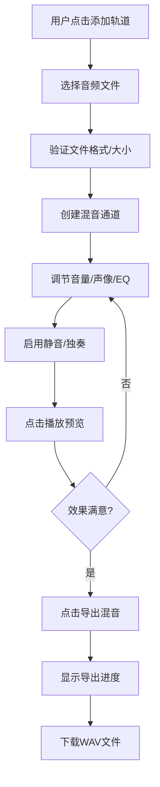

## 1. 产品概述
MixBoard是一款在线多轨混音台Web应用，专为独立音乐人和播客主设计，在没有专业DAW软件时能够快速制作简单混音demo。
- 支持同时加载多个音频轨并进行独立混音调节
- 提供专业级的音量、声像、三段均衡器控制
- 一键导出合成后的WAV格式音频

## 2. 核心功能

### 2.1 用户角色
| 角色 | 注册方式 | 核心权限 |
|------|----------|----------|
| 独立音乐人/播客主 | 无需注册，直接使用 | 上传音频、调节混音、播放预览、导出混音 |

### 2.2 功能模块
1. **混音台主页**：全局播放控制、轨道管理、混音调节、电平表、导出功能

### 2.3 页面详情
| 页面名称 | 模块名称 | 功能描述 |
|-----------|-------------|---------------------|
| 混音台主页 | 全局播放控制 | 播放/暂停/停止按钮，导出混音按钮 |
| 混音台主页 | 轨道管理 | 添加轨道按钮，支持多文件上传（wav/mp3，≤10MB） |
| 混音台主页 | 单通道控件 | 音量推子（-60dB~+6dB）、声像旋钮（L100~R100）、三段EQ（80Hz/1kHz/8kHz，-12~+12dB）、静音/独奏按钮 |
| 混音台主页 | 电平表 | 垂直条状总混音音量电平表，绿-黄-红渐变，30fps刷新率 |
| 混音台主页 | 导出功能 | 44100Hz 16-bit PCM WAV格式导出，带进度条显示 |

## 3. 核心流程
用户上传音频文件 → 系统自动创建混音通道 → 用户调节各通道音量/EQ/声像 → 用户播放预览混音效果 → 用户满意后导出合成音频

## 4. 用户界面设计

### 4.1 设计风格
- 主背景色：#1E1E1E（深灰黑），通道卡片背景：#2A2A2A
- 强调色：#667eea（紫蓝）、#3498DB（蓝）、#2ECC71（绿）、#E74C3C（红）、#F1C40F（黄）
- 圆角：8px，内间距：16px，卡片间距：12px
- 选中通道：发光边框 #667eea 2px + drop-shadow滤镜
- 过渡效果：所有滑块/按钮hover状态0.2s ease

### 4.2 页面设计概览
| 页面名称 | 模块名称 | UI元素 |
|-----------|-------------|-------------|
| 混音台主页 | 全局播放控制 | 播放▶/暂停||/停止■按钮，导出按钮（涟漪效果），电平表 |
| 混音台主页 | 通道区域 | 横向排列通道卡片，自定义滚动条，响应式布局 |
| 混音台主页 | MixerChannel | 垂直音量推子+数字标签，水平声像滑块（L/R渐变），三条EQ小滑块，M/S方形按钮 |

### 4.3 响应式
- 桌面端（>1024px）：通道横向排列，水平滚动，自定义滚动条（8px高，圆角4px）
- 平板端（768~1024px）：每行最多4个通道，自动换行
- 移动端（<768px）：通道垂直堆叠，可折叠，折叠时仅显示名称和音量推子

### 4.4 动画效果
- 静音按钮激活：红色#E74C3C + 0.2s闪烁脉冲动画（scale 1.0→1.2）
- 音量推子拖拽：手柄变蓝色#3498DB
- 导出按钮：点击涟漪效果（0.6s渐隐圆形扩散）
- 电平表：30fps实时峰值更新
