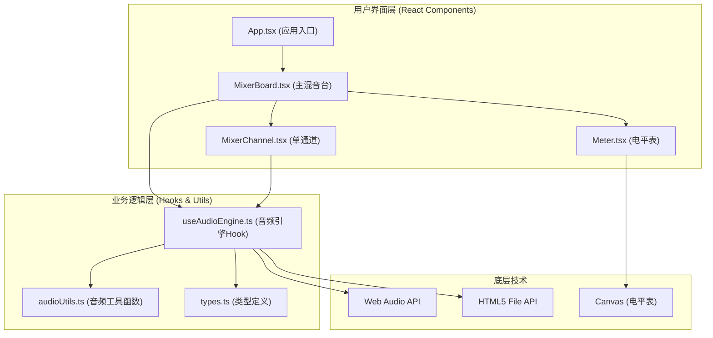
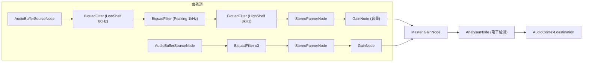

## 1. 架构设计



## 2. 技术说明
- 前端框架：React 18 + TypeScript
- 构建工具：Vite
- 音频处理：Web Audio API（原生，无需第三方库）
- 状态管理：React useState/useReducer（用户指定无外部状态管理库）
- 样式方案：纯CSS（CSS Modules + CSS Variables）
- 不使用任何第三方状态管理、UI组件库或音频处理库

## 3. 项目文件结构与调用关系

```
e:\solo\VersionFast\tasks\auto117\
├── index.html                              # 入口页面（包含#root挂载点和MixBoard标题）
├── package.json                            # 依赖配置
├── vite.config.js                          # Vite构建配置
├── tsconfig.json                           # TypeScript配置
└── src/
    ├── main.tsx                            # 应用入口，渲染App
    ├── App.tsx                             # 应用根组件，渲染MixerBoard
    ├── index.css                           # 全局样式、CSS变量、暗色主题
    ├── types/
    │   └── audio.ts                        # 音轨数据类型定义
    ├── utils/
    │   └── audioUtils.ts                   # WAV编码、dB转换等工具函数
    ├── hooks/
    │   └── useAudioEngine.ts               # 音频引擎Hook（Web Audio API封装）
    └── components/
        ├── MixerBoard.tsx                  # 主混音台组件
        ├── MixerChannel.tsx                # 单音轨通道组件
        └── Meter.tsx                       # 总输出电平表组件
```

### 调用关系与数据流向：
1. **index.html → main.tsx → App.tsx → MixerBoard.tsx**：组件渲染层级
2. **MixerBoard.tsx**：
   - 持有 `tracks` 状态数组（TrackData[]）
   - 持有播放/暂停状态
   - 调用 `useAudioEngine` Hook获取音频控制能力
   - 将单条track数据和update回调传递给 `MixerChannel.tsx`
   - 渲染多个 `MixerChannel` 和一个 `Meter`
3. **MixerChannel.tsx**：
   - 接收props: `track: TrackData, onUpdate: (track) => void, onSelect: (id) => void`
   - 用户交互（滑块/按钮）→ 调用 `onUpdate` → MixerBoard更新状态 → 同步到useAudioEngine
4. **useAudioEngine.ts**：
   - 内部维护AudioContext、各轨道GainNode/BiquadFilterNode/PannerNode/StereoPanner
   - 暴露loadTrack、play、pause、stop、setVolume、setPan、setEQ、exportMix等方法
   - 电平数据通过AnalyserNode获取并通过回调给Meter组件

## 4. 核心数据模型

### TrackData（音轨数据）
```typescript
interface TrackData {
  id: string;            // 唯一ID (uuid)
  name: string;          // 文件名（截取前15字符）
  originalName: string;  // 原始文件名
  volumeDb: number;      // 音量 -60 ~ +6 dB，默认-6
  pan: number;           // 声像 -100(L) ~ +100(R)，默认0
  eqLow: number;         // 低频EQ -12 ~ +12 dB，默认0
  eqMid: number;         // 中频EQ -12 ~ +12 dB，默认0
  eqHigh: number;        // 高频EQ -12 ~ +12 dB，默认0
  muted: boolean;        // 静音状态
  solo: boolean;         // 独奏状态
  selected: boolean;     // 选中状态
  audioBuffer: AudioBuffer | null;  // 解码后的音频缓冲
}
```

## 5. Web Audio API 节点连接图



## 6. 性能优化策略
- 使用Web Audio API原生节点处理（高性能C++实现）
- AudioBuffer一次性解码缓存，不重复解码
- 电平表30fps刷新率使用requestAnimationFrame节流
- 导出混音使用OfflineAudioContext离线渲染，不阻塞UI
- React使用useMemo/useCallback避免不必要重渲染
