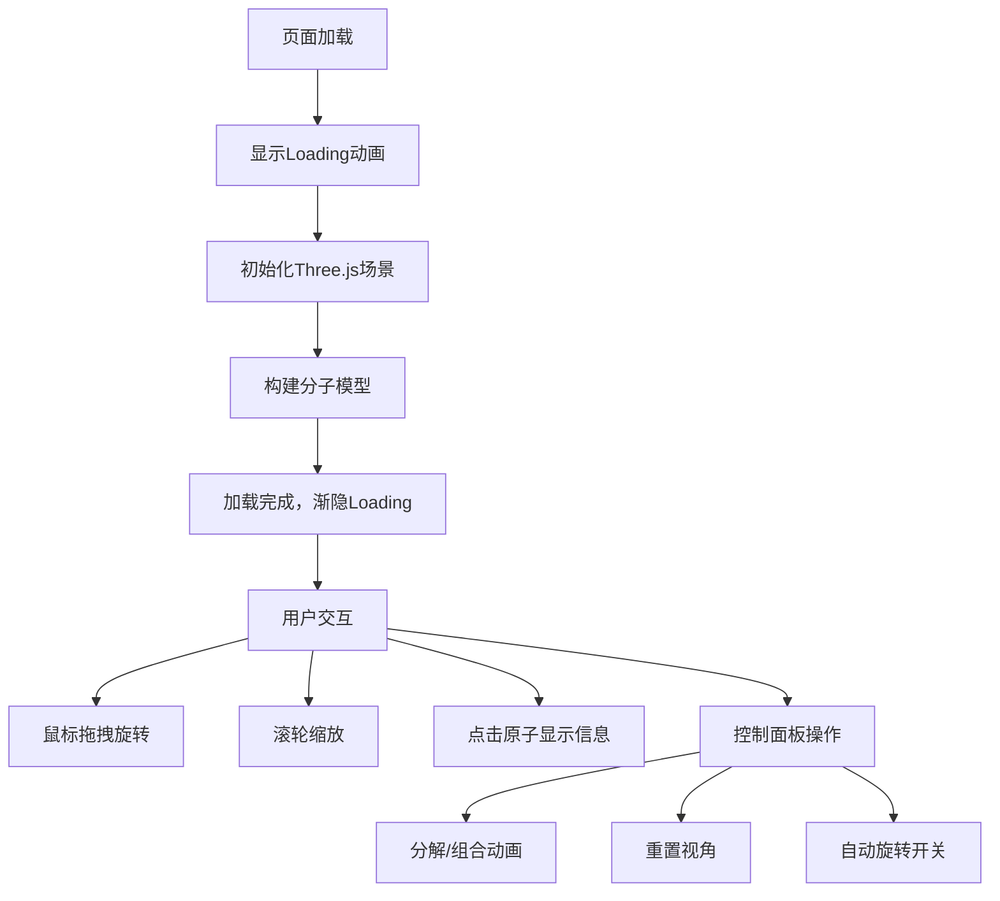

## 1. 产品概述

基于Three.js的交互式分子结构查看器，让用户能在浏览器中以3D方式旋转、缩放和拆解有机分子（如咖啡因C8H10N4O2），提供沉浸式的化学分子可视化体验。

- 核心用途：化学教育、分子结构可视化、科学展示
- 目标用户：学生、教师、化学爱好者、科研人员
- 产品价值：将抽象的分子结构转化为可交互的3D可视化模型，降低理解门槛

## 2. 核心功能

### 2.1 功能模块

1. **3D分子渲染模块**：原子球体渲染、化学键圆柱渲染、整体Group组合
2. **视角交互模块**：鼠标拖拽旋转、滚轮缩放、视角重置
3. **原子信息模块**：点击原子弹出信息卡片、显示元素属性与空间坐标
4. **动画控制模块**：分解/组合动画、自动旋转控制
5. **UI控制面板**：右侧半透明控制面板、功能按钮与开关

### 2.2 页面详情

| 页面名称 | 模块名称 | 功能描述 |
|---------|---------|---------|
| 主页面 | 3D场景渲染 | 渐变星空背景、分子模型悬浮展示、地面平台效果 |
| 主页面 | 视角控制 | 鼠标拖拽绕X/Y轴旋转（阻尼0.1）、滚轮缩放（0.5x-3x）、平滑过渡0.3s |
| 主页面 | 原子信息卡片 | 毛玻璃背景(blur 8px)、圆角12px、显示元素符号/原子序号/连接数/XYZ坐标、跟随原子偏移20px |
| 主页面 | 右侧控制面板 | 宽200px、背景#1A1A2E80、blur 12px、圆角16px、距右20px顶部对齐 |
| 主页面 | 分解/组合按钮 | 原子沿球心到原点向量外移1.5倍距离、1.2s ease-in-out动画 |
| 主页面 | 重置视角按钮 | 摄像机回到初始位置、1s ease-out过渡 |
| 主页面 | 自动旋转开关 | 绕Y轴每30秒转一圈、linear缓动 |

## 3. 核心流程

## 4. 用户界面设计

### 4.1 设计风格

- **主色调**：深蓝色到黑紫色渐变背景（#0B0C2A → #1A1A2E）
- **原子颜色**：
  - 碳（C）：灰色 #666666
  - 氢（H）：白色 #FFFFFF
  - 氮（N）：蓝色 #3050F8
  - 氧（O）：红色 #FF0D0D
- **按钮风格**：圆角、半透明毛玻璃效果、hover过渡0.2s
- **字体**：现代无衬线字体、白色文字在深色背景上
- **布局**：全屏3D场景、右侧浮动控制面板、动态信息卡片

### 4.2 页面设计概览

| 页面名称 | 模块名称 | UI元素 |
|---------|---------|-------|
| 主页面 | 背景 | 渐变星空(#0B0C2A→#1A1A2E)、银色时钟圆环(外径200px内径196px、30度刻度) |
| 主页面 | 地面平台 | 深色半透明(#1E1E3A80)、宽600px高400px、圆角16px、blur 4px |
| 主页面 | 原子球体 | 标准材质(粗糙度0.3、金属度0.1、环境光0.4、平行光0.8)、不同颜色和大小 |
| 主页面 | 化学键 | 半透明圆柱体连接原子 |
| 主页面 | 信息卡片 | 毛玻璃(blur 8px)、圆角12px、白色文字、关闭按钮(24px圆形、半透明#FFFFFF40、hover#FFFFFF80) |
| 主页面 | 控制面板 | 宽200px、#1A1A2E80背景、blur 12px、圆角16px、包含3个控制项 |

### 4.3 响应式设计

- 桌面端优先，全屏展示
- 触控设备支持：触摸拖拽旋转、双指缩放
- 信息卡片边界检测，避免超出视口

### 4.4 3D场景指导

- **环境与氛围**：深色渐变星空背景，营造科技感与沉浸感
- **光照设置**：环境光强度0.4，平行光强度0.8
- **摄像机设置**：PerspectiveCamera，初始位置可完整展示分子模型
- **构图**：分子悬浮于地面正上方，时钟圆环作为视觉装饰
- **交互与动画**：阻尼旋转、平滑缩放、分解组合动画1.2s ease-in-out、自动旋转30秒/圈
- **后处理**：毛玻璃UI效果使用CSS backdrop-filter
- **性能预算**：帧率≥45fps，原子≤30个，键≤35条，使用BufferGeometry和InstancedMesh优化
