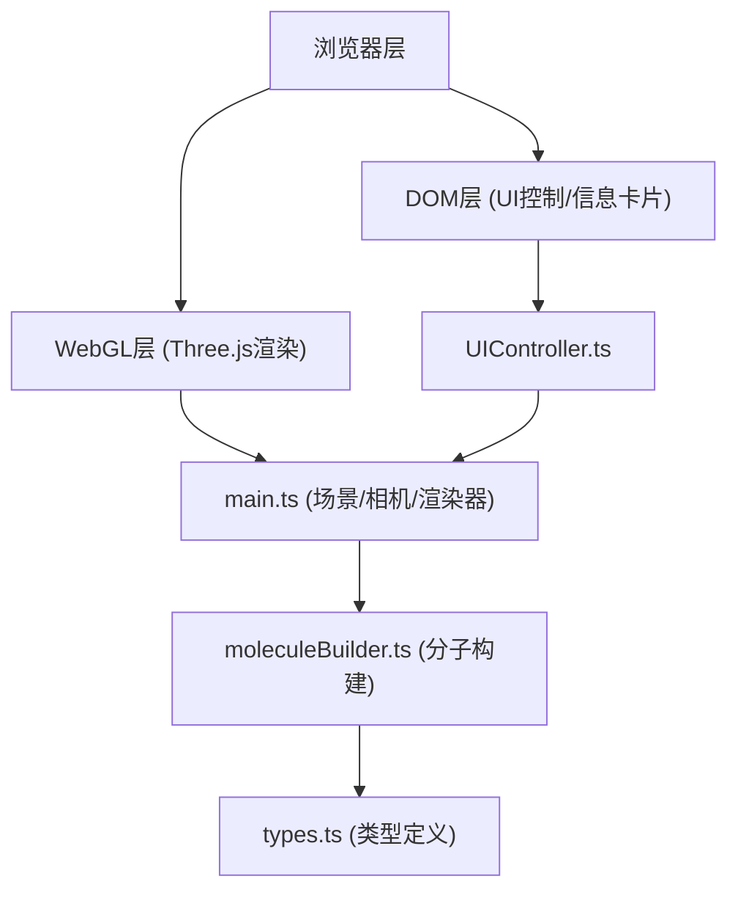

## 1. 架构设计



## 2. 技术描述

- **前端框架**：原生TypeScript + Three.js (无React/Vue，按用户需求)
- **构建工具**：Vite 5.x
- **3D渲染**：Three.js @0.160.0
- **类型系统**：TypeScript (严格模式)
- **样式方案**：原生CSS + CSS变量
- **后端**：无（纯前端项目）

## 3. 项目结构

```
auto118/
├── package.json
├── vite.config.js
├── tsconfig.json
├── index.html
└── src/
    ├── main.ts           # 入口：场景/相机/渲染器/控制器初始化
    ├── moleculeBuilder.ts # 分子模型构建
    ├── UIController.ts   # UI控制面板与交互
    └── types.ts          # 类型定义
```

## 4. 核心模块设计

### 4.1 类型定义 (types.ts)

```typescript
interface Atom {
  element: string;      // 元素符号: C, H, N, O
  atomicNumber: number; // 原子序号
  position: [number, number, number]; // XYZ坐标
  color: string;        // 颜色HEX
  radius: number;       // 原子半径
  connections: number;  // 连接数
}

interface Bond {
  from: number; // 起始原子索引
  to: number;   // 目标原子索引
}
```

### 4.2 分子构建模块 (moleculeBuilder.ts)

- 静态定义咖啡因分子(C8H10N4O2)的原子坐标和连接关系
- 使用InstancedMesh优化多个球体渲染
- 使用BufferGeometry构建半透明圆柱化学键
- 返回THREE.Group包含所有原子和键

### 4.3 UI控制模块 (UIController.ts)

- 创建DOM控制面板
- 绑定分解/组合按钮事件，使用requestAnimationFrame实现1.2s ease-in-out动画
- 绑定重置视角按钮，实现1s ease-out摄像机过渡
- 管理自动旋转开关状态
- 管理原子信息卡片的显示/隐藏与定位

### 4.4 入口模块 (main.ts)

- 初始化THREE.Scene、PerspectiveCamera、WebGLRenderer
- 设置渐变背景、星空效果、地面平台、时钟圆环
- 实现鼠标拖拽旋转（阻尼0.1）、滚轮缩放（0.5x-3x，0.3s过渡）
- 实现Raycaster点击检测，触发原子信息卡片
- 主渲染循环，处理自动旋转和动画更新

## 5. 性能优化策略

- 使用BufferGeometry替代Geometry
- 同类原子使用InstancedMesh批量绘制
- 材质复用，减少GPU状态切换
- 控制原子数量≤30，键≤35
- 目标帧率≥45fps
