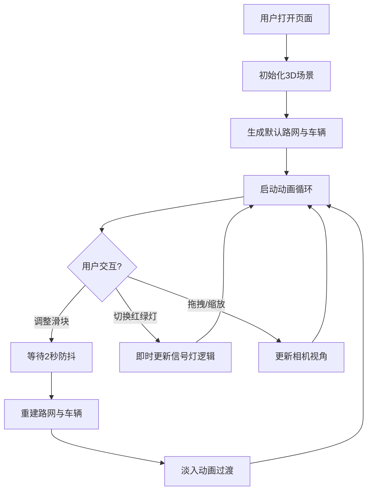

## 1. 产品概述

城市交通流3D可视化模拟器，帮助城市规划爱好者和学生直观观察不同路网密度与红绿灯策略下车辆移动效率的差异。通过交互式参数调整，用户可以实时对比交通流动态变化，理解城市交通规划的核心要素。

- 目标用户：城市规划爱好者、学生、教育工作者
- 核心价值：将抽象的交通理论转化为可视化的动态演示，降低学习门槛

## 2. 核心功能

### 2.1 用户角色

| 角色 | 注册方式 | 核心权限 |
|------|----------|----------|
| 访客用户 | 无需注册 | 调整路网参数、切换红绿灯模式、观察交通流动态 |

### 2.2 功能模块

1. **3D城市场景**：俯视视角方形街区网格、道路系统、随机高度建筑、交通信号灯
2. **车辆模拟系统**：多车辆持续行驶、路口转向决策、信号灯响应
3. **参数控制面板**：道路密度滑块、车辆数量滑块、红绿灯模式下拉菜单
4. **实时监控**：FPS帧率显示、平滑过渡动画

### 2.3 页面详情

| 页面名称 | 模块名称 | 功能描述 |
|----------|----------|----------|
| 主页面 | 3D渲染区 | 全屏Three.js场景，支持鼠标拖拽旋转和滚轮缩放 |
| 主页面 | FPS显示 | 左上角实时显示当前帧率 |
| 主页面 | 控制面板 | 右下角毛玻璃面板，包含两个滑块和一个下拉菜单 |

## 3. 核心流程

用户打开页面后，默认展示6x6街区、20辆小车、固定周期红绿灯的城市交通场景。用户可通过拖拽旋转视角、滚轮缩放观察细节，通过滑块调整道路密度和车辆数量触发路网重建（带平滑淡入动画），通过下拉菜单即时切换红绿灯策略观察车辆行为变化。

## 4. 用户界面设计

### 4.1 设计风格

- **主色调**：深灰色背景 #2a2a2a，浅灰色道路 #e0e0e0，亮蓝色车辆 #1e90ff，半透明绿色建筑
- **视觉风格**：科技感、极简、暗色系主题
- **面板样式**：毛玻璃效果（backdrop-filter: blur(8px)），半透明悬浮
- **动画风格**：平滑淡入淡出、连续流畅的车辆运动

### 4.2 页面设计概览

| 页面名称 | 模块名称 | UI元素 |
|----------|----------|--------|
| 主页面 | 3D场景 | 俯视相机、可旋转缩放、动态光照 |
| 主页面 | FPS显示 | 左上角白色等宽字体，实时更新 |
| 主页面 | 控制面板 | 右下角毛玻璃面板，包含标签、滑块轨道、滑块手柄、下拉选择框 |
| 主页面 | 车辆元素 | 亮蓝色长方体，沿道路直线行驶 |
| 主页面 | 信号灯 | 红绿圆形指示灯（直径0.3单位），路口四向分布 |
| 主页面 | 建筑元素 | 半透明绿色方块，随机高度1-3单位 |

### 4.3 响应式设计

采用桌面端优先设计，3D画布自适应窗口大小，控制面板固定在右下角。触控设备支持双指缩放和单指拖拽旋转。

### 4.4 3D场景指引

- **环境与氛围**：深灰色背景营造沉浸式暗色调体验，柔和环境光配合方向光突出道路与车辆轮廓
- **光照设置**：AmbientLight（0.5强度）+ DirectionalLight（0.8强度，45度俯角）
- **相机设置**：PerspectiveCamera，初始俯角60度，距离场景中心30单位，支持OrbitControls拖拽旋转和滚轮缩放
- **构图与焦点**：路网居中，车辆动态运动吸引视线，建筑作为背景点缀
- **交互与动画**：车辆持续移动形成流动感，重建路网时0.5秒交叉淡入淡出过渡，信号灯颜色切换带平滑过渡
- **后处理效果**：基础渲染，无额外后处理以保证60fps性能
- **资源来源与性能预算**：全部程序化生成，无外部资源。50辆车目标60fps，单帧渲染时间<16ms
