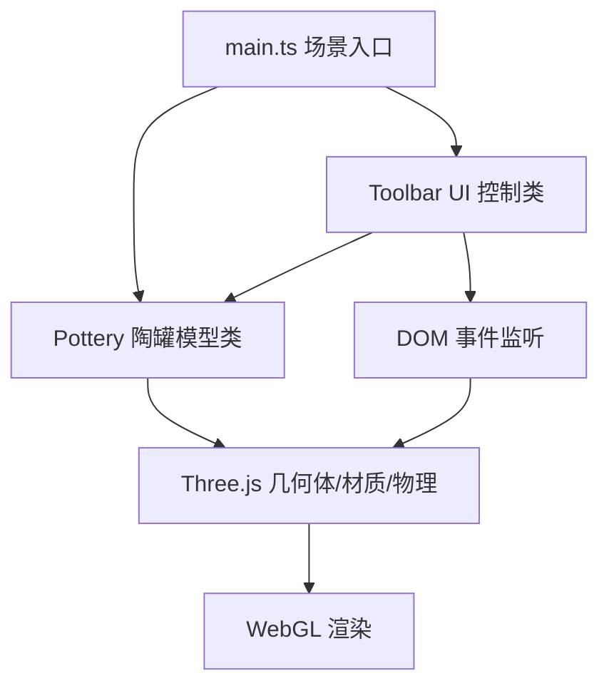

## 1. 架构设计



## 2. 技术说明

- 前端：TypeScript + Three.js (r160+) + Vite
- 构建工具：Vite 5.x
- 类型定义：@types/three
- 无后端、无数据库，纯前端 3D 交互应用

## 3. 文件结构

| 文件 | 职责 |
|------|------|
| package.json | 依赖配置与启动脚本 |
| index.html | 入口页面，全屏黑色背景 |
| vite.config.js | Vite 构建配置，端口 3000 |
| tsconfig.json | TypeScript 严格模式配置 |
| src/main.ts | Three.js 场景、相机、灯光、渲染循环初始化 |
| src/pottery.ts | 陶罐模型类：几何体创建、顶点变形、颜色/粗糙度、撤销重做 |
| src/toolbar.ts | UI 工具栏和调色板类：DOM 构建、事件绑定、状态显示 |

## 4. 核心模块设计

### 4.1 Pottery 类接口

```typescript
class Pottery {
  mesh: THREE.Mesh
  constructor(scene: THREE.Scene)
  deformVertex(intersection: THREE.Intersection, velocity: number): void
  setColor(color: string): void
  setRoughness(value: number): void
  reset(): void
  undo(): void
  redo(): void
  update(deltaTime: number): void
}
```

内部状态：
- `originalPositions`：初始顶点位置（用于重置）
- `currentDisplacements`：当前顶点位移量
- `velocities`：顶点回弹速度（弹簧模型）
- `historyStack`：变形历史栈（最多 10 条）
- `redoStack`：重做栈

### 4.2 Toolbar 类接口

```typescript
class Toolbar {
  constructor(pottery: Pottery)
  private buildPalette(): void
  private buildToolbar(): void
  private bindEvents(): void
}
```

### 4.3 变形算法

1. 鼠标拖拽时通过 Raycaster 拾取模型表面交点
2. 计算拖拽瞬时速度 → 映射到变形强度 0.01~0.05
3. 在交点周围半径范围内的顶点，沿法线方向叠加位移（距离衰减）
4. 松开后每帧应用弹簧公式：`v = v * 0.95 - displacement * k`，`position += v * dt`
5. 3秒后或位移极小时停止回弹

## 5. 性能优化

- 几何体使用 CylinderGeometry，细分参数控制顶点数 ≤ 5000
- 顶点变形直接操作 BufferGeometry.attributes.position，避免重建网格
- 回弹物理仅对有位移的顶点进行计算（活跃顶点集合）
- 使用 requestAnimationFrame 驱动渲染，deltaTime 做时间步长归一化
