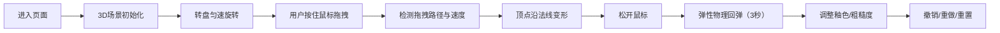

## 1. 产品概述

基于 WebGL 的浏览器端虚拟陶艺拉坯体验应用，用户通过鼠标手势模拟手指按压，在旋转的虚拟转盘上实时塑造 3D 陶罐模型，感受真实陶泥的物理变形特性。

- 核心价值：将传统陶艺制作体验数字化，降低创作门槛，提供即时视觉反馈
- 目标用户：陶艺爱好者、艺术创作者、教育场景学习者

## 2. 核心特性

### 2.1 功能模块

1. **3D 陶艺场景**：旋转转盘、可变形陶罐模型、动态光照
2. **手势交互系统**：鼠标拖拽变形、速度感应变形深度、弹性物理回弹
3. **调色面板**：四种预设釉色切换、表面粗糙度调节
4. **操作控制栏**：撤销、重做、重置功能
5. **响应式布局**：宽屏侧边栏、窄屏底部浮动面板

### 2.2 功能详情

| 模块 | 功能点 | 详细说明 |
|------|--------|----------|
| 3D场景 | 陶罐模型 | 半透明材质，颜色 #D4A574，内部镂空，高3单位，半径1单位，顶点数≤5000 |
| 3D场景 | 旋转转盘 | 半径2单位，木质纹理 #8B5E3C，匀速旋转 15°/秒 |
| 手势交互 | 拖拽变形 | 按住左键拖拽，路径上顶点沿法线方向内凹/外凸，变形量 0.01-0.05 取决于拖拽速度 |
| 手势交互 | 弹性回弹 | 松开鼠标后变形保留并缓慢回弹，阻尼 0.95，持续3秒，弹簧模型 |
| 调色面板 | 釉色切换 | 青瓷 #90EE90、天蓝 #87CEEB、朱红 #DC143C、象牙白 #FFFFF0，0.5秒线性渐变过渡 |
| 调色面板 | 粗糙度调节 | 滑块 0.0-1.0，步长 0.1，白色圆形手柄直径16px，数值实时显示 |
| 操作控制栏 | 撤销/重做 | 历史栈最多10条变形状态 |
| 操作控制栏 | 重置 | 恢复为初始圆柱形状 |
| 响应式 | 宽屏适配 | ≥1280px 调色板固定左侧（200px） |
| 响应式 | 窄屏适配 | ≤768px 调色板折叠为底部可展开浮动面板 |

## 3. 核心流程

用户进入页面 → 看到自动旋转的陶罐 → 按住鼠标拖拽按压陶泥 → 观察陶泥随手势变形 → 松开后陶泥弹性回弹 → 切换釉色/调整粗糙度 → 撤销/重置操作

## 4. 用户界面设计

### 4.1 设计风格

- 主色调：深黑背景 #0A0A0A，陶土棕 #D4A574，木纹棕 #8B5E3C
- 毛玻璃 UI 面板：rgba(255,255,255,0.3) + blur 12px，圆角 16px
- 工具栏：半透明深灰 rgba(0,0,0,0.4)，高度 48px
- 按钮悬停：背景变白，0.3s ease 过渡
- 按钮点击：scale(0.95)，0.1s 动画

### 4.2 页面布局

| 区域 | 位置 | UI 元素 |
|------|------|---------|
| 工具栏 | 顶部 | 撤销按钮、重做按钮、重置按钮 |
| 调色板 | 左侧（宽屏）/底部（窄屏） | 四个釉色按钮、粗糙度滑块 |
| 3D 场景 | 中央剩余区域 | 旋转转盘 + 陶罐模型 |
| 版本号 | 底部中央 | rgba(255,255,255,0.3) 小字 |

### 4.3 响应式

- Desktop-first 设计
- ≥1280px：调色板固定左侧，宽 200px
- ≤768px：调色板折叠为底部浮动面板，点击按钮展开（0.3s ease-out）
- 触控设备：支持触摸拖拽交互

### 4.4 3D 场景指导

- 环境：深色空间背景，营造专注创作氛围
- 光照：主光源 + 环境光 + 补光，突出陶泥半透明质感
- 相机：透视相机，45° 俯视角，可环绕观察
- 性能目标：拖拽变形时帧率 ≥ 30fps
