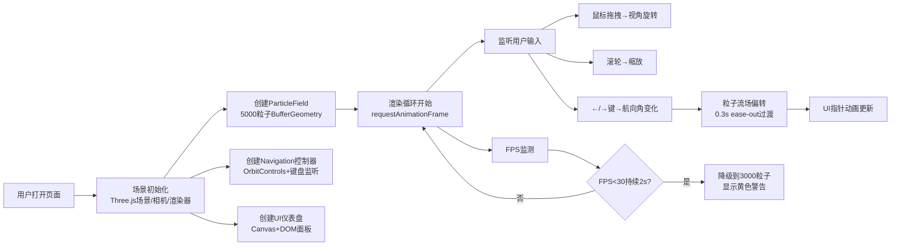

## 1. 产品概述

3D星空粒子流场导航仪表盘 - 模拟宇宙飞船在星云中航行的实时粒子流场效果，为科幻爱好者打造沉浸式太空驾驶体验。
- 主要用途：提供沉浸式太空粒子流可视化，支持用户交互控制航向和视角
- 目标用户：科幻爱好者、视觉艺术创作者、3D交互体验追求者
- 产品价值：通过高性能粒子系统和流畅的交互反馈，打造令人难忘的太空航行沉浸感

## 2. 核心功能

### 2.1 功能模块

1. **3D粒子流场系统**：5000个粒子组成的球形星云，带呼吸闪烁动画和光晕效果
2. **航向控制系统**：键盘左右方向键控制航向角（-180°~180°），粒子流跟随偏转
3. **视角操控系统**：鼠标拖拽旋转视角，滚轮缩放场景
4. **仪表UI系统**：底部毛玻璃仪表盘，显示航向角、粒子数量、FPS计数器

### 2.2 页面详情

| 页面名称 | 模块名称 | 功能描述 |
|---------|---------|---------|
| 主场景页面 | 3D粒子流场 | 5000个粒子在半径8单位球体内随机分布，蓝绿色渐变，呼吸闪烁，光晕效果 |
| 主场景页面 | 航向控制 | 键盘←/→每次调整5度，0.3s ease-out过渡，粒子速度向量随航向偏转 |
| 主场景页面 | 视角操控 | OrbitControls鼠标拖拽旋转，阻尼0.1，极角0.1~2.5rad，滚轮缩放0.3~3倍 |
| 主场景页面 | 仪表UI | 底部圆弧仪表盘（航向指针、粒子计数、FPS），毛玻璃效果，响应式适配 |

## 3. 核心流程

用户打开页面 → 3D场景初始化（粒子系统、相机、灯光、控制器）→ 显示仪表盘初始状态
用户交互：
  - 鼠标拖拽 → 视角旋转 → 场景平滑跟随
  - 滚轮滚动 → 场景缩放 → 平滑过渡
  - 按←/→键 → 航向角±5度 → 粒子流场偏转 → 仪表盘指针更新 → 数值显示更新
系统监测：
  - FPS持续低于30超过2秒 → 自动降级到3000粒子 → 显示警告提示（3秒后消失）

## 4. 用户界面设计

### 4.1 设计风格
- **主色调**：深紫蓝渐变背景 #0a0a2e → #1a1a3e
- **强调色**：粒子蓝绿渐变 #4A90D9 → #50E3C2
- **文字色**：淡青色 #E0F7FA，FPS绿色 #00FF88 / 红色 #FF4444，警告色 #FFD700
- **视觉风格**：太空科幻、毛玻璃拟态、发光粒子、沉浸式暗色
- **字体**：等宽数字字体用于计数显示，确保可读性

### 4.2 页面设计概览

| 页面名称 | 模块名称 | UI元素 |
|---------|---------|--------|
| 主场景 | 3D背景 | 全屏幕Canvas，深蓝紫垂直渐变 |
| 主场景 | 粒子系统 | 5000个发光圆形Sprite，大小0.05~0.15，呼吸闪烁正弦波1~3s周期随机 |
| 主场景 | 仪表盘面板 | 底部居中400×120px，圆角16px，blur(8px)毛玻璃，rgba(10,10,30,0.5)背景 |
| 主场景 | 航向圆弧 | 0~360度映射圆弧，红到绿渐变，白色三角指针带2px外发光 |
| 主场景 | 数据显示 | 粒子数（2.3k格式）、FPS（等宽字体，<30fps变红） |

### 4.3 响应式设计
- **桌面端（>1024px）**：仪表盘400px宽，标准字体
- **平板端（768~1024px）**：仪表盘半宽200px，中等字体
- **移动端（≤768px）**：仪表盘200px宽，小字体，精简布局
- 场景Canvas自动适配窗口大小（onResize）

### 4.4 3D场景指导
- **环境**：深空星云氛围，深蓝紫径向渐变背景，无外部HDRI
- **光照**：粒子自发光发光材质，无需场景光源，使用Sprite+Canvas贴图实现光晕
- **相机**：PerspectiveCamera（fov 75，near 0.1，far 1000），初始位置看向原点
- **控制器**：OrbitControls，target原点，damping 0.1，minPolarAngle 0.1rad，maxPolarAngle 2.5rad
- **动画**：
  - 粒子整体按航向角绕Y轴旋转（0.3s ease-out过渡）
  - 每个粒子独立呼吸闪烁（正弦波，1~3s周期随机相位）
  - 每个粒子带微小随机速度形成浮游感
- **性能**：BufferGeometry + PointsMaterial，不每帧重建几何体；FPS监测自动降级
