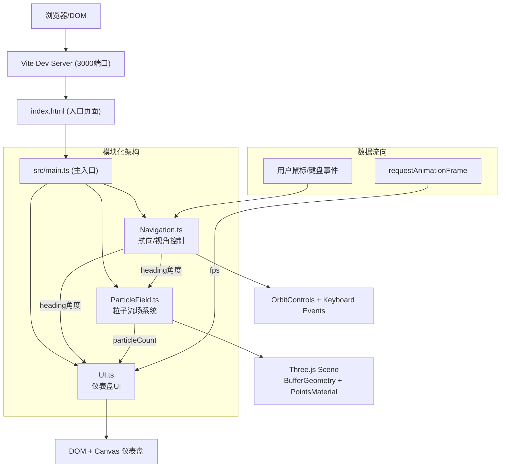

## 1. 架构设计



## 2. 技术描述

- **前端框架**：原生 TypeScript（无React/Vue，按用户要求）
- **构建工具**：Vite 5.x
- **3D引擎**：Three.js r160+，使用 BufferGeometry + PointsMaterial 高性能粒子渲染
- **类型系统**：TypeScript 严格模式（strict: true），ESNext 模块
- **样式**：原生 CSS + HTML，毛玻璃效果 backdrop-filter: blur()
- **无需后端/数据库**：纯前端可视化应用

## 3. 项目结构

| 文件路径 | 职责 | 依赖/调用关系 |
|---------|------|--------------|
| `package.json` | 依赖管理、启动脚本 | three, @types/three, typescript, vite |
| `vite.config.js` | Vite构建配置（端口3000，入口index.html） | - |
| `tsconfig.json` | TS配置（严格模式，esnext模块） | - |
| `index.html` | 入口页面，全屏容器+底部仪表盘DOM | 引入 src/main.ts |
| `src/main.ts` | 场景初始化、模块装配、渲染循环 | 引入 ParticleField, Navigation, UI |
| `src/ParticleField.ts` | 创建/管理5000粒子，更新偏转和闪烁 | Three.js (BufferGeometry, Points, Sprite) |
| `src/Navigation.ts` | OrbitControls视角+键盘航向控制 | Three.js (OrbitControls) |
| `src/UI.ts` | 仪表盘渲染（航向圆弧、粒子数、FPS） | Canvas 2D API + DOM |

## 4. 数据流向与接口

### 4.1 核心数据对象

```typescript
// Navigation → ParticleField / UI 航向数据
interface NavigationState {
  heading: number;           // 当前航向角（度），范围 -180 ~ 180
  targetHeading: number;     // 目标航向角（用于缓动）
}

// ParticleField → UI 粒子数据
interface ParticleStats {
  visibleCount: number;      // 当前可见粒子数量
}

// 全局状态（简单回调订阅，无需状态管理库）
type HeadingCallback = (heading: number) => void;
type FpsCallback = (fps: number) => void;
```

### 4.2 模块接口

```typescript
// ParticleField.ts
class ParticleField {
  constructor(scene: THREE.Scene, count?: number);
  updateHeading(targetHeading: number): void;    // 设置目标航向，内部0.3s缓动
  update(delta: number): void;                    // 每帧更新（闪烁、浮游、偏转）
  getVisibleCount(): number;
  dispose(): void;
  setParticleCount(count: number): void;         // 性能降级时调用
}

// Navigation.ts
class Navigation {
  constructor(camera: THREE.PerspectiveCamera, domElement: HTMLElement);
  onHeadingChange(callback: HeadingCallback): void;  // 订阅航向变化
  update(delta: number): void;                       // 每帧更新（键盘缓动）
  dispose(): void;
}

// UI.ts
class DashboardUI {
  constructor(container: HTMLElement);
  updateHeading(heading: number): void;
  updateParticleCount(count: number): void;
  updateFPS(fps: number): void;
  showWarning(message: string, duration?: number): void;
  dispose(): void;
}
```

## 5. 性能优化策略

1. **粒子渲染**：使用 `BufferGeometry` + `PointsMaterial`，每帧仅更新 position/color attribute 数组，不重建几何体
2. **减少draw call**：所有粒子合并到一个 Points 对象，避免5000个Sprite的开销
3. **发光效果**：通过 Canvas 生成一张径向渐变圆形贴图作为 PointsMaterial 的 map，模拟光晕
4. **动画缓动**：航向变化使用 requestAnimationFrame 的 delta 时间做 ease-out 插值，避免 CSS transition 对3D场景的影响
5. **FPS监测**：滑动窗口记录最近60帧耗时，连续2s平均FPS<30时触发降级（5000→3000粒子）
6. **响应式**：仅在 window resize 时更新 camera.aspect 和 renderer.setSize，不每帧检测
