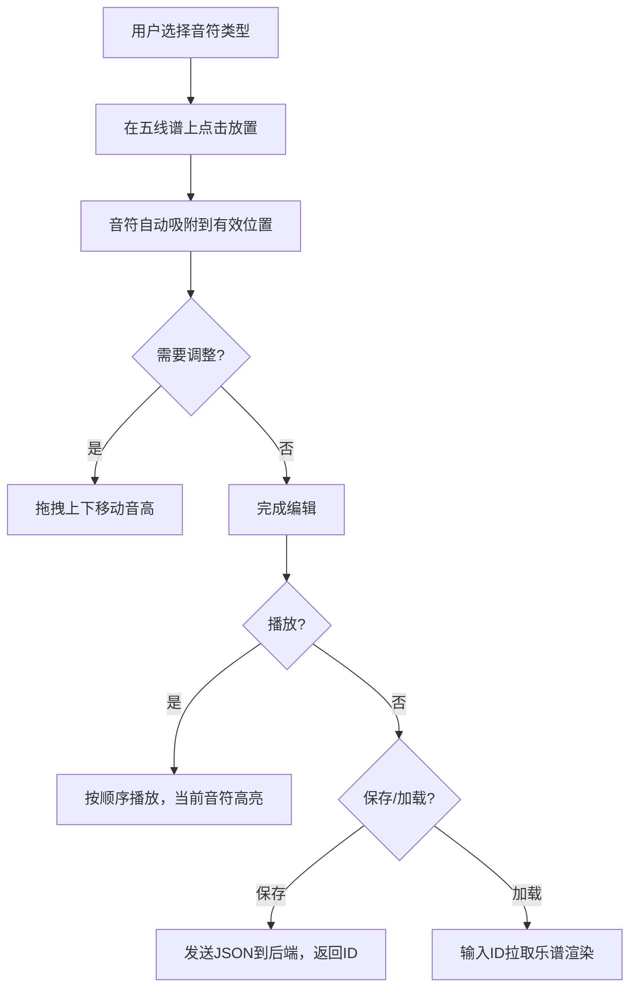

## 1. 产品概述
在线音乐乐谱编辑与播放全栈Web应用，用户可在浏览器中创建、编辑和播放简单的五线谱音乐作品。
- 面向音乐爱好者、学习者和创作者，提供直观的可视化乐谱编辑与即时音频反馈
- 提供类似纸上创作的体验，支持音符放置、拖拽调整、删除、播放、保存和加载功能

## 2. 核心功能

### 2.1 用户角色
无需登录注册，所有用户可直接使用全部功能。

### 2.2 功能模块
1. **主编辑页面**：左侧工具栏、右侧五线谱画布
2. **乐谱编辑模块**：音符放置、拖拽调整音高、右键删除
3. **音频播放模块**：按节拍顺序播放、当前音符高亮动画
4. **数据持久化模块**：保存乐谱生成ID、通过ID加载乐谱

### 2.3 页面详情
| 页面名称 | 模块名称 | 功能描述 |
|-----------|-------------|---------------------|
| 主编辑页 | 工具栏 | 音符类型选择（全/二分/四分/八分音符、休止符）、播放/停止控制、保存/加载控制 |
| 主编辑页 | 五线谱画布 | Canvas渲染高音谱号五线谱、音符显示与吸附、小节时值校验、播放高亮动画 |
| 主编辑页 | 保存/加载 | 序列化乐谱JSON发送后端保存、输入ID从后端拉取乐谱渲染 |

## 3. 核心流程
用户在工具栏选择音符类型后，在五线谱上点击放置音符（自动吸附到线/间位置），可拖拽上下调整音高，右键删除。点击播放按钮按节拍顺序依次播放，当前音符红色高亮。保存时发送乐谱JSON到后端返回4位ID，加载时输入ID拉取乐谱渲染。

## 4. 用户界面设计

### 4.1 设计风格
- **主色**：深色背景#1A1A2E，工具栏#16213E，画布背景#E8D5B7（旧纸色）
- **强调色**：按钮默认#0F3460，hover#533483，选中#E94560，音符高亮#FF4444
- **五线谱**：深褐色#4A3728，线宽2px
- **按钮**：圆角8px，白色文字，间距12px，过渡动画0.2s ease-out
- **字体**：系统无衬线字体，确保乐谱符号清晰可读

### 4.2 页面设计概述
| 页面名称 | 模块名称 | UI元素 |
|-----------|-------------|-------------|
| 主编辑页 | 工具栏 | 垂直排列（桌面）/水平滚动（移动端），音符按钮图标化，播放按钮独立分组，保存/加载输入框+按钮 |
| 主编辑页 | 五线谱画布 | 居中显示，高音谱号在首，小节线分隔，底部显示错误提示 |
| 主编辑页 | 整体布局 | 最大宽度1400px居中，桌面左右布局，移动端上下布局 |

### 4.3 响应式
桌面优先，宽度<768px时：工具栏变为顶部水平滚动条，画布高度自适应。
