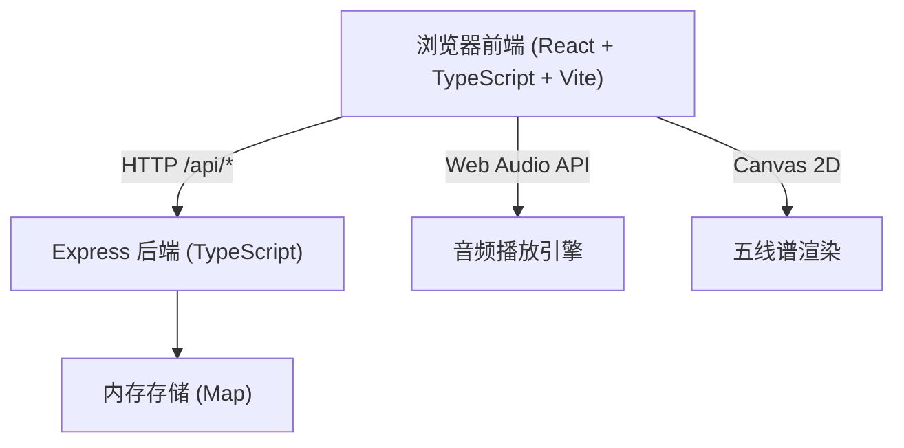
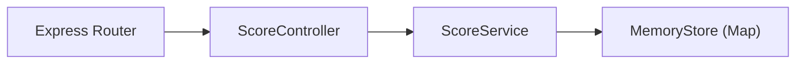
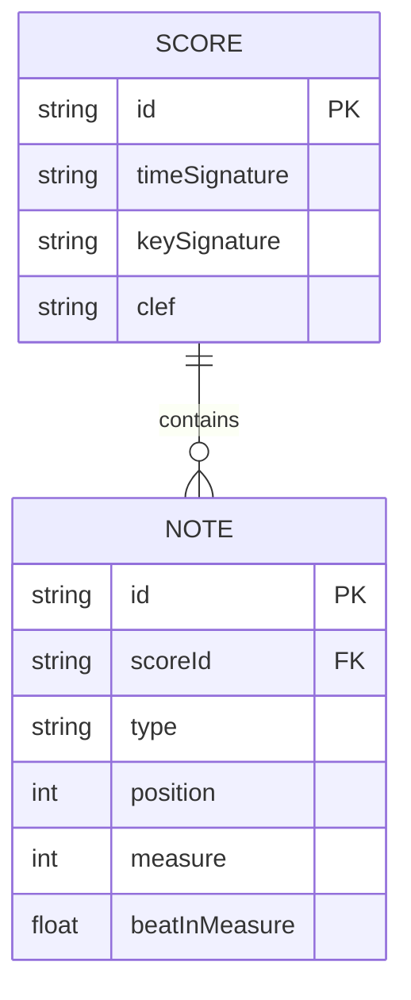

## 1. 架构设计


## 2. 技术描述
- 前端：React 18 + TypeScript 5 + Vite 5，无外部状态管理库（使用React useState/useRef）
- 后端：Express 4 + TypeScript，内存Map存储
- 构建：Vite代理/api到后端端口3001
- 音频：Web Audio API（OscillatorNode生成正弦波）
- 渲染：HTML5 Canvas 2D API

## 3. 路由定义
| Route | Purpose |
|-------|---------|
| GET / | Vite前端入口页面 |
| POST /api/save | 保存乐谱数据，返回唯一ID |
| GET /api/load/:id | 根据ID加载乐谱数据 |

## 4. API定义

### 类型定义
```typescript
type NoteType = 'whole' | 'half' | 'quarter' | 'eighth' | 'rest-whole' | 'rest-half' | 'rest-quarter' | 'rest-eighth';

interface Note {
  id: string;
  type: NoteType;
  position: number; // 0-8: 从下往上，0=第一线，1=第一间，...，8=第五线
  measure: number;  // 所属小节
  beatInMeasure: number; // 在小节内的拍位起点
}

interface ScoreData {
  notes: Note[];
  timeSignature: { beats: number; beatType: number }; // 4/4拍
  keySignature: string; // 'C'
  clef: 'treble';
}
```

### POST /api/save
Request: `ScoreData`
Response: `{ id: string }`  // 4位字母数字ID

### GET /api/load/:id
Response: `ScoreData` 或 `{ error: 'Not found' }`

## 5. 服务器架构图


## 6. 数据模型

### 6.1 数据模型定义


### 6.2 内存存储
使用 `Map<string, ScoreData>` 作为内存存储，key为4位字母数字ID。
