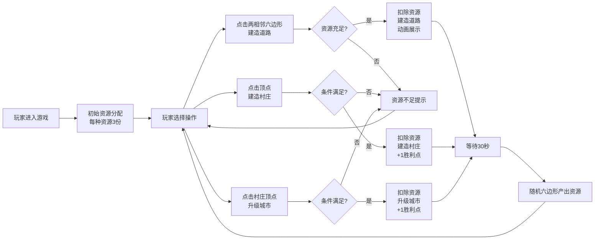

## 1. 产品概述
《卡坦岛》资源交易与建筑工坊是一款基于浏览器的六边形网格策略游戏，玩家通过采集资源、建造道路和建筑来累积胜利点。
- 目标用户：桌游爱好者、休闲游戏玩家
- 核心价值：在浏览器中体验经典桌游的资源管理与建造乐趣

## 2. 核心功能

### 2.1 用户角色
| 角色 | 注册方式 | 核心权限 |
|------|----------|----------|
| 单机玩家 | 无需注册 | 进行游戏、采集资源、建造建筑 |

### 2.2 功能模块
1. **游戏主界面**：六边形网格地图、资源面板、胜利点显示
2. **资源采集系统**：5种资源（木材、砖块、羊毛、小麦、矿石），每30秒自动产出
3. **建造系统**：道路建造、村庄建造、城市升级
4. **交互反馈系统**：资源不足提示、动画效果、Tooltip提示

### 2.3 页面详情
| 页面名称 | 模块名称 | 功能描述 |
|----------|----------|----------|
| 游戏主界面 | 六边形地图 | 19个六边形蜂窝网格，显示资源图标和建筑标记，支持点击交互 |
| 游戏主界面 | 资源面板 | 顶部固定显示5种资源数量，支持悬停查看详情，显示胜利点 |
| 游戏主界面 | 提示系统 | 资源不足提示、建造动画、资源获得动画 |

## 3. 核心流程
玩家打开游戏后，初始拥有每种资源各3份。玩家可以：
1. 点击两个相邻六边形建造道路（消耗木材1+砖块1）
2. 在有道路连接的顶点建造村庄（消耗木材1+砖块1+羊毛1+小麦1）
3. 在已有村庄且满足条件时升级为城市（消耗矿石3+小麦2）
4. 每30秒系统自动产出资源

## 4. 用户界面设计

### 4.1 设计风格
- 主色调：深绿色 #1B4332（背景）、金色 #FFD700（高亮/胜利点）
- 辅助色：绿色渐变 #90EE90 → #228B22（六边形）、棕色 #8B4513（道路）、红色 #B22222（建筑顶部）
- 字体：桌面游戏风格，清晰易读
- 按钮/交互：圆角设计，毛玻璃效果资源面板
- 动画：所有交互0.2-0.4秒平滑过渡，ease-out曲线

### 4.2 页面设计概述
| 页面名称 | 模块名称 | UI元素 |
|----------|----------|--------|
| 游戏主界面 | 六边形地图 | 19个六边形网格（边长80px），CSS Clip Path绘制，白色2px边框，悬停金色高亮，居中显示资源图标 |
| 游戏主界面 | 资源面板 | 顶部固定居中，半透明白色毛玻璃（blur 10px），圆角12px，5种资源图标水平排列（间距20px），右侧显示胜利点（金色） |
| 游戏主界面 | 建筑系统 | 道路（棕色6px直线，两端圆角）、村庄（底宽24高30，浅木色+红色三角顶）、城市（底宽30高36，深灰色+红色三角顶+炮楼） |
| 游戏主界面 | 提示系统 | 资源不足红底白字提示（屏幕中央偏上，3秒自动消失）、Tooltip（黑色半透明，白色字体12px） |

### 4.3 响应式设计
- 桌面优先设计，最小宽度1200px
- 屏幕宽度小于1200px时，整体通过transform: scale(0.8)缩小
- 地图整体尺寸约1000px × 800px，居中显示

### 4.4 动画与交互
- 六边形悬停：0.2秒过渡到金色高亮
- 道路建造：从中心向两端伸展，0.3秒ease-out
- 村庄建造：从小变大升起，0.4秒ease-out
- 城市升级：闪烁三次后放大，0.6秒总时长
- 资源获得：数字跳变并放大闪烁，0.2秒
- 提示淡出：0.5秒淡出动画
