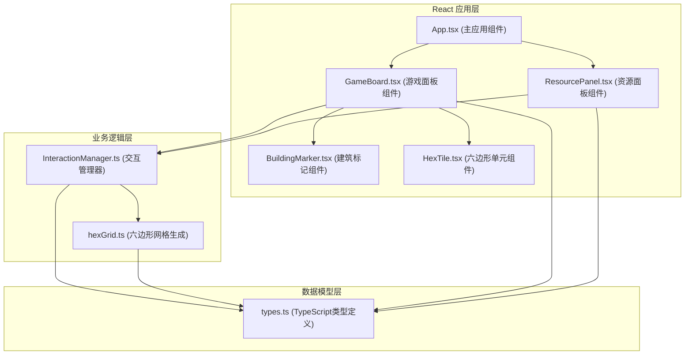
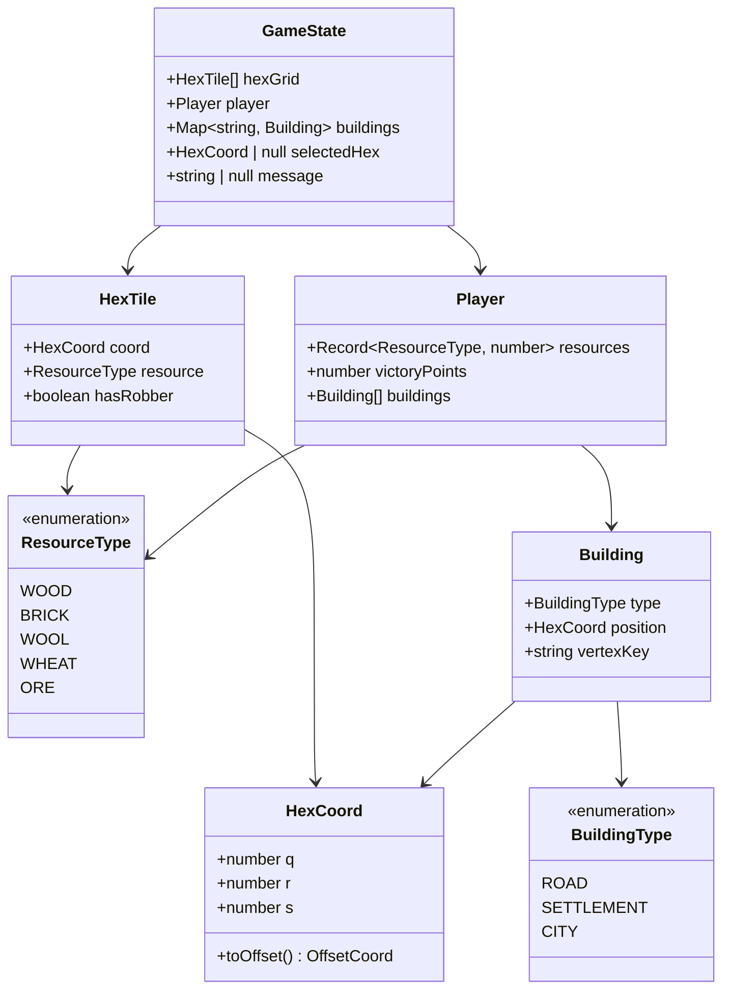

## 1. 架构设计



## 2. 技术描述
- **前端框架**：React 18 + TypeScript
- **构建工具**：Vite 5
- **状态管理**：React useState/useReducer（无外部状态管理库）
- **样式方案**：CSS Modules / 内联样式（CSS Clip Path绘制六边形）
- **动画方案**：CSS Transitions / CSS Animations
- **开发服务器端口**：3000

### 2.1 依赖清单
| 依赖包 | 版本 | 用途 |
|--------|------|------|
| react | ^18.x | UI框架 |
| react-dom | ^18.x | DOM渲染 |
| typescript | ^5.x | 类型系统 |
| @types/react | ^18.x | React类型定义 |
| @types/react-dom | ^18.x | React DOM类型定义 |
| vite | ^5.x | 构建工具 |
| @vitejs/plugin-react | ^4.x | Vite React插件 |

## 3. 路由定义
| 路由 | 用途 |
|------|------|
| / | 游戏主界面（单页应用，无额外路由） |

## 4. 数据模型

### 4.1 数据模型定义



### 4.2 核心数据结构

**HexCoord（六边形坐标）**：使用cube坐标系统(q, r, s)，满足q + r + s = 0
- `q`: 列坐标
- `r`: 行坐标
- `s`: 辅助坐标（=-q-r）

**ResourceType（资源类型枚举）**：
- `WOOD`: 木材
- `BRICK`: 砖块
- `WOOL`: 羊毛
- `WHEAT`: 小麦
- `ORE`: 矿石

**BuildingType（建筑类型枚举）**：
- `ROAD`: 道路
- `SETTLEMENT`: 村庄
- `CITY`: 城市

**Player（玩家状态）**：
- `resources`: 各资源数量映射
- `victoryPoints`: 胜利点数
- `buildings`: 已建造建筑列表

**HexTile（六边形地块）**：
- `coord`: 六边形坐标
- `resource`: 资源类型
- `hasRobber`: 是否有强盗（预留扩展）

## 5. 文件结构与调用关系

```
project-root/
├── index.html                    # 入口HTML，包含渲染容器
├── package.json                  # 项目依赖配置
├── vite.config.js                # Vite构建配置（端口3000）
├── tsconfig.json                 # TypeScript严格模式配置
└── src/
    ├── main.tsx                  # React入口文件
    ├── App.tsx                   # 主应用组件
    ├── types.ts                  # 全局类型定义（被所有文件引用）
    ├── hexGrid.ts                # 六边形网格生成与坐标转换
    │   └── 引用: types.ts
    ├── InteractionManager.ts     # 游戏交互与业务逻辑
    │   └── 引用: types.ts, hexGrid.ts
    ├── components/
    │   ├── GameBoard.tsx         # 游戏面板组件
    │   │   └── 引用: types.ts, hexGrid.ts, InteractionManager.ts
    │   ├── ResourcePanel.tsx     # 资源面板组件
    │   │   └── 引用: types.ts
    │   ├── HexTile.tsx           # 单个六边形组件
    │   │   └── 引用: types.ts
    │   └── BuildingMarker.tsx    # 建筑标记组件
    │       └── 引用: types.ts
    └── styles/
        └── index.css             # 全局样式
```

## 6. 核心算法与数据流

### 6.1 六边形网格生成（hexGrid.ts）
1. 生成19个六边形的蜂窝状布局（3行中心六边形）
2. 使用offset坐标转换为cube坐标系统
3. 随机分配资源类型：每种资源3-4个，共19个
4. 提供坐标转换函数：`offsetToCube()`, `cubeToOffset()`, `getHexCenter()`

### 6.2 交互处理流程（InteractionManager.ts）
```
玩家点击 → 检测点击目标
    ├─ 点击六边形 → 检查是否已有选中六边形
    │   ├─ 无选中 → 标记为选中状态
    │   └─ 有选中 → 检查两六边形是否相邻
    │       ├─ 相邻 → 尝试建造道路（检查资源→扣除→更新状态）
    │       └─ 不相邻 → 替换选中六边形
    ├─ 点击顶点 → 检查顶点条件
    │   ├─ 有村庄 → 尝试升级城市（检查条件→扣除资源→更新状态）
    │   └─ 无建筑 → 尝试建造村庄（检查道路连接→距离规则→扣除资源→更新状态）
    └─ 点击资源图标 → 显示Tooltip
```

### 6.3 资源自动产出
- 每30秒触发一次定时器
- 随机选择一个六边形
- 若该六边形资源类型存在于玩家已占领区域，则对应资源+1
- 触发数字跳变动画

## 7. 性能优化策略
- 使用CSS transform和opacity属性实现动画（GPU加速）
- React组件合理拆分，避免不必要的重渲染
- 六边形使用CSS Clip Path绘制，避免SVG性能损耗
- 状态更新使用不可变数据模式
- 定时器清理防止内存泄漏
