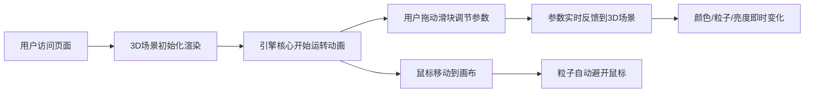

## 1. 产品概述

虚拟宇宙星舰引擎核心可视化交互台，让用户以工程师视角在浏览器中实时观察和调节科幻风格的引擎核心。通过动态等离子体火焰、能量环和粒子流营造沉浸式科技体验，调节参数可实时改变颜色、转速和亮度。

- 核心目标：打造具有赛博朋克科技感的3D可视化交互体验
- 目标用户：科幻爱好者、前端开发者、视觉设计师
- 产品价值：展示WebGL 3D技术与实时交互能力的标杆案例

## 2. 核心功能

### 2.1 功能模块

1. **引擎核心3D场景**：旋转二十面体框架、动态等离子体球、环绕粒子系统
2. **实时参数控制面板**：能量输出、引擎温度、粒子密度三个调节滑块
3. **状态监控面板**：温度、能量、粒子数实时数字显示
4. **鼠标交互系统**：粒子鼠标斥力避让、场景交互

### 2.2 页面详情

| 页面名称 | 模块名称 | 功能描述 |
|---------|---------|---------|
| 主交互台 | 引擎核心3D渲染 | 二十面体框架旋转、等离子体动态纹理、粒子环绕运动 |
| 主交互台 | 左侧状态面板 | 实时显示温度(K)、能量(%)、粒子数三个关键指标 |
| 主交互台 | 右侧控制面板 | 三个参数滑块，支持实时调节，0.3秒过渡动画 |

## 3. 核心流程

用户打开页面后，首先看到居中的3D引擎核心自动运转，左侧状态面板实时显示运行数据。用户可通过右侧三个滑块分别调节能量输出、引擎温度和粒子密度，所有调节即时生效，并有平滑过渡动画。当鼠标在3D画布上移动时，环绕粒子会自动避让鼠标位置。

## 4. 用户界面设计

### 4.1 设计风格

- **主色调**：深空蓝黑渐变背景（#0B0E1A 到 #1A233A）
- **强调色**：金色线框 #FFD700、等离子体冷色 #00BFFF 到暖色 #FF4500
- **文字色**：纯白 #FFFFFF
- **面板风格**：半透明毛玻璃效果（backdrop-filter: blur(12px)），圆角16px，内边距20px
- **字体**：monospace 等宽字体，20px 状态数字
- **整体风格**：赛博朋克科技感、深空科幻美学
- **动效风格**：所有面板带浮动动画（translateY 0-5px，周期4秒，ease-in-out交替），参数变化0.3秒ease-in-out过渡

### 4.2 页面设计概述

| 页面名称 | 模块名称 | UI元素 |
|---------|---------|---------|
| 主交互台 | 3D画布 | 全屏画布，引擎核心居中占60%面积，深空渐变背景 |
| 主交互台 | 左侧状态面板 | 三个数据指标标签+数值，毛玻璃面板，浮动动画 |
| 主交互台 | 右侧控制面板 | 三个滑块组件（标签+数值显示+滑块轨道），毛玻璃面板，浮动动画 |

### 4.3 响应式设计

- 桌面优先设计，最小支持 800x600 视口
- 面板在小屏幕上自动调整位置和大小
- 3D画布自适应窗口大小变化

### 4.4 3D场景指引

- **环境氛围**：深空宇宙背景，暗色调带轻微渐变
- **光照设置**：环境光+点光源组合，突出金色框架和等离子体发光效果
- **相机设置**：透视相机，核心居中，距离适中可完整观察引擎运转
- **核心元素**：
  - 二十面体线框：金色 #FFD700，线宽2px，Y轴每秒10度旋转
  - 等离子体球：半透明，噪声纹理模拟湍流，颜色随温度从冷蓝到暖橙渐变，大小随能量变化
  - 粒子系统：BufferGeometry批量渲染，轨道半径3-8单位，速度0.5-2单位/秒，0.8px发光光晕，鼠标斥力半径1单位
- **性能要求**：稳定60fps，粒子数最多50时无卡顿
