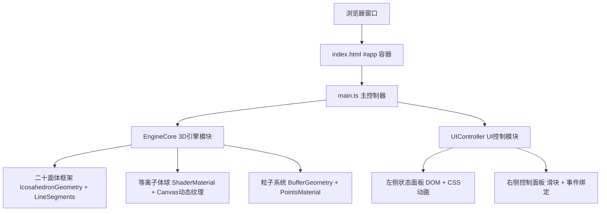

## 1. 架构设计



## 2. 技术说明

- **前端框架**：TypeScript + Three.js + Vite（原生WebGL 3D，不使用React）
- **构建工具**：Vite 5.x，开发端口 3000
- **3D渲染**：Three.js r160+，使用 BufferGeometry 批量渲染粒子
- **样式方案**：原生 CSS，使用 backdrop-filter 实现毛玻璃效果
- **动画实现**：requestAnimationFrame 渲染循环，CSS transition 参数过渡

### 技术选型说明：
1. 选择原生 Three.js 而非 @react-three/fiber，因项目为单一3D场景，原生方案更轻量、性能更优
2. 使用 Canvas 2D + Simplex 噪声算法动态生成等离子体湍流纹理，避免引入额外着色器依赖
3. 粒子系统采用 BufferGeometry + Points 批量渲染，确保50个粒子时60fps稳定运行

## 3. 文件结构与模块职责

| 文件路径 | 职责说明 |
|---------|---------|
| `/package.json` | 项目依赖与脚本配置（three、@types/three、typescript、vite） |
| `/vite.config.js` | Vite 构建配置，入口 index.html，端口 3000 |
| `/tsconfig.json` | TypeScript 严格模式配置，ESNext 模块 |
| `/index.html` | 入口HTML，全屏 #app 容器 |
| `/src/main.ts` | 主入口：场景初始化、渲染循环、鼠标交互、参数事件协调 |
| `/src/engine.ts` | EngineCore 类：3D几何体、材质、等离子体纹理、粒子系统的创建与更新 |
| `/src/ui.ts` | UIController 类：DOM界面生成、状态显示更新、滑块事件绑定与回调 |

## 4. 核心类与API定义

### 4.1 EngineCore 类

```typescript
interface EngineParams {
  energy: number;      // 0-100
  temperature: number; // 0-5000
  particleCount: number; // 1-50
}

class EngineCore {
  constructor(scene: THREE.Scene);
  update(delta: number, mouseWorld: THREE.Vector3): void;
  setParams(params: Partial<EngineParams>): void;
  getParams(): EngineParams;
  dispose(): void;
}
```

### 4.2 UIController 类

```typescript
interface UICallbacks {
  onEnergyChange: (value: number) => void;
  onTemperatureChange: (value: number) => void;
  onParticleCountChange: (value: number) => void;
}

class UIController {
  constructor(container: HTMLElement, callbacks: UICallbacks);
  updateStatus(params: EngineParams): void;
}
```

## 5. 关键技术实现方案

### 5.1 等离子体纹理生成
- 使用 HTMLCanvasElement 离屏渲染
- Simplex 噪声算法生成多层湍流纹理
- 颜色映射：0K → #00BFFF（深蓝），5000K → #FF4500（橙红）
- 每帧更新纹理数据实现动态流动效果

### 5.2 粒子系统与鼠标斥力
- BufferGeometry 存储所有粒子位置
- 每个粒子维护独立的轨道参数（半径、角度、角速度、倾角）
- 每一帧计算粒子与鼠标世界坐标距离，小于1单位时施加切向斥力
- 粒子颜色随温度参数实时插值

### 5.3 性能优化
- 粒子使用 Points 一次性批量渲染，而非多个 Mesh
- 等离子体纹理尺寸控制在 256x256，每帧只更新像素数据
- 避免在渲染循环中创建新对象，复用 Vector3/Color 等临时变量
- 使用 Three.js LineSegments 渲染线框，而非 EdgesGeometry + Line

### 5.4 动画与过渡
- 二十面体框架：rotation.y += 10° * delta（10度/秒）
- 等离子体球：scale 随 energy 参数插值变化
- UI面板：CSS @keyframes float 4秒 ease-in-out 无限交替
- 参数响应：CSS transition 0.3s ease-in-out
