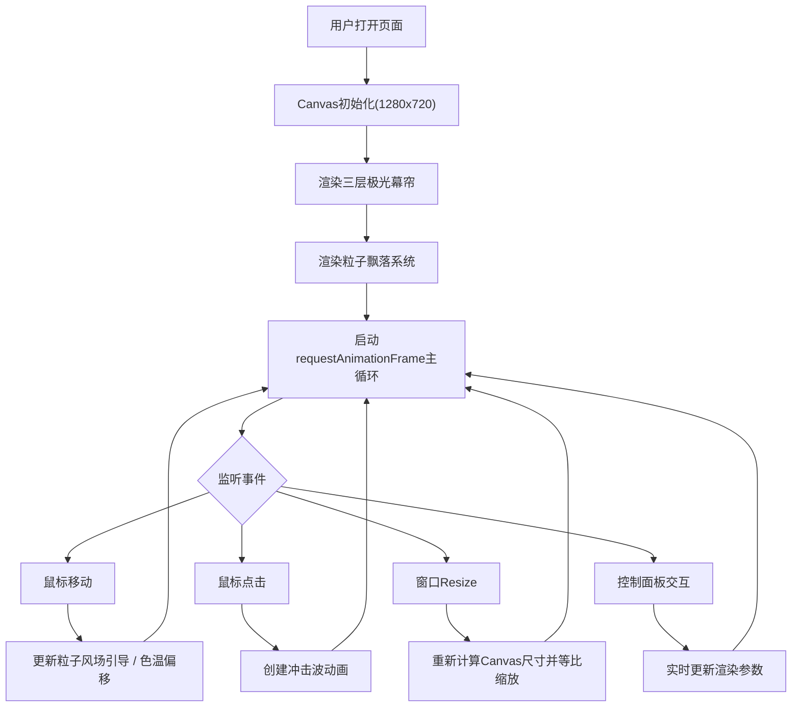

## 1. 产品概述

极光粒子视觉特效是一款基于HTML5 Canvas的交互式浏览器视觉应用，为前端开发者提供可嵌入的动态极光幕墙与粒子飘落效果，无需复杂3D引擎或后端渲染服务，即可在静态网页中展示流动、半透明、多层叠加且响应鼠标运动的自然光效。

- **核心目标**：提供高性能、可定制、纯前端的极光粒子视觉特效解决方案
- **目标用户**：前端开发者、网页设计师、创意编程爱好者
- **产品价值**：降低极光类视觉特效的实现门槛，提供开箱即用的可配置组件

## 2. 核心功能

### 2.1 用户角色

| 角色 | 注册方式 | 核心权限 |
|------|----------|----------|
| 访客用户 | 无需注册 | 浏览视觉效果、调整控制面板参数 |

### 2.2 功能模块

1. **全屏Canvas渲染器**：三层极光幕帘 + 粒子系统 + 冲击波特效
2. **交互式控制面板**：速度/密度/色温调节、平滑/尾迹开关
3. **鼠标交互系统**：风场引导、色温偏移、冲击波触发
4. **自适应缩放系统**：16:9比例、自动居中、等比参数调整

### 2.3 页面详情

| 页面名称 | 模块名称 | 功能描述 |
|----------|----------|----------|
| 主页面 | 极光幕帘渲染 | 三层波浪曲线，渐变色彩，不同速度水平飘移和正弦波浮动 |
| 主页面 | 粒子飘落系统 | 200个半透明粒子，布朗运动，鼠标风场引导，顶部重生 |
| 主页面 | 鼠标交互 | 右侧色温偏移、点击冲击波、风场引导粒子 |
| 主页面 | 控制面板 | 滑块参数调节、复选框开关、毛玻璃UI效果 |
| 主页面 | 自适应缩放 | 窗口resize时保持16:9比例，自动等比调整所有参数 |

## 3. 核心流程

用户打开页面 → 全屏Canvas自动初始化并渲染极光与粒子 → 鼠标移动触发风场引导/色温偏移 → 点击画布触发冲击波 → 用户通过左上角控制面板实时调整参数 → 窗口缩放时画面自动等比适配

## 4. 用户界面设计

### 4.1 设计风格

- **主色调**：#0a0a1a（深紫黑）
- **辅助色**：#1a1a3a（深紫蓝）
- **高亮色**：#00ffaa（青绿）
- **极光色带**：底层#00ff88→#00ccff、中层#ff66ff→#ff00aa、顶层#ffff00→#ff8800
- **字体**：白灰渐变(#cccccc~#ffffff)，14px，无衬线字体
- **风格定位**：深色科幻、赛博朋克、沉浸式视觉体验

### 4.2 控制面板UI细节

| 元素 | 样式规格 |
|------|----------|
| 面板背景 | rgba(255,255,255,0.08)，blur 10px毛玻璃，圆角12px，内边距16px |
| 滑块轨道 | 高4px，圆角2px，颜色#333333 |
| 滑块圆形 | 直径16px，颜色#00ffaa |
| 复选框 | 12x12px矩形，选中填充#00ffaa，未选中边框#555555，过渡0.2s ease |
| 悬停效果 | 向上浮起2px，box-shadow放大，过渡0.15s ease |

### 4.3 页面设计概述

| 页面名称 | 模块名称 | UI元素 |
|----------|----------|----------|
| 主页面 | Canvas全屏区域 | 1280x720基础尺寸，黑色背景#0a0a1a，居中显示，两侧留黑边 |
| 主页面 | 控制面板 | 左上角固定定位，毛玻璃半透明，包含3滑块+2复选框 |
| 主页面 | 极光视觉 | 三层叠加波浪曲线，渐变色彩，透明度0.25/0.15/0.08 |
| 主页面 | 粒子视觉 | 圆形2-5px半径，半透明，主色调随机，可选尾迹效果 |
| 主页面 | 冲击波 | 白色细圆环，从点击处向外扩散 |

### 4.4 响应式设计

- 桌面端优先设计
- 窗口缩放时保持16:9固定比例
- Canvas自动居中，超出区域显示黑色背景填充
- 所有粒子和极光参数根据实际渲染尺寸等比缩放
- 控制面板保持固定左上角位置，不随Canvas缩放

### 4.5 动画与交互规范

- 极光水平飘移速度：底层0.3px/帧、中层0.6px/帧、顶层0.9px/帧（可通过速度滑块0.5x~3x调节）
- 极光竖直浮动：正弦波，振幅40-80px，频率0.02-0.04Hz
- 粒子下落速度：1-3px/帧随机，布朗运动±1px/帧
- 色温过渡：鼠标在右侧1/3区域时，色相0-45度偏移，0.5秒ease-out过渡
- 冲击波生命周期：1.5秒，半径0→200px，透明度0.8→0，线宽2px→0
- 极光冲击波反馈：透明度短暂增加50%，0.3秒内恢复
- 鼠标事件节流：每帧最多触发一次位置更新

## 5. 性能要求

- 帧率稳定55fps以上
- 粒子数量>400时启用离屏Canvas预渲染粒子纹理
- 极光顶点每帧仅更新UV坐标，不做全量重绘
- 鼠标事件节流至每帧一次
