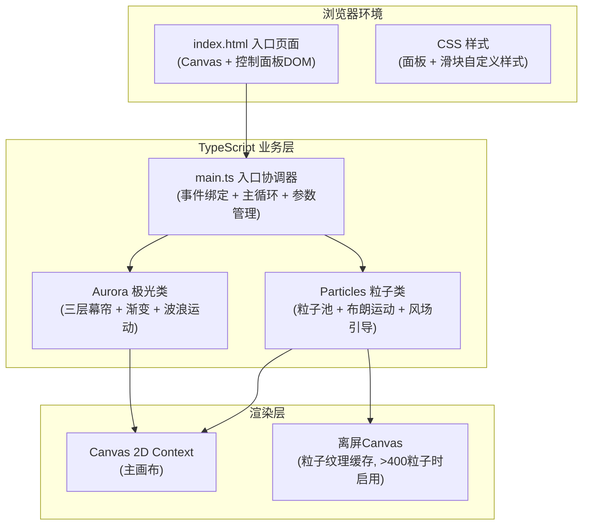

## 1. 架构设计



## 2. 技术选型

- **前端框架**：原生HTML/CSS + TypeScript（不引入React/Vue，保持轻量）
- **构建工具**：Vite 5.x（极速HMR，支持TypeScript）
- **开发语言**：TypeScript 5.x（严格模式，ES2020）
- **渲染技术**：HTML5 Canvas 2D API（硬件加速）
- **无第三方UI库**：纯CSS实现控制面板样式

## 3. 文件结构

```
auto137/
├── .trae/
│   └── documents/
│       ├── PRD-极光粒子视觉特效.md
│       └── 技术架构-极光粒子视觉特效.md
├── index.html              # 入口页面：Canvas + 控制面板DOM
├── package.json            # 依赖配置：typescript + vite
├── vite.config.js          # Vite配置：端口3000、TS支持
├── tsconfig.json           # TS配置：严格模式、ES2020
└── src/
    ├── aurora.ts           # 极光系统核心类
    ├── particles.ts        # 粒子系统核心类
    └── main.ts             # 入口逻辑、事件绑定、主循环
```

## 4. 模块接口定义

### 4.1 Aurora 类 (src/aurora.ts)

```typescript
interface AuroraLayerConfig {
    vertexCount: number;       // 顶点数量 (150)
    colorStart: string;        // 渐变起始色
    colorEnd: string;          // 渐变终止色
    alpha: number;             // 透明度 (0.25/0.15/0.08)
    driftSpeed: number;        // 水平飘移速度 (0.3/0.6/0.9)
    amplitude: number;         // 正弦振幅 (40-80)
    frequency: number;         // 正弦频率 (0.02-0.04)
}

class Aurora {
    constructor(width: number, height: number);
    update(auroraSpeed: number, colorShift: number, smooth: boolean): void;
    render(ctx: CanvasRenderingContext2D, width: number, height: number): void;
    triggerShockwave(): void;  // 冲击波经过时透明度增加
    resize(width: number, height: number): void;
}
```

### 4.2 Particles 类 (src/particles.ts)

```typescript
interface Particle {
    x: number;
    y: number;
    vx: number;
    vy: number;
    radius: number;
    color: string;
    alpha: number;
    trail: { x: number; y: number; alpha: number }[];
}

class Particles {
    constructor(count: number, width: number, height: number);
    update(mouseX: number, mouseY: number, density: number, trail: boolean): void;
    render(ctx: CanvasRenderingContext2D, width: number, height: number, trailCanvas: HTMLCanvasElement | null): void;
    resize(width: number, height: number): void;
}
```

### 4.3 main.ts 状态接口

```typescript
interface ControlState {
    auroraSpeed: number;     // 0.5 ~ 3.0, 默认1.0
    particleDensity: number; // 50 ~ 400, 默认200
    colorTempShift: number;  // -30 ~ +30, 默认0
    smoothAurora: boolean;   // 默认true
    particleTrail: boolean;  // 默认false
}

interface MouseState {
    x: number;
    y: number;
    inRightThird: boolean;
    lastUpdateFrame: number;
}

interface Shockwave {
    x: number;
    y: number;
    radius: number;
    maxRadius: number;
    alpha: number;
    lineWidth: number;
    startTime: number;
    duration: number;
}
```

## 5. 关键实现策略

### 5.1 极光渲染优化

- 每帧仅更新UV偏移量（相位），顶点坐标通过公式实时计算，避免数组全量重写
- 使用`quadraticCurveTo`（平滑模式）或`lineTo`（普通模式）绘制波浪曲线
- 渐变使用`createLinearGradient`预创建，按层缓存
- 透明度动态修改实现冲击波经过效果

### 5.2 粒子系统优化

- 对象池模式复用粒子对象，避免GC
- 粒子数量>400时启用离屏Canvas预渲染粒子纹理，使用`drawImage`批量绘制
- 尾迹模式下，每个粒子维护最近位置数组，按透明度递减绘制残影
- 布朗运动使用`Math.random()` ±1px每帧

### 5.3 鼠标风场引导算法

```
if mouseY < height / 2:
    directionX = Math.sign(mouseX - particle.x)
    particle.vx += directionX * 0.05  // 微弱加速度
    particle.vx *= 0.98               // 阻尼衰减
```

### 5.4 色温偏移算法

```
hueShift = lerp(0, 45, mouseX / (width * 2/3 - width))  // 右侧1/3区域归一化
hueShift = clamp(hueShift + colorTempShift, -30, 75)
// 对每层层极光渐变起始/终止色进行HSL色相旋转
```

### 5.5 16:9自适应缩放

```
scale = Math.min(windowWidth / 1280, windowHeight / 720)
canvas.style.width = (1280 * scale) + 'px'
canvas.style.height = (720 * scale) + 'px'
canvas.style.left = ((windowWidth - 1280 * scale) / 2) + 'px'
canvas.style.top = ((windowHeight - 720 * scale) / 2) + 'px'
// 内部渲染仍按1280x720逻辑坐标
```

## 6. 性能指标

| 指标 | 目标值 |
|------|--------|
| FPS | ≥ 55 |
| 单次render耗时 | ≤ 12ms |
| 内存占用 | ≤ 80MB |
| 粒子上限（流畅） | 400+（离屏Canvas优化） |
