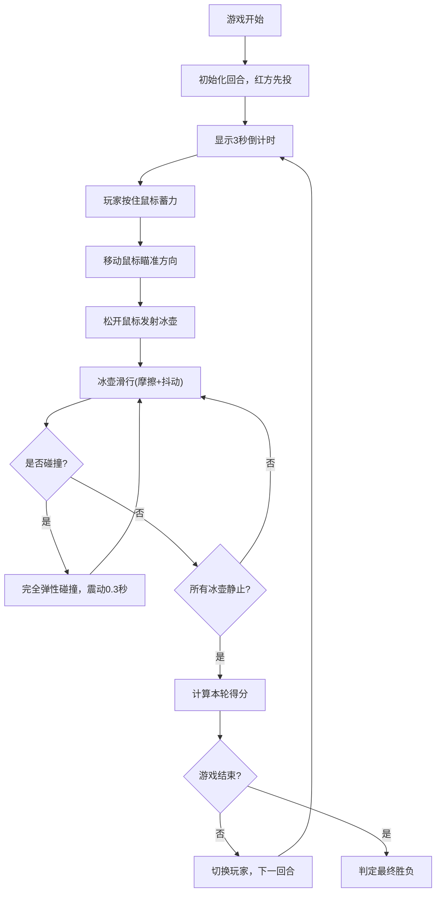

## 1. 产品概述

基于物理模拟的双人对战冰壶投掷游戏，两名玩家在虚拟冰面上轮流投掷不同颜色的冰壶（红色和蓝色），通过力度和方向控制让冰壶滑行，最终距离靶心更近的一方获胜。

- 主要目的：提供一个具有真实物理效果的休闲对战游戏体验
- 目标用户：双人本地对战玩家、休闲游戏爱好者
- 产品价值：无需真实冰场即可体验冰壶运动，物理模拟增加真实感和策略性

## 2. 核心功能

### 2.1 功能模块

1. **投掷系统**：鼠标蓄力、方向瞄准、冰壶发射
2. **物理模拟**：摩擦减速、随机抖动、完全弹性碰撞、碰撞震动动画
3. **冰面渲染**：渐变背景、三环靶心、蓄力条、倒计时进度条
4. **计分系统**：回合计分、距离判定胜负、历史分数记录

### 2.2 页面详情

| 页面名称 | 模块名称 | 功能描述 |
|----------|----------|----------|
| 游戏主界面 | 投掷机制 | 按住鼠标蓄力(0-100)，松开沿鼠标方向射出 |
| 游戏主界面 | 物理模拟 | 摩擦减速度0.5单位/秒²，随机抖动±2度，弹性碰撞速度交换，碰撞后0.3秒震动 |
| 游戏主界面 | 界面渲染 | 浅蓝到白色径向渐变冰面，中央三环靶心(半径20/40/60像素，红/白/蓝) |
| 游戏主界面 | 信息显示 | 左上角回合与分数(24px白色带2px黑描边)，右上角3秒倒计时圆形进度条(绿→红) |
| 游戏主界面 | 蓄力条 | 底部中央长200px高20px，左绿右红渐变 |
| 游戏主界面 | 预览冰壶 | 玩家切换时预览出现在左下角(蓝方)或右下角(红方) |

## 3. 核心流程

玩家轮流投掷，每回合有3秒倒计时准备时间。玩家按住鼠标蓄力，移动鼠标瞄准方向，松开发射冰壶。冰壶滑行期间受摩擦力减速，碰撞其他冰壶时发生完全弹性碰撞。所有冰壶静止后计算本轮得分，距离靶心更近的一方得分。

## 4. 用户界面设计

### 4.1 设计风格

- **主色调**：冰蓝色系 - 浅蓝(#B0E0E6)到白色(#F0F8FF)径向渐变
- **强调色**：红色(#FF0000)、蓝色(#0000FF)、绿色(#00FF00)、白色(#FFFFFF)
- **字体**：24px，白色带2px黑色描边，确保在冰面上清晰可读
- **布局**：全屏Canvas游戏界面，UI元素分布于四角和底部中央

### 4.2 页面设计概览

| 页面名称 | 模块名称 | UI元素 |
|----------|----------|--------|
| 游戏主界面 | 冰面背景 | 径向渐变 #B0E0E6 → #F0F8FF |
| 游戏主界面 | 三环靶心 | 中央位置，半径20(红)/40(白)/60(蓝)像素 |
| 游戏主界面 | 回合与分数 | 左上角，24px白色文字带2px黑色描边 |
| 游戏主界面 | 倒计时 | 右上角圆形进度条，绿色→红色渐变 |
| 游戏主界面 | 蓄力条 | 底部中央，长200px高20px，左绿右红渐变 |
| 游戏主界面 | 预览冰壶 | 红方右下角/蓝方左下角 |

### 4.3 响应式

- 采用全屏Canvas渲染，按窗口大小自适应
- 游戏区域保持固定比例，UI元素按屏幕尺寸定位

### 4.4 动画与交互

- **蓄力动画**：蓄力条实时填充，从绿色渐变到红色
- **倒计时动画**：圆形进度条3秒内从绿色渐变到红色
- **碰撞动画**：碰撞后0.3秒震动效果
- **冰壶抖动**：滑行过程中±2度随机角度偏移，模拟冰面不平
