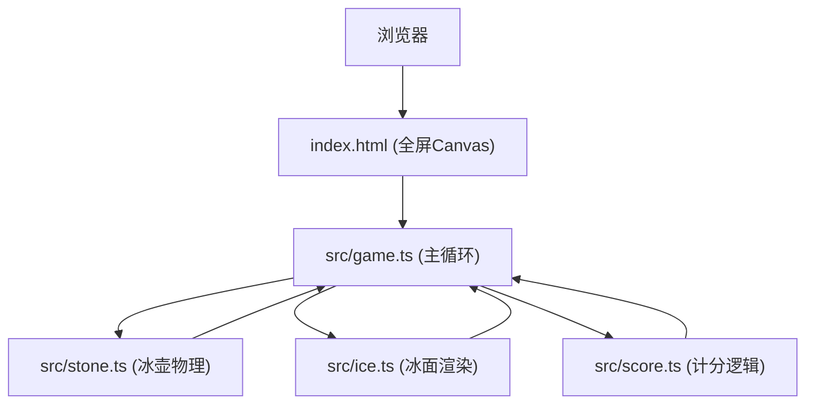

## 1. 架构设计



## 2. 技术描述

- **前端**：TypeScript + HTML5 Canvas + Vite
- **构建工具**：Vite
- **开发服务器端口**：8080
- **目标帧率**：60fps
- **模块系统**：ESNext

## 3. 项目文件结构

| 文件路径 | 用途 |
|----------|------|
| package.json | 项目依赖与脚本配置(vite、typescript) |
| index.html | 入口页面，包含全屏Canvas |
| vite.config.js | Vite构建配置，入口index.html，端口8080 |
| tsconfig.json | TypeScript配置，严格模式，esnext模块 |
| src/game.ts | 游戏主循环：Canvas渲染、事件绑定、帧率控制、模块调度 |
| src/stone.ts | 冰壶物理类：位置、速度、摩擦力、碰撞检测与响应 |
| src/ice.ts | 冰面渲染类：渐变背景、靶心、蓄力条、倒计时进度条绘制 |
| src/score.ts | 计分逻辑：距离判定胜负、历史回合分数数组 |

## 4. 核心数据模型

### 4.1 Stone (冰壶)

```typescript
class Stone {
  x: number           // x坐标
  y: number           // y坐标
  vx: number          // x方向速度
  vy: number          // y方向速度
  color: 'red' | 'blue'  // 颜色
  radius: number      // 半径
  isMoving: boolean   // 是否运动中
  shakeTime: number   // 震动剩余时间
  angleOffset: number // 随机角度偏移
}
```

### 4.2 Score (计分)

```typescript
class Score {
  roundHistory: Array<{red: number, blue: number}>  // 历史回合得分
  currentRound: number  // 当前回合数
  totalRed: number      // 红方总分
  totalBlue: number     // 蓝方总分
}
```

## 5. 物理参数

| 参数 | 值 | 说明 |
|------|-----|------|
| 摩擦减速度 | 0.5 单位/秒² | 冰壶滑行时的减速 |
| 随机抖动角度 | ±2度 | 模拟冰面不平 |
| 碰撞类型 | 完全弹性碰撞 | 质量相等，速度交换 |
| 碰撞震动时长 | 0.3秒 | 碰撞后短暂震动动画 |
| 蓄力范围 | 0-100 | 对应发射力度比例 |
| 倒计时时长 | 3秒 | 每回合开始前准备时间 |

## 6. UI绘制参数

| 元素 | 参数 |
|------|------|
| 冰面渐变 | 径向渐变 #B0E0E6 → #F0F8FF |
| 靶心内圈 | 半径20px，红色 |
| 靶心中圈 | 半径40px，白色 |
| 靶心外圈 | 半径60px，蓝色 |
| 分数文字 | 24px，白色#FFFFFF，2px黑色描边 |
| 倒计时进度条 | 圆形，绿色#00FF00→红色#FF0000 |
| 蓄力条 | 长200px，高20px，左绿右红渐变 |
