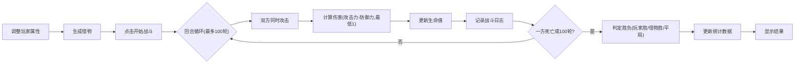

## 1. 产品概述

复古魔塔RPG回合制战斗模拟器，为独立游戏开发者提供战斗平衡测试工具。
- 玩家可自定义角色属性，与随机生成的怪物进行自动战斗
- 通过实时战斗日志和胜负统计，帮助开发者快速验证数值设计

## 2. 核心功能

### 2.1 功能模块
1. **角色配置区**：攻击/防御/生命值三个滑块实时调整
2. **怪物生成区**：随机生成怪物属性并展示
3. **战斗控制区**：开始战斗按钮、战斗过程播放
4. **战斗日志区**：逐轮显示战斗详情
5. **统计面板**：战斗次数、胜率、平均回合数累计统计

### 2.2 页面详情
| 页面名称 | 模块名称 | 功能描述 |
|-----------|-------------|---------------------|
| 主页面 | 角色配置区 | 三个滑块（攻击10-100、防御5-80、生命50-500），实时显示数值 |
| 主页面 | 怪物生成区 | 点击"生成怪物"按钮，随机生成攻击20-80、防御10-60、生命80-300 |
| 主页面 | 战斗控制区 | 点击"开始战斗"按钮，启动最多100轮的回合制自动战斗 |
| 主页面 | 战斗日志区 | 每100ms逐行显示本轮双方伤害和剩余血量，最多30条 |
| 主页面 | 统计面板 | 累计战斗次数、玩家胜率、平均回合数，页面刷新前持久保存 |
| 主页面 | 重置统计 | 清空所有统计数据 |

## 3. 核心流程

用户调整角色属性 → 生成怪物 → 开始战斗 → 观看战斗过程 → 查看战斗结果 → 统计数据更新

## 4. 用户界面设计

### 4.1 设计风格
- **主色调**：深灰 `#1a1a2e` 背景，暗金 `#c9a84c` 强调色，悬停亮金 `#e0c56b`
- **字体**：等宽字体（Courier New、Monaco、monospace）
- **按钮**：按压动画（scale 0.95 → 1），金色渐变悬停，过渡0.3s
- **滑块**：细线装饰边框，金色标签

### 4.2 页面布局
- **桌面端**：Flex横向排列，左侧配置区，中间战斗按钮，右侧怪物+日志
- **移动端**（<768px）：纵向排列

### 4.3 页面设计详情
| 页面名称 | 模块名称 | UI元素 |
|-----------|-------------|-------------|
| 主页面 | 整体容器 | 暗色背景，金色边框装饰，等宽字体 |
| 主页面 | 角色配置区 | 三个带金色标签的滑块，细线边框 |
| 主页面 | 怪物展示区 | 卡片式布局，金色标题，属性列表 |
| 主页面 | 战斗日志区 | 固定高度滚动容器，新日志从底部插入 |
| 主页面 | 统计面板 | 金色数据展示，重置按钮 |
| 主页面 | 开始战斗按钮 | 大尺寸暗金按钮，悬停渐变亮金 |

### 4.4 响应式设计
- Desktop-first 设计
- 断点：768px 以下切换为纵向布局
- 触摸设备优化滑块和按钮尺寸
