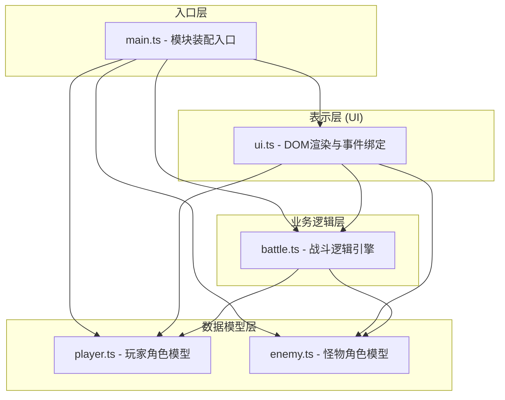

## 1. 架构设计



**数据流向说明：**
1. 用户通过UI滑块调整属性 → 更新Player模块状态
2. 用户点击"生成怪物" → UI调用Enemy模块生成随机属性
3. 用户点击"开始战斗" → UI将Player和Enemy实例传入Battle模块
4. Battle模块循环计算回合 → 更新双方HP → 生成日志数据回调给UI
5. UI模块接收日志 → 逐行渲染到DOM → 更新统计面板

## 2. 技术描述
- **前端框架**：原生 TypeScript（无框架）
- **构建工具**：Vite 5.x
- **语言标准**：TypeScript 严格模式，ESNext Module
- **样式方案**：原生 CSS（CSS 变量管理主题色）
- **状态持久化**：sessionStorage（页面刷新前保存统计数据）

## 3. 文件结构与职责

| 文件路径 | 职责 | 输入 | 输出 | 依赖 |
|-----------|------|------|------|------|
| `index.html` | 入口页面，DOM骨架 | - | - | - |
| `src/main.ts` | 应用入口，装配各模块 | - | 启动应用 | player, enemy, battle, ui |
| `src/player.ts` | 玩家角色数据模型与伤害计算 | 初始配置参数 | 角色状态数据 | - |
| `src/enemy.ts` | 怪物模板与随机生成 | 难度系数 | 怪物状态数据 | - |
| `src/battle.ts` | 战斗循环、伤害计算、胜负判定 | 玩家/怪物实例 | 战斗结果+日志 | player, enemy 类型定义 |
| `src/ui.ts` | DOM操作、事件监听、渲染更新 | 用户交互/战斗数据 | 视觉反馈 | player, enemy, battle |

## 4. 核心数据模型

### 4.1 类型定义
```typescript
// 角色基础属性
interface CharacterStats {
    attack: number;      // 攻击力
    defense: number;     // 防御力
    maxHp: number;       // 最大生命值
    currentHp: number;   // 当前生命值
}

// 玩家配置
interface PlayerConfig {
    attack: number;      // 10-100
    defense: number;     // 5-80
    hp: number;          // 50-500
}

// 单轮战斗日志
interface BattleLogEntry {
    round: number;
    playerDamage: number;
    enemyDamage: number;
    playerHp: number;
    enemyHp: number;
}

// 战斗结果
type BattleResult = 'player_win' | 'enemy_win' | 'draw';

interface BattleSummary {
    result: BattleResult;
    totalRounds: number;
    logs: BattleLogEntry[];
}

// 统计数据
interface Statistics {
    totalBattles: number;
    playerWins: number;
    totalRounds: number;
}
```

### 4.2 数据持久化
- Key: `battle_statistics`
- 存储位置: sessionStorage
- 生命周期: 页面会话期间（刷新不丢失，关闭标签页清除）

## 5. 性能约束
- 动画帧率目标：60FPS（每帧 ≤16ms）
- 每轮战斗计算+DOM更新：≤50ms
- 战斗轮次间隔：100ms
- 日志容量上限：30条（超出时移除最旧条目）
