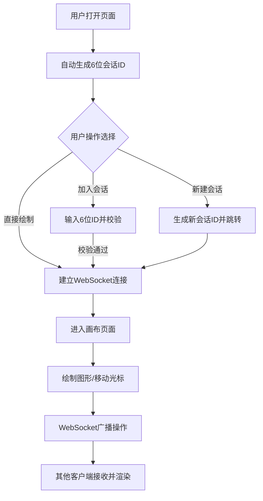

## 1. 产品概述

在线协同虚拟白板与实时批注系统，支持多用户在同一无限画布上实时绘制图形、添加文本和贴图，所有操作实时同步到所有连接客户端，适用于远程会议、头脑风暴、在线教学场景。

- 核心价值：打破地域限制，实现多人远程实时协作白板
- 目标用户：远程办公团队、教育工作者、创意工作者

## 2. 核心功能

### 2.1 用户角色

| 角色 | 注册方式 | 核心权限 |
|------|----------|----------|
| 普通用户 | 自动生成用户ID，无需注册 | 创建/加入会话、绘制图形、添加文本、实时协作 |

### 2.2 功能模块

1. **会话管理模块**：自动生成会话ID、新建会话、加入会话
2. **实时光标同步模块**：多用户光标位置实时共享、光标颜色分配、超时淡出
3. **绘图工具模块**：画笔、矩形、圆形、直线、自由曲线、文本、橡皮擦
4. **图形同步模块**：图形增删改实时广播、内存存储、UUID唯一标识
5. **界面交互模块**：顶部导航栏、底部工具栏、调色板、Toast提示

### 2.3 页面详情

| 页面名称 | 模块名称 | 功能描述 |
|----------|----------|----------|
| 会话页 | 顶部导航栏 | 显示应用名、会话ID（带复制按钮）、在线人数、退出按钮 |
| 会话页 | 无限画布 | 显示所有图形、响应鼠标绘制、显示其他用户光标 |
| 会话页 | 底部工具栏 | 绘图工具选择、画笔粗细、调色板选择 |
| 加入页 | 会话输入 | 输入6位会话ID加入已有会话 |

## 3. 核心流程

用户打开页面 → 自动生成随机会话ID并显示 → 用户可直接开始绘制或点击"新建会话"/"加入会话" → 通过WebSocket建立连接 → 绘制操作广播到所有客户端 → 接收其他用户的图形和光标更新 → 实时渲染到画布。

## 4. 用户界面设计

### 4.1 设计风格

- **主色调**：深色主题 #1E1E2E（导航栏），强调色 #7C5CFC（紫色高亮）
- **辅助色**：#4A4E69（在线人数胶囊），#555（分隔线）
- **光标调色板**：8种预设颜色用于区分用户
- **绘图调色板**：24种颜色供画笔选择
- **按钮风格**：圆角、毛玻璃效果、选中时2px紫色实线边框
- **字体**：默认系统无衬线字体，文本工具默认14px白色
- **布局风格**：顶部固定导航栏（56px），底部悬浮工具栏（60px，居中圆角16px）
- **图标风格**：简洁线条风格

### 4.2 页面设计概览

| 页面名称 | 模块名称 | UI元素 |
|----------|----------|--------|
| 会话页 | 顶部导航栏 | 深色毛玻璃背景，左：应用名，中：会话ID+复制按钮，右：在线人数胶囊+退出按钮 |
| 会话页 | 画布区域 | 无限画布，显示图形和半透明用户光标，背景深灰色 |
| 会话页 | 底部工具栏 | 半透明毛玻璃背景，圆角16px，工具按钮（画笔/矩形/圆形/直线/自由曲线/文本/橡皮擦），竖线分隔，调色板，画笔粗细选择 |
| 加入页 | 输入区域 | 居中卡片，会话ID输入框，加入按钮 |

### 4.3 响应式设计

- 桌面端优先设计
- 画布区域自适应窗口大小
- 工具栏保持居中，最小宽度适配移动设备

### 4.4 动效设计

- 光标超3秒无操作淡出消失（透明度过渡）
- 复制成功Toast提示（淡入淡出）
- 工具按钮选中高亮（边框过渡动画）
- 橡皮擦模式背景红色半透明警示

## 5. 性能指标

- 绘制操作响应延迟 < 16ms（60FPS）
- WebSocket同步延迟 < 200ms
- 支持至少200个图形同时显示无卡顿
- 自由曲线采样间隔 10ms
