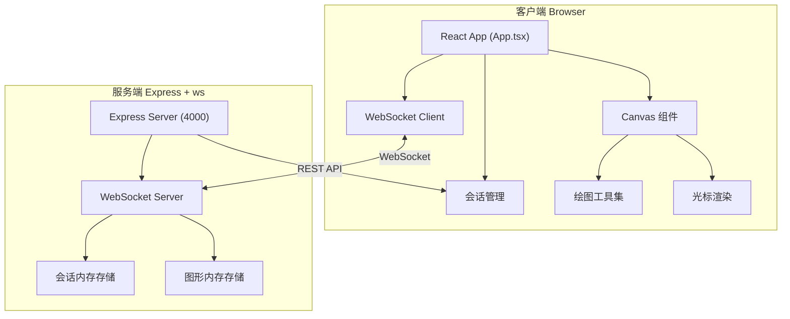
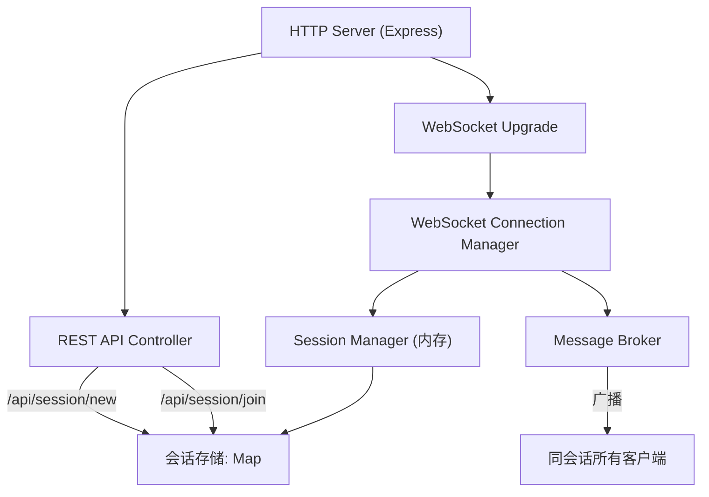

## 1. 架构设计



## 2. 技术描述

- **前端**：React 18 + TypeScript + Vite
- **后端**：Express 4 + ws (WebSocket) + TypeScript
- **状态管理**：React Hooks (useState, useEffect, useRef)，无外部状态管理库
- **构建工具**：Vite（开发端口3000，代理 /api 和 /ws 到 4000）
- **数据存储**：内存存储（会话、图形、用户连接）

## 3. 路由定义

| 路由 | 用途 |
|------|------|
| / | 根路径，自动创建或跳转会话 |
| /session/:id | 画布会话页面 |
| /join | 加入会话页面 |

## 4. API 定义

### REST API

```typescript
// GET /api/session/new
// 响应
{ sessionId: string } // 6位字母数字组合

// POST /api/session/join
// 请求体
{ sessionId: string }
// 响应
{ success: boolean; exists: boolean }
```

### WebSocket 消息协议

```typescript
// 客户端 -> 服务端
type ClientMessage =
  | { type: 'join'; sessionId: string; userId: string }
  | { type: 'cursor'; sessionId: string; userId: string; x: number; y: number; color: string }
  | { type: 'addShape'; sessionId: string; shape: Shape }
  | { type: 'deleteShape'; sessionId: string; shapeId: string }
  | { type: 'clearCanvas'; sessionId: string }

// 服务端 -> 客户端
type ServerMessage =
  | { type: 'init'; shapes: Shape[]; users: User[] }
  | { type: 'userJoin'; userId: string; color: string }
  | { type: 'userLeave'; userId: string }
  | { type: 'cursorUpdate'; userId: string; x: number; y: number; color: string }
  | { type: 'shapeAdded'; shape: Shape }
  | { type: 'shapeDeleted'; shapeId: string }
  | { type: 'canvasCleared' }
```

### 数据类型定义

```typescript
interface User {
  id: string
  color: string
  lastActive: number
}

type ShapeType = 'pen' | 'rectangle' | 'circle' | 'line' | 'curve' | 'text'

interface BaseShape {
  id: string
  type: ShapeType
  authorId: string
  color: string
  strokeWidth: number
  createdAt: number
}

interface PenShape extends BaseShape {
  type: 'pen'
  points: { x: number; y: number }[]
}

interface RectangleShape extends BaseShape {
  type: 'rectangle'
  x: number
  y: number
  width: number
  height: number
  fill: boolean
}

interface CircleShape extends BaseShape {
  type: 'circle'
  cx: number
  cy: number
  radiusX: number
  radiusY: number
  fill: boolean
}

interface LineShape extends BaseShape {
  type: 'line'
  x1: number
  y1: number
  x2: number
  y2: number
}

interface CurveShape extends BaseShape {
  type: 'curve'
  points: { x: number; y: number }[]
}

interface TextShape extends BaseShape {
  type: 'text'
  x: number
  y: number
  text: string
  fontSize: number
}

type Shape = PenShape | RectangleShape | CircleShape | LineShape | CurveShape | TextShape
```

## 5. 服务端架构



会话内存结构：
```typescript
interface Session {
  id: string
  users: Map<userId, { ws: WebSocket; color: string; lastActive: number }>
  shapes: Shape[]
  createdAt: number
}
```

## 6. 项目文件结构

```
auto147/
├── package.json
├── tsconfig.json
├── vite.config.js
├── index.html
├── server/
│   └── src/
│       └── index.ts          # Express + WebSocket 服务端
└── client/
    └── src/
        ├── App.tsx           # 主组件、路由、全局状态
        └── Canvas.tsx        # 画布组件、绘图、光标同步
```
