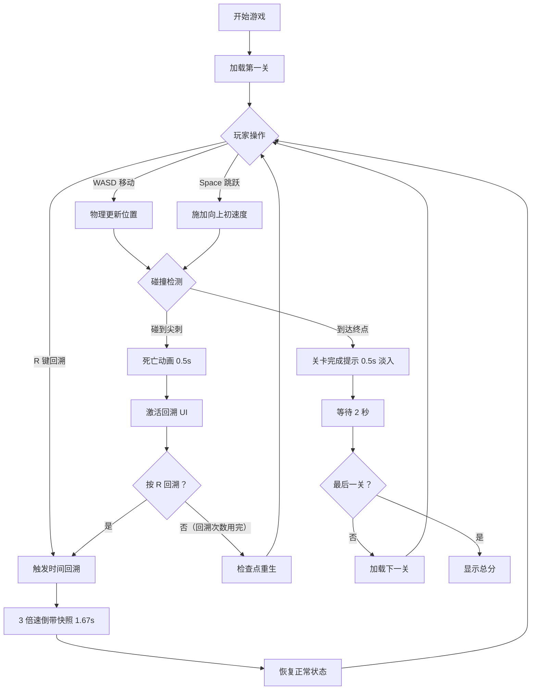

## 1. 产品概述

基于时间回溯机制的 2D 物理解谜浏览器游戏，玩家控制方形角色在充满尖刺、移动平台和碎砖的关卡中前进，利用 5 秒时间回溯能力在死亡后倒带重置位置，同时场景破坏和碎片会保留形成独特的动态困难设计。

- 目标用户：独立游戏爱好者、解谜游戏玩家
- 产品价值：创新的时间回溯+物理破坏机制，带来独特的策略解谜体验

## 2. 核心功能

### 2.1 功能模块

1. **游戏主界面**：Canvas 游戏渲染区、状态面板、操作提示
2. **玩家控制模块**：WASD 移动、Space 跳跃、R 键时间回溯
3. **时间回溯系统**：5 秒快照记录、3 倍速倒带、回溯状态管理
4. **关卡管理模块**：3 个内置关卡、墙体/尖刺/移动平台/碎砖/终点构建
5. **物理引擎模块**：Matter.js 物理模拟、碰撞检测、碎砖生成
6. **死亡与重生系统**：死亡动画、回溯激活、检查点重生
7. **关卡切换与计分系统**：关卡完成提示、自动切关、总分计算

### 2.2 页面详情

| 页面名称 | 模块名称 | 功能描述 |
|---------|---------|----------|
| 游戏主页面 | Canvas 渲染区 | 800x600 游戏画面，物理世界实时渲染 |
| 游戏主页面 | 状态面板 | 左上角显示关卡编号、死亡次数、回溯剩余次数 |
| 游戏主页面 | 操作提示 | 左下角常驻显示 WASD/Space/R 操作说明 |
| 游戏主页面 | 关卡完成提示 | 淡入动画显示"关卡完成"，2 秒后自动切关 |
| 游戏主页面 | 通关结算 | 显示最终得分（死亡次数×10 + 回溯次数×5，上限 999） |

## 3. 核心流程

## 4. 用户界面设计

### 4.1 设计风格

- **主色调**：深色主题，背景色 #1E1E2E
- **强调色**：
  - 角色正常：白色
  - 角色死亡闪烁：红色 #FF5555
  - 角色回溯中：蓝色 #00BFFF（半透明 0.5）
  - 尖刺：红色
  - 终点光柱：绿色
  - 碎片：灰色 #555555
  - 死亡次数文字：红色 #FF5555
  - 回溯次数文字：蓝色 #5555FF
- **字体**：monospace（无衬线，复古风格）
- **布局风格**：中央 Canvas + 左上角状态面板 + 左下角操作提示
- **特效**：毛玻璃背景（blur 8px）、圆角、淡入动画

### 4.2 页面设计概述

| 页面名称 | 模块名称 | UI 元素 |
|---------|---------|---------|
| 游戏主页面 | Canvas 区域 | 800x600，2px 白色内边框，抗锯齿，60fps |
| 游戏主页面 | 状态面板 | 半透明毛玻璃，blur 8px，圆角 8px，内边距 8px；三行文字：关卡（白）、死亡次数（红）、回溯剩余次数（蓝） |
| 游戏主页面 | 操作提示 | 12px 小字体，灰色 #888888，左下角常驻 |
| 游戏主页面 | 关卡完成提示 | 居中显示，0.5s 淡入动画 |
| 游戏主页面 | 通关结算 | 居中显示最终得分 |

### 4.3 响应式

- Desktop-first 设计
- Canvas 固定尺寸 800x600 居中显示
- 状态面板和操作提示使用绝对定位

### 4.4 动画效果

- 死亡动画：角色红色闪烁 0.5 秒后消失
- 回溯动画：角色半透明蓝色，1.67s 倒带
- 关卡完成：0.5s 淡入
- 碎砖碎裂：随机方向飞散，1s 后停止物理
