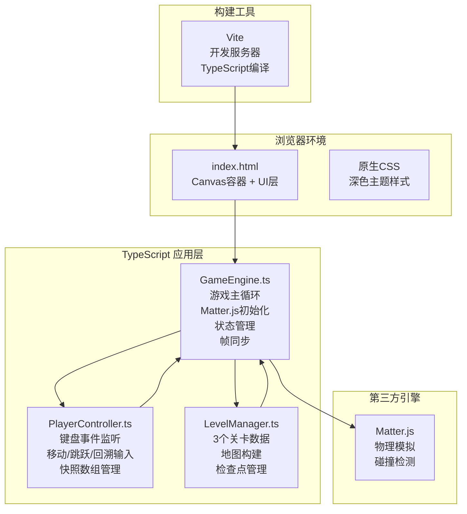

## 1. 架构设计



**数据流向说明**：
1. `PlayerController` 监听键盘事件 → 将输入状态传递给 `GameEngine`
2. `LevelManager.buildLevel(levelId)` → 返回物理体数组 → `GameEngine` 加载到 Matter.js 世界
3. `GameEngine` 每帧：调用 Matter.js 更新物理 → 读取玩家输入 → 更新角色位置 → 记录位置快照 → 渲染 Canvas
4. 玩家死亡/按 R：`PlayerController` 发送 Rewind 请求（携带 300 帧快照）→ `GameEngine` 进入回溯模式 → 倒带回放
5. 关卡切换：`GameEngine` 检测到终点碰撞 → 调用 `LevelManager` 加载下一关

## 2. 技术描述

- **前端框架**：原生 TypeScript（无 React/Vue，轻量级游戏场景）
- **构建工具**：Vite
- **物理引擎**：Matter.js
- **渲染**：原生 Canvas 2D API
- **样式**：原生 HTML/CSS

**依赖版本**：
- typescript: ^5.x
- vite: ^5.x
- matter-js: ^0.19.x
- @types/matter-js: ^0.19.x

## 3. 项目结构

```
.
├── index.html                          # 入口HTML：Canvas容器 + UI层
├── package.json                        # 依赖与启动脚本
├── vite.config.js                      # Vite构建配置（端口8080）
├── tsconfig.json                       # TypeScript配置（严格模式，esnext）
└── src/
    ├── main.ts                         # 入口文件：初始化GameEngine
    ├── GameEngine.ts                   # 游戏主循环、核心状态管理
    ├── PlayerController.ts             # 玩家输入、回溯控制、快照管理
    └── LevelManager.ts                 # 关卡数据、地图构建、检查点
```

**模块调用关系**：
- `main.ts` → 实例化 `GameEngine` 并启动
- `GameEngine.ts` → 导入并使用 `PlayerController` 和 `LevelManager`
- `PlayerController.ts` → 仅定义类，被 `GameEngine` 持有实例
- `LevelManager.ts` → 仅导出数据和构建方法，被 `GameEngine` 调用

## 4. 核心数据结构

### 4.1 回溯快照

```typescript
interface PlayerSnapshot {
  x: number;     // 位置 x
  y: number;     // 位置 y
  vx: number;    // 速度 x
  vy: number;    // 速度 y
}
```

### 4.2 关卡数据

```typescript
interface LevelData {
  walls: Array<{ x: number; y: number; w: number; h: number }>;
  spikes: Array<{ x: number; y: number; w: number; h: number }>;
  platforms: Array<{
    x: number; y: number; w: number; h: number;
    direction: 'horizontal' | 'vertical';
    range: number;
    speed: number;
  }>;
  breakableWalls: Array<{ x: number; y: number; cols: number; rows: number; brickSize: number }>;
  goal: { x: number; y: number; w: number; h: number };
  checkpoints: Array<{ x: number; y: number }>;
  playerStart: { x: number; y: number };
  rewindCount: number;
}
```

### 4.3 游戏状态

```typescript
type GameState = 'playing' | 'dying' | 'rewinding' | 'levelComplete' | 'gameComplete';
```

## 5. 物理与性能配置

### Matter.js 引擎配置
- `positionIterations: 5`
- `velocityIterations: 3`

### 性能约束
- 帧率：60fps（requestAnimationFrame 驱动）
- 物理更新超过 16ms 时跳过渲染帧
- 回溯快照：最多 300 帧（5 秒 × 60fps）
- 碎砖对象上限：30 个，超出后移除最早生成的碎片
- 每帧快照仅存储 4 个 float（x, y, vx, vy）

## 6. 游戏参数常量

| 参数 | 值 | 说明 |
|-----|-----|------|
| PLAYER_SPEED | 5 | 移动速度（px/帧） |
| JUMP_VELOCITY | -10 | 跳跃初速度 |
| REWIND_MAX_FRAMES | 300 | 最大回溯帧数（5s） |
| REWIND_SPEED_MULTIPLIER | 3 | 回溯倍速 |
| DEATH_ANIMATION_DURATION | 500 | 死亡动画时长（ms） |
| LEVEL_COMPLETE_DELAY | 2000 | 关卡完成后等待时间（ms） |
| MAX_DEBRIS | 30 | 最大碎砖数量 |
| FALL_SPEED_THRESHOLD | 8 | 高空坠落碎砖阈值（px/帧） |
| BRICK_DEBRIS_COUNT_MIN | 2 | 每块砖碎裂最少碎片数 |
| BRICK_DEBRIS_COUNT_MAX | 4 | 每块砖碎裂最多碎片数 |
