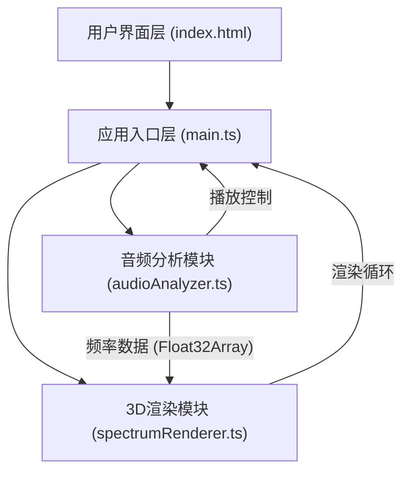

## 1. 架构设计



## 2. 技术说明
- **前端框架**: 原生 TypeScript（无UI框架），使用 Three.js 进行3D渲染
- **构建工具**: Vite 5.x，使用 @vitejs/plugin-react 支持（预留扩展能力）
- **音频处理**: Web Audio API (AudioContext, AnalyserNode, AudioBufferSourceNode)
- **3D渲染**: Three.js r160+
- **运行环境**: 现代浏览器（支持 WebGL 和 Web Audio API）

## 3. 文件结构
| 文件路径 | 职责 |
|----------|------|
| `package.json` | 项目依赖与脚本配置 |
| `vite.config.js` | Vite 构建配置，入口 index.html |
| `tsconfig.json` | TypeScript 严格模式配置，module ESNext |
| `index.html` | 入口页面，包含Canvas容器、文件选择器、控制按钮、时间显示 |
| `src/audioAnalyzer.ts` | Web Audio API 封装，解析音频，提供实时频率数据与播放控制 |
| `src/spectrumRenderer.ts` | Three.js 3D场景管理，柱状图创建与更新，自旋动画，响应式缩放 |
| `src/main.ts` | 初始化各模块，连接UI事件，协调数据流 |

## 4. 核心模块接口设计

### 4.1 audioAnalyzer.ts
```typescript
interface AudioAnalyzerResult {
  getFrequencyData: () => Uint8Array;
  play: () => Promise<void>;
  pause: () => void;
  stop: () => void;
  setLoop: (loop: boolean) => void;
  getCurrentTime: () => number;
  getDuration: () => number;
  isPlaying: () => boolean;
  isLooping: () => boolean;
  loadFile: (file: File) => Promise<void>;
  onEnded: (callback: () => void) => void;
}
```

### 4.2 spectrumRenderer.ts
```typescript
interface SpectrumRendererResult {
  updateFrequencyData: (data: Uint8Array) => void;
  startRenderLoop: () => void;
  stopRenderLoop: () => void;
  handleResize: () => void;
}
```

## 5. 关键技术实现

### 5.1 音频分析
- 使用 `AudioContext.decodeAudioData` 解码音频文件
- `AnalyserNode.fftSize = 256`，得到128个频率点，取前64个用于展示
- `AnalyserNode.smoothingTimeConstant = 0.8` 使频谱变化更平滑
- 使用 `AudioBufferSourceNode` 实现播放/暂停/停止/循环控制

### 5.2 3D频谱渲染
- 64个 CylinderGeometry 柱体，顶部使用圆角（通过较高分段数模拟）
- 颜色插值：从 #00FFFF (HSL 180°, 100%, 50%) 到 #FF00FF (HSL 300°, 100%, 50%)
- 频谱容器组绕Y轴旋转：角速度 = 2π / 10 rad/s
- 柱体高度映射：frequencyData[i] / 255 * maxHeight
- 柱体缩放时保持底部固定，修改 scale.y 和 position.y

### 5.3 响应式设计
- 监听 window.resize 事件
- 根据窗口宽高比调整柱体间距和最大高度
- 相机 aspect 实时更新并 projectionMatrix

### 5.4 性能优化
- 使用 requestAnimationFrame 驱动渲染循环，与浏览器刷新率同步
- 柱体使用 BufferGeometry，共享几何体实例
- 避免每帧创建新对象，复用 TypedArray 和 Color 对象
