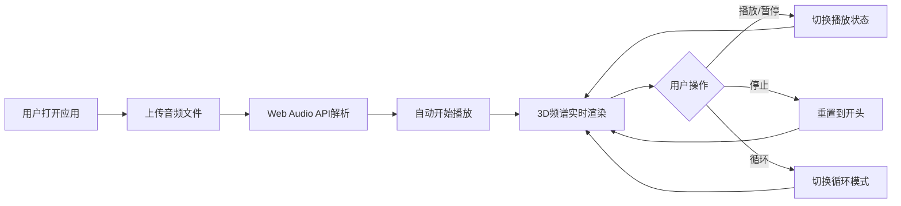

## 1. 产品概述
3D音频频谱可视化应用，为音乐爱好者和音频设计师提供本地音频文件的沉浸式频率分析体验。
- 解决用户在播放音频时无法直观感知声音频率分布随时间变化的问题
- 通过3D可视化柱状图将抽象的声音数据转化为可感知的视觉艺术

## 2. 核心功能

### 2.1 用户角色
| 角色 | 注册方式 | 核心权限 |
|------|----------|----------|
| 普通用户 | 无需注册，直接使用 | 上传音频文件、播放控制、查看3D频谱 |

### 2.2 功能模块
1. **主页（单页应用）**: 文件上传区、3D频谱可视化区、播放控制栏、时间显示区

### 2.3 页面详情
| 页面名称 | 模块名称 | 功能描述 |
|----------|----------|----------|
| 主页 | 文件上传区 | 支持拖拽或点击选择本地MP3/WAV文件，上传后自动播放 |
| 主页 | 3D频谱可视化区 | 64+柱状图，高度表示频率能量，颜色从青色到紫色渐变，整体绕Y轴自转 |
| 主页 | 播放控制栏 | 播放/暂停按钮、停止按钮、循环模式开关按钮 |
| 主页 | 时间显示区 | 显示当前播放时间和总时长，格式 mm:ss / mm:ss |

## 3. 核心流程
用户打开应用 → 点击或拖拽上传本地音频文件 → 系统解析音频并自动播放 → 3D频谱柱状图实时动态展示频率分布 → 用户可随时暂停/播放/停止/切换循环模式

## 4. 用户界面设计

### 4.1 设计风格
- **主色**: 深黑色背景 #0a0a0a
- **渐变色**: 低频青色 #00FFFF → 高频紫色 #FF00FF
- **按钮样式**: 半透明灰色圆角矩形，背景 rgba(255,255,255,0.1)
- **字体**: 白色半透明无衬线字体
- **布局风格**: 全屏居中布局，频谱居中主体，控制栏底部居中

### 4.2 页面设计概览
| 页面名称 | 模块名称 | UI元素 |
|----------|----------|--------|
| 主页 | 文件上传区 | 隐藏式文件选择器，点击页面中央触发 |
| 主页 | 3D频谱区 | Three.js 3D场景，64根圆角柱体，自转动画 |
| 主页 | 控制栏 | 三个按钮横向排列，悬停放大10%，点击缩小至95% |
| 主页 | 时间显示 | 频谱下方居中显示 mm:ss / mm:ss |

### 4.3 响应式设计
- 桌面端优先设计
- 宽屏：柱子间距拉大，柱高保持
- 窄屏：柱子间距缩小，柱高等比缩放
- 窗口尺寸变化时自动适配

### 4.4 3D场景设计
- **环境**: 纯黑背景，营造宇宙深空感
- **光照**: 环境光 + 点光源，突出柱体光泽
- **相机**: 透视相机，固定距离观察频谱中心
- **动画**: 频谱整体绕Y轴缓慢自转（10秒/圈），柱体高度随频率实时变化
- **柱体**: 顶部圆角，从底部向上生长，颜色随频率位置渐变

## 5. 性能要求
- 频谱更新帧率 ≥ 30fps
- 100秒以内音频文件 CPU 占用 ≤ 单核30%
- 按钮状态颜色过渡动画 300ms
