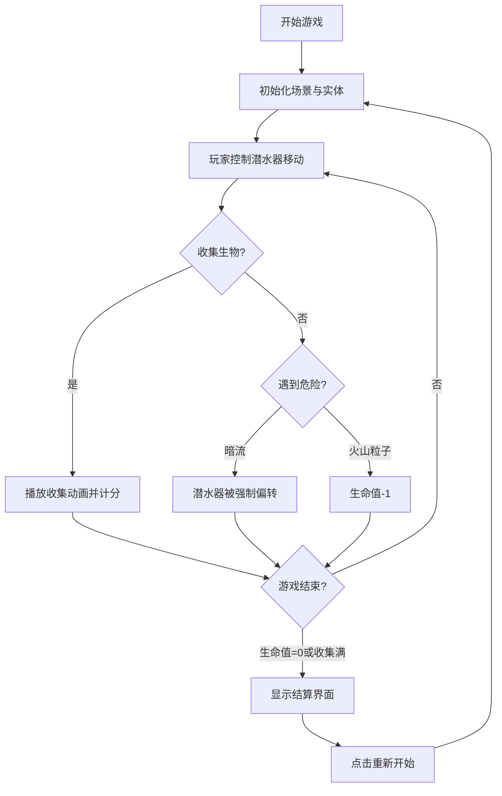

## 1. 产品概述
深海探险与生物收集是一款基于HTML5 Canvas的浏览器交互式游戏，玩家驾驶潜水器在程序化生成的深海地形中探索，收集发光生物并躲避暗流与火山喷发。

- 目标用户：休闲游戏爱好者，喜欢探索与收集类玩法的玩家
- 产品价值：提供沉浸式深海探索体验，结合随机地形与动态事件创造多样化游戏过程

## 2. 核心功能

### 2.1 功能模块
1. **深海场景系统**：Perlin噪声生成起伏地形、深度渐变背景、动态浮游粒子
2. **潜水器控制**：WASD/方向键移动、碰撞检测、生命值管理
3. **发光生物系统**：20种随机分布生物、脉动动画、躲避行为、点击收集
4. **暗流与火山系统**：随机暗流强制偏转、周期性火山喷发粒子伤害
5. **UI信息面板**：毛玻璃风格信息面板、收集列表、生命值、稀有生物提示
6. **游戏结束结算**：半透明遮罩结算界面、分数统计、重新开始按钮

### 2.2 页面详情
| 页面名称 | 模块名称 | 功能描述 |
|---------|---------|----------|
| 游戏主界面 | 深海场景渲染 | 程序化地形、深度渐变、浮游粒子背景 |
| 游戏主界面 | 潜水器与控制 | 圆形潜水器、键盘移动、生命值血条 |
| 游戏主界面 | 生物系统 | 水母/海星/荧光鱼造型、脉动发光、点击收集动画 |
| 游戏主界面 | 危险事件 | 半透明箭头暗流、红橙色火山喷发粒子 |
| 游戏主界面 | 信息面板 | 毛玻璃侧边栏、收集生物列表、生命值进度条、稀有闪光 |
| 游戏主界面 | 深度计 | 左侧垂直进度条显示当前深度百分比 |
| 结算界面 | 结果展示 | 收集总数、稀有数量、总得分、重新开始按钮 |

## 3. 核心流程
玩家启动游戏后进入深海场景，通过键盘控制潜水器探索地图，鼠标点击收集附近发光生物。过程中需要躲避暗流强制偏转和火山喷发粒子伤害。当生命值耗尽或收集满20种生物时进入结算界面，可选择重新开始。

## 4. 用户界面设计

### 4.1 设计风格
- **主色调**：深海蓝紫渐变（顶部#0077B6 → 底部#001F3F）
- **强调色**：暖色系生物发光色（#FF6B6B、#FFD93D、#6BCB77、#4D96FF）
- **危险色**：红橙火山色、蓝色暗流
- **UI风格**：半透明深色毛玻璃（blur 8px）、圆角8px、过渡动画0.3s ease
- **字体**：现代无衬线字体，清晰可读
- **按钮**：悬停背景#FFD93D、圆角8px、过渡0.2s

### 4.2 页面设计概述
| 页面名称 | 模块名称 | UI元素 |
|---------|---------|--------|
| 游戏主界面 | 深海场景 | 蓝紫垂直渐变背景、Perlin地形轮廓、300漂浮粒子 |
| 游戏主界面 | 潜水器 | 白色圆形(r15px)、外发光2px |
| 游戏主界面 | 发光生物 | 水母伞状/海星五角/鱼椭圆、暖色系配色、1.5s脉动缩放±0.1 |
| 游戏主界面 | 暗流 | 半透明蓝色箭头纹理、方向提示 |
| 游戏主界面 | 火山粒子 | 红/橙色圆形(r5-10px)、向上扩散 |
| 游戏主界面 | 信息面板(右) | 毛玻璃背景blur8px、圆角12px、宽180px、内边距12px |
| 游戏主界面 | 深度计(左) | 垂直进度条、0-1000单位、百分比显示 |
| 游戏主界面 | 血条(左下) | 红色进度条、5点生命值 |
| 结算界面 | 遮罩层 | 半透明黑色overlay、居中白色卡片 |
| 结算界面 | 统计信息 | 收集总数、稀有数量、总得分(普通10分/稀有50分) |
| 结算界面 | 重新开始按钮 | 默认半透明深色、悬停#FFD93D、圆角8px |

### 4.3 响应式
- 桌面端优先设计，最小宽度768px
- Canvas全屏自适应，UI面板固定定位
- 深度计与信息面板随视口尺寸保持比例

## 5. 性能要求
- 帧率稳定60FPS
- 实体总数超过150时自动剔除距离玩家最远20%的粒子
- Canvas渲染优化，避免不必要的重绘
