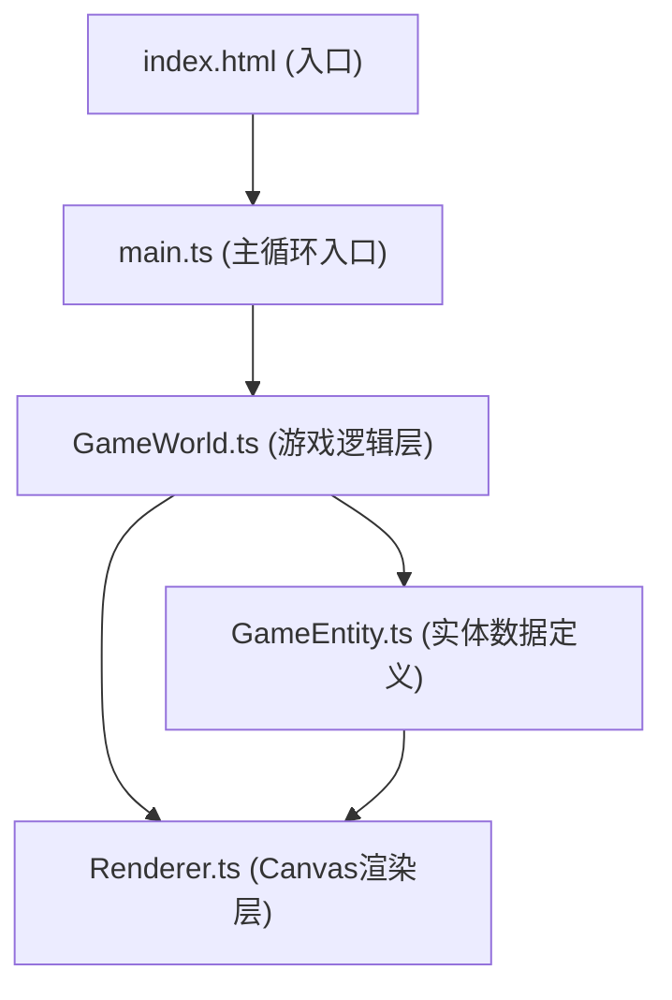

## 1. 架构设计



分层说明：
- **入口层**：index.html 提供Canvas容器与UI DOM锚点
- **主控层**：main.ts 负责初始化、帧循环调度、DOM UI更新
- **逻辑层**：GameWorld.ts 管理玩家、生物、暗流、火山等所有实体与游戏规则
- **数据层**：GameEntity.ts 定义实体接口、基类、类型常量
- **渲染层**：Renderer.ts 接收状态数据，负责所有Canvas绘制

## 2. 技术栈描述
- **前端框架**：原生 TypeScript (无UI框架)
- **构建工具**：Vite 5.x
- **渲染技术**：HTML5 Canvas 2D API
- **模块系统**：ESNext
- **目标环境**：ES2020
- **开发服务器端口**：8080

## 3. 文件结构
| 文件路径 | 职责说明 |
|---------|---------|
| `package.json` | 依赖声明（vite、typescript）、启动脚本 |
| `index.html` | 入口HTML，Canvas全屏容器 + UI层DOM锚点 |
| `vite.config.js` | Vite构建配置，入口index.html，dev server 8080 |
| `tsconfig.json` | TypeScript严格模式配置 |
| `src/main.ts` | 游戏主循环，初始化场景、帧循环、UI更新 |
| `src/GameWorld.ts` | 核心游戏逻辑，实体管理、状态更新、碰撞检测 |
| `src/Renderer.ts` | Canvas全部绘制：地形、实体、粒子、UI |
| `src/GameEntity.ts` | 生物、暗流、火山等实体基类与数据接口 |

## 4. 数据模型定义

### 4.1 核心实体接口

```typescript
// 位置与速度
interface Vec2 { x: number; y: number }

// 实体基类
interface Entity {
  id: string
  position: Vec2
  velocity: Vec2
  type: EntityType
  alive: boolean
}

// 玩家（潜水器）
interface Player extends Entity {
  type: EntityType.PLAYER
  radius: number
  health: number
  maxHealth: number
  currentVelocityOffset: Vec2
  offsetTimer: number
}

// 发光生物
type CreatureShape = 'jellyfish' | 'starfish' | 'fish'
interface Creature extends Entity {
  type: EntityType.CREATURE
  shape: CreatureShape
  color: string
  isRare: boolean
  pulsePhase: number
  fleeing: boolean
  collectAnimating: boolean
  collectProgress: number
  baseRadius: number
}

// 暗流区域
interface Underflow extends Entity {
  type: EntityType.UNDERFLOW
  direction: Vec2
  strength: number
  lifetime: number
  radius: number
}

// 火山喷发粒子
interface VolcanoParticle extends Entity {
  type: EntityType.VOLCANO_PARTICLE
  radius: number
  color: string
  lifetime: number
  maxLifetime: number
}

// 浮游粒子
interface FloatingParticle {
  x: number
  y: number
  baseY: number
  radius: number
  alpha: number
  phase: number
  speed: number
}

// 地形高度图
interface Terrain {
  heights: number[]
  width: number
}

// 收集记录
interface CollectRecord {
  shape: CreatureShape
  color: string
  count: number
}

// 游戏全局状态
interface GameState {
  player: Player
  creatures: Creature[]
  underflows: Underflow[]
  volcanoParticles: VolcanoParticle[]
  floatingParticles: FloatingParticle[]
  terrain: Terrain
  collectedCreatures: Map<string, CollectRecord>
  totalScore: number
  rareCollected: number
  gameOver: boolean
  gameWon: boolean
  lastVolcanoTime: number
  nextVolcanoInterval: number
  rareFlashTimer: number
  mapWidth: number
  mapHeight: number
}

enum EntityType {
  PLAYER = 'player',
  CREATURE = 'creature',
  UNDERFLOW = 'underflow',
  VOLCANO_PARTICLE = 'volcano_particle',
}
```

### 4.2 常量配置
| 常量 | 值 | 说明 |
|-----|---|------|
| MAP_WIDTH | 1000 | 地形宽度（单位） |
| MAP_HEIGHT | 800 | 地形高度（单位） |
| PLAYER_RADIUS | 15 | 潜水器半径 |
| PLAYER_SPEED | 150 | 潜水器移动速度 px/s |
| MAX_HEALTH | 5 | 最大生命值 |
| COLLECT_DISTANCE | 30 | 可收集距离 |
| CREATURE_FLEE_SPEED | 120 | 生物逃离速度 px/s |
| PULSE_PERIOD | 1.5 | 脉动周期（秒） |
| PULSE_AMPLITUDE | 0.1 | 脉动幅度 |
| UNDERFLOW_DURATION | 2 | 暗流持续时间（秒） |
| UNDERFLOW_STRENGTH | 180 | 暗流速度偏移 px/s |
| VOLCANO_INTERVAL_MIN | 15 | 火山最小间隔（秒） |
| VOLCANO_INTERVAL_MAX | 20 | 火山最大间隔（秒） |
| VOLCANO_PARTICLE_LIFETIME | 5 | 火山粒子存活（秒） |
| RARE_CHANCE | 0.15 | 稀有生物概率 |
| CREATURE_COUNT | 20 | 生物总数 |
| FLOATING_PARTICLE_COUNT | 300 | 浮游粒子数 |
| CULL_THRESHOLD | 150 | 性能剔除阈值 |
| CULL_RATIO | 0.2 | 剔除比例 |

## 5. 核心算法

### 5.1 Perlin噪声简化版（地形生成）
使用多层正弦波叠加模拟Perlin噪声：
```
height(x) = Σ amplitude[i] * sin(frequency[i] * x + phase[i])
```
其中 frequency 递增，amplitude 递减。

### 5.2 实体碰撞检测
圆形-圆形碰撞：`distance(centerA, centerB) < radiusA + radiusB`

### 5.3 生物逃离方向
```
dir = normalize(player.pos - creature.pos) * (-1)
creature.vel = dir * FLEE_SPEED
```

### 5.4 性能剔除
当总实体数 > CULL_THRESHOLD 时：
1. 计算所有浮游粒子到玩家的距离
2. 按距离降序排序
3. 剔除前 CULL_RATIO 部分（最远的）

## 6. 渲染流程
每帧执行顺序：
1. 清空画布
2. 绘制深海渐变背景
3. 绘制地形高度图轮廓
4. 绘制浮游粒子
5. 绘制暗流区域箭头
6. 绘制火山喷发粒子
7. 绘制发光生物（含脉动缩放、收集动画）
8. 绘制潜水器（含外发光）
9. Renderer.drawHUD() 调用：深度计、血条、信息面板由Canvas绘制
10. 游戏结束时：主循环中main.ts显示DOM结算层
