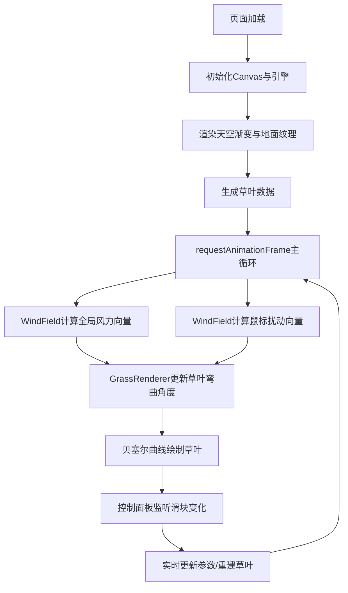

## 1. 产品概述

基于Canvas的动态风场与草地摇曳模拟应用，为自然爱好者提供沉浸式的风与植被互动体验。
- 核心功能：模拟草地在微风和强风下的摇曳效果，支持鼠标划过制造局部气流扰动
- 目标用户：自然爱好者、视觉体验用户、前端交互演示场景

## 2. 核心功能

### 2.1 功能模块
1. **主画布区域**：全屏Canvas渲染天空渐变背景、地面泥土纹理、1500根草叶动态摇曳
2. **风场控制系统**：全局正弦波周期风（10秒周期）、鼠标局部气旋扰动
3. **控制面板**：风速倍率调节、草叶密度调节，实时生效

### 2.2 功能详情
| 模块名称 | 功能描述 |
|---------|---------|
| 草地渲染 | 贝塞尔曲线绘制3顶点草叶，随机高度20-50px，3种绿色随机配色，无风时0.5度/帧自然抖动 |
| 风场控制 | 正弦波强度0-1.2循环，风向0-45度变化，最大弯曲60度，根部0.1秒滞后形成波浪传递 |
| 鼠标交互 | 鼠标位置80px半径内生成旋转气旋，方向跟随鼠标移动，停止后1秒内衰减消散（0.95/帧） |
| 控制面板 | 毛玻璃半透明风格，风速倍率0.5-2.0（默认1.0），密度500-3000（默认1500） |
| 性能优化 | 密度>2000时贝塞尔分段从16降至8段，帧率<30FPS自动关闭抗锯齿，目标60FPS |

## 3. 核心流程

用户进入页面后，Canvas自动初始化并开始渲染动态草地场景。全局风力按正弦波周期变化，草叶自然摇曳。用户可通过鼠标划过画布制造局部气旋扰动，草叶形成波浪传递效果。左下角控制面板可调节风速和草密度，所有交互实时响应。

## 4. 用户界面设计

### 4.1 设计风格
- **主色调**：天空蓝#87CEEB→#F0F8FF渐变，草地绿#4CAF50/#66BB6A/#81C784
- **强调色**：淡绿#A5D6A7、白色#FFFFFF、深灰#37474F
- **面板风格**：半透明毛玻璃（backdrop-filter: blur 8px），圆角12px，内边距12px
- **滑块风格**：圆角细长，0.2s ease-out过渡动效
- **字体**：系统默认无衬线字体，简洁现代

### 4.2 页面设计
| 区域 | 模块 | UI元素 |
|-----|------|--------|
| 全屏 | Canvas容器 | 1000x600逻辑尺寸，16:9比例自适应，居中显示 |
| 画布上部60% | 天空区域 | 线性渐变从#87CEEB到#F0F8FF |
| 画布下部40% | 地面区域 | 草绿色基底+随机泥土颗粒点纹理 |
| 左下角 | 控制面板 | 半透明毛玻璃面板，两个滑块（风速倍率、草叶密度），hover时背景变亮 |
| 鼠标 | 交互区域 | 划过画布时生成局部气旋，草叶向扰动中心弯曲 |

### 4.3 响应式设计
- 桌面端优先，Canvas保持16:9比例自适应窗口
- 画布居中显示，最大尺寸不超过窗口
- 控制面板固定在左下角，不受Canvas缩放影响
