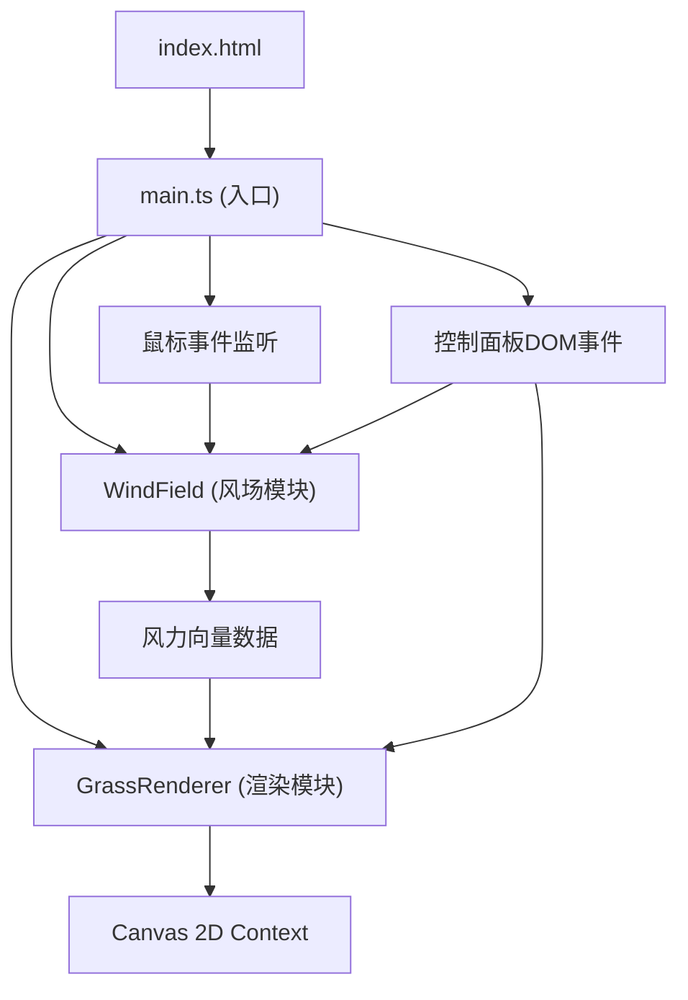

## 1. 架构设计



**数据流向**：main.ts → windField.ts（计算风力向量）→ grassRenderer.ts（应用向量并绘制草叶）

## 2. 技术描述

- **前端框架**：原生HTML/CSS + TypeScript（无React/Vue，按用户需求使用原生实现）
- **构建工具**：Vite 5.x
- **渲染技术**：Canvas 2D API，贝塞尔曲线绘制
- **开发语言**：TypeScript（严格模式，target ES2020，ESNext模块）
- **后端**：无（纯前端项目）
- **数据库**：无

## 3. 文件结构定义

```
project-root/
├── index.html                 # 入口页面，Canvas容器+控制面板DOM
├── package.json               # 依赖配置（vite、typescript）
├── vite.config.js             # Vite构建配置（端口8080，入口index.html）
├── tsconfig.json              # TypeScript配置（严格模式，esnext，es2020）
└── src/
    ├── main.ts                # 应用入口：初始化、事件绑定、主循环
    ├── windField.ts           # 风场控制：全局风、鼠标扰动、风力向量输出
    └── grassRenderer.ts       # 草地渲染：草叶数据、弯曲更新、Canvas绘制
```

### 模块职责与调用关系

| 文件 | 职责 | 对外接口 | 依赖 |
|-----|------|---------|-----|
| main.ts | 初始化Canvas/引擎，绑定鼠标/滑块事件，驱动requestAnimationFrame主循环 | 无（入口文件） | WindField类, GrassRenderer类 |
| windField.ts | 生成全局正弦风力，模拟鼠标气旋扰动，输出(x,y)风力向量 | update(dt), getWindAt(x,y), setMouse(x,y,vx,vy), setWindMultiplier(v) | 无 |
| grassRenderer.ts | 存储草叶数据，应用风力更新弯曲角度，使用贝塞尔曲线绘制草叶 | init(count), update(windField, dt), render(ctx), resize(w,h), setCount(n) | WindField（只读接口） |

## 4. 核心数据模型

### 4.1 WindField 数据

```typescript
interface WindVector {
  x: number;      // 水平风力分量
  y: number;      // 垂直风力分量
}

interface MouseDisturbance {
  x: number;      // 扰动中心X
  y: number;      // 扰动中心Y
  vx: number;     // 鼠标水平速度
  vy: number;     // 鼠标垂直速度
  strength: number; // 当前扰动强度（随时间衰减）
}
```

### 4.2 GrassRenderer 草叶数据

```typescript
interface GrassBlade {
  baseX: number;       // 根部X坐标
  baseY: number;       // 根部Y坐标
  height: number;      // 草叶高度 (20-50px)
  width: number;       // 草叶宽度 (1-2px)
  color: string;       // 草叶颜色
  bendAngle: number;   // 当前弯曲角度（弧度）
  targetBend: number;  // 目标弯曲角度
  rootOffset: number;  // 根部偏移量（滞后效果）
  phase: number;       // 自然抖动相位
}
```

## 5. 性能优化策略

1. **贝塞尔精度自适应**：草叶密度 > 2000 时，曲线分段数从16段降为8段
2. **帧率监控**：每5秒统计FPS，低于30FPS时关闭 `imageSmoothingEnabled` 抗锯齿
3. **增量更新**：仅在密度滑块变化时重建草叶数组，避免每帧GC
4. **对象池**：草叶数据对象复用，避免频繁创建销毁
5. **requestAnimationFrame**：使用原生RAF，与浏览器刷新率同步
