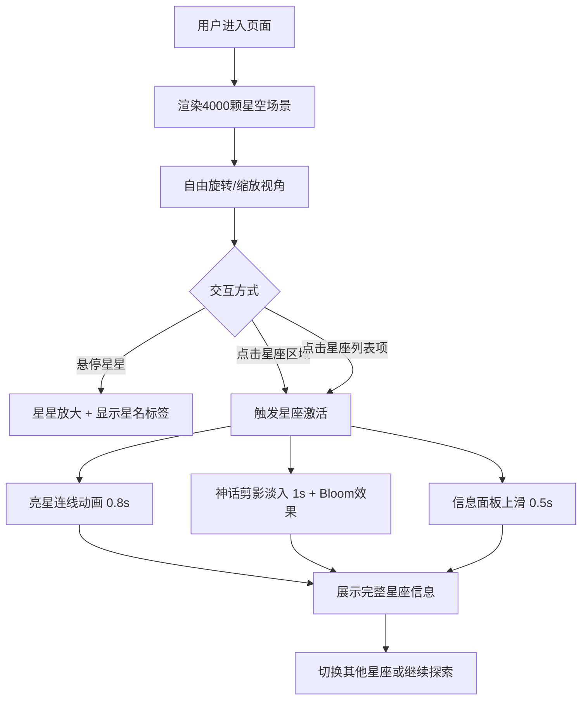

## 1. 产品概述

基于Three.js的交互式星座神话星空投影仪，将夜空中的星座与古希腊神话故事结合，让用户在沉浸式3D星空场景中探索星座与神话。

- 主要用途：天文科普教育、神话文化展示、沉浸式艺术体验
- 目标用户：天文爱好者、学生、文化艺术爱好者、普通大众用户
- 产品价值：以可视化交互方式呈现传统文化与科学知识，兼具教育性与观赏性

## 2. 核心功能

### 2.1 用户角色
无角色区分，所有用户均可自由体验全部功能。

### 2.2 功能模块
1. **3D星空场景**：4000颗真实坐标星星渲染、深空背景、交互式视角控制
2. **星座交互系统**：点击激活星座、亮星连线动画、神话剪影展示、故事面板
3. **星座导航列表**：右下角可滚动列表、缩略预览图、选中高亮、快捷跳转
4. **悬停交互**：星星悬停放大、名称标签显示、视觉反馈

### 2.3 页面详情
| 页面名称 | 模块名称 | 功能描述 |
|-----------|-------------|---------------------|
| 主界面 | 3D星空场景 | 全屏深空蓝色背景，4000颗星星按真实赤经赤纬映射到球面半径20单位，鼠标拖拽旋转，滚轮缩放 |
| 主界面 | 星星交互 | 星等>3的金色光晕，其余淡蓝灰色，悬停放大1.5倍并显示星名标签 |
| 主界面 | 星座激活 | 点击星座区域触发连线动画（0.8s从中心向外扩散）、神话剪影淡入（1s）、信息面板上滑（0.5s） |
| 主界面 | 信息面板 | 毛玻璃背景blur 10px，圆角12px，最大宽度300px，含星座名、神话故事、小型星图 |
| 主界面 | 星座列表 | 右下角可滚动，圆角8px列表项，悬停背景#2A2D40，选中边框#FFD700，附60x60预览图 |
| 主界面 | 控制面板 | 左上角与右下角深色半透明毛玻璃风格，按钮滑块平滑过渡0.3s |

## 3. 核心流程

用户进入页面后首先看到全屏星空场景，可通过鼠标拖拽自由旋转视角、滚轮缩放观察星空。当鼠标悬停在星星上时，星星放大并显示名称。用户可通过两种方式探索星座：一是直接点击星空区域中的星座亮星，二是点击右下角星座列表中的项。激活星座后，亮星连线动画播放，神话角色剪影淡入，下方信息面板滑出展示故事内容。用户可继续旋转查看或切换其他星座。

## 4. 用户界面设计

### 4.1 设计风格
- **主色调**：深空蓝 #0B1026 作为全屏背景
- **点缀色**：金色 #FFD700 用于亮星光晕、选中高亮边框
- **辅助色**：淡蓝灰色 #B0C4DE 用于暗星、半透明白用于剪影和连线
- **面板色**：深色半透明 #1A1D2E 配合毛玻璃backdrop-blur
- **字体**：采用优雅的无衬线字体，主标题使用展示字体增强神话感
- **整体风格**：深空神秘主义，沉浸式氛围，精致的发光与毛玻璃效果，极简控制面板

### 4.2 页面设计概述
| 页面名称 | 模块名称 | UI元素 |
|-----------|-------------|-------------|
| 主界面 | 3D星空 | 深空蓝渐变背景，4000颗粒子星星，金色亮星带发光，暗星小颗粒 |
| 主界面 | 悬停标签 | 白色14px字体，黑色描边，跟随鼠标位置，出现/消失平滑过渡 |
| 主界面 | 星座连线 | 白色半透明线条，从星座中心向外扩散的动画效果 |
| 主界面 | 神话剪影 | ShapeGeometry构建，半透明白色(alpha 0.6)，Bloom发光轮廓，淡入动画 |
| 主界面 | 信息面板 | 毛玻璃背景，blur 10px，圆角12px，从底部上滑ease-out 0.5s，最大宽300px |
| 主界面 | 星座列表 | 右下角，固定宽高，overflow-y滚动，列表项圆角8px，悬停变色，选中金色边框，含60x60缩略图 |
| 主界面 | 控制面板 | 左上角，深色毛玻璃，圆角，按钮/滑块过渡0.3s |

### 4.3 响应式设计
- 采用桌面优先设计，移动端在768px断点自动适配
- 移动端：星座列表宽度自适应，信息面板宽度全屏，交互控件尺寸放大适配触摸
- 触摸设备：支持单指拖拽旋转、双指捏合缩放

### 4.4 3D场景指引
- **环境**：纯深空蓝背景，无HDRI，营造纯净星空氛围
- **光照**：环境光+点光源，主要星星自发光，剪影通过Bloom后处理产生发光效果
- **相机**：PerspectiveCamera，初始距离球面约30单位，缩放范围10-50单位
- **运动**：OrbitControls，禁止平移，仅允许绕Y轴旋转和缩放，启用阻尼效果
- **交互**：Raycaster进行星星拾取，悬停检测，点击判定
- **后处理**：UnrealBloomPass，强度0.8，仅应用于神话剪影轮廓和亮星
- **性能**：BufferGeometry渲染4000星星，PointsMaterial，帧率目标50FPS+
