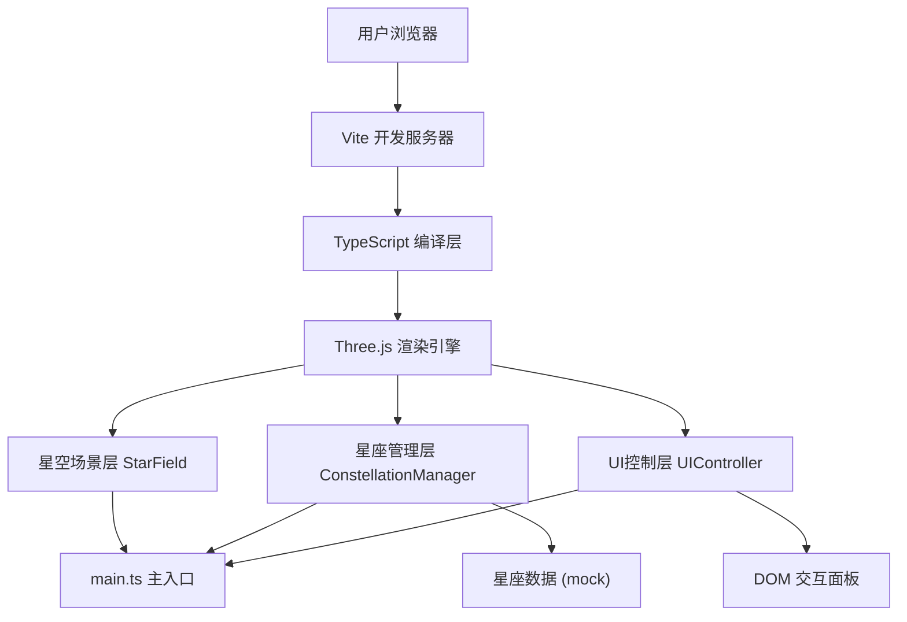

## 1. 架构设计



## 2. 技术说明

- **前端框架**：原生 TypeScript + Three.js (无React/Vue，直接操作WebGL和DOM)
- **构建工具**：Vite 5.x
- **3D渲染**：Three.js (r160+)，使用 BufferGeometry + Points 优化粒子性能
- **后处理**：Three.js examples/jsm/postprocessing/UnrealBloomPass
- **交互控制**：Three.js examples/jsm/controls/OrbitControls
- **UI样式**：原生 CSS + CSS Variables + backdrop-filter 毛玻璃
- **初始化方式**：手动创建项目结构，通过 npm install 安装依赖

## 3. 文件结构

```
auto155/
├── .trae/documents/
│   ├── PRD-星空投影仪.md
│   └── 技术架构-星空投影仪.md
├── src/
│   ├── main.ts                    # 应用入口，初始化场景/相机/渲染器/控制器
│   ├── starField.ts               # 星空渲染模块：4000星星BufferGeometry、拾取、悬停
│   ├── constellationManager.ts    # 星座管理：数据、连线动画、剪影Shape、故事文本
│   └── uiController.ts            # UI控制：星座列表、信息面板、控制面板、响应式
├── index.html                     # 入口页面，canvas容器 + DOM面板
├── vite.config.js                 # Vite配置，端口8080
├── tsconfig.json                  # TypeScript严格模式
└── package.json                   # 依赖与脚本
```

## 4. 模块职责

### 4.1 main.ts
- 创建 WebGLRenderer、Scene、PerspectiveCamera、OrbitControls
- 设置渲染循环（requestAnimationFrame）
- 处理 window resize 事件
- 初始化 StarField、ConstellationManager、UIController
- 协调各模块事件通信

### 4.2 starField.ts
- 生成 4000 颗星星：赤经赤纬 → 球面坐标 (半径20)
- 使用 BufferGeometry 存储 position、color、size 属性
- PointsMaterial 渲染，星等>3 用金色 #FFD700 发光1.5，其余 #B0C4DE 大小0.02
- Raycaster 实现悬停检测：星星放大1.5倍，显示白色14px带黑描边标签
- 暴露星星拾取接口，供 ConstellationManager 判断点击的星座

### 4.3 constellationManager.ts
- 内置星座 mock 数据（至少6个经典星座：大熊座、仙后座、猎户座、天蝎座、狮子座、天琴座）
- 每个星座数据包含：亮星赤经赤纬坐标、连线索引对、神话剪影Shape顶点、故事文本
- 点击星座后：逐条绘制白色半透明连线（0.8s从中心向外扩散动画）
- ShapeGeometry 创建神话剪影：半透明白色 alpha=0.6，Bloom强度0.8
- 剪影淡入动画 1s，通过 material.opacity 从 0→0.6
- 向 UIController 发送事件，触发信息面板显示

### 4.4 uiController.ts
- 创建左上角控制面板、右下角星座列表 DOM 元素
- 星座列表：可滚动，列表项圆角8px，悬停#2A2D40，选中边框#FFD700
- 每个列表项绘制 60x60 canvas 缩略星图
- 信息面板：毛玻璃 blur 10px，圆角12px，最大宽300px，底部上滑 ease-out 0.5s
- 响应式：媒体查询 768px 断点，移动端自适应
- 监听 ConstellationManager 事件更新UI

## 5. 核心数据模型

```typescript
// 星星数据
interface StarData {
  ra: number;           // 赤经 (弧度)
  dec: number;          // 赤纬 (弧度)
  magnitude: number;    // 星等
  name?: string;        // 星名
  constellationId?: string; // 所属星座ID
}

// 星座数据
interface Constellation {
  id: string;
  name: string;         // 中文名
  latinName: string;    // 拉丁名
  stars: { ra: number; dec: number; name: string; magnitude: number }[];
  lines: [number, number][];  // 连线索引对
  silhouettePoints: { x: number; y: number }[]; // 剪影轮廓点
  center: { ra: number; dec: number }; // 星座中心
  story: string;        // 神话故事文本
}
```

## 6. 性能优化策略

- **星星渲染**：BufferGeometry + Points 而非独立Mesh，减少draw call
- **拣选优化**：Raycaster 每帧检测但仅对可视范围星星计算
- **动画帧率**：使用 requestAnimationFrame + deltaTime 控制动画速度
- **Bloom限制**：仅神话剪影和亮星参与Bloom，暗星不触发后处理
- **内存管理**：切换星座时及时 dispose 旧 Geometry 和 Material
- **CSS优化**：使用 transform/opacity 动画触发GPU合成层，避免reflow
