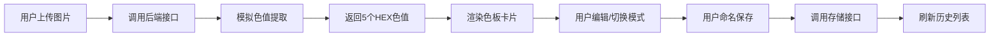

## 1. 产品概述
在线调色板与配色方案生成器，为独立插画师和设计师提供智能色彩提取与配色方案管理工具。
- 基于上传图片自动提取主色调，生成和谐配色方案（互补、类似、三角色）
- 提供色值复制、方案保存与历史管理，帮助设计师快速建立色彩体系

## 2. 核心功能

### 2.1 功能模块
1. **主页面**：图片上传区、色板编辑区、历史方案区

### 2.2 页面详情
| 页面名称 | 模块名称 | 功能描述 |
|-----------|-------------|---------------------|
| 主页面 | 图片上传区 | 支持点击/拖拽上传JPEG/PNG图片（≤5MB），实时显示提取进度动画 |
| 主页面 | 色板编辑区 | 显示5个主色卡片，支持点击编辑HEX色值，提供互补/类似/三角色自动配色模式 |
| 主页面 | 历史方案区 | 展示已保存的配色方案卡片网格，支持点击加载到编辑区 |

## 3. 核心流程
用户上传图片 → 后端提取5个主色 → 前端渲染色板卡片 → 用户手动编辑或切换配色模式 → 用户命名并保存方案 → 方案存入后端内存 → 历史方案列表更新 → 用户可点击历史方案重新加载

## 4. 用户界面设计

### 4.1 设计风格
- **主色**：#6C63FF
- **辅助色**：#F0C040
- **背景色**：#1E1E2E（主背景）、#2B2B3D（卡片背景）
- **错误色**：#FF4444
- **按钮样式**：圆角8px，主色按钮悬停变暗#5A52D5
- **字体**：现代无衬线字体
- **布局**：三栏式布局（30% / 45% / 25%），桌面优先

### 4.2 页面设计概述
| 页面名称 | 模块名称 | UI元素 |
|-----------|-------------|-------------|
| 主页面 | 图片上传区 | 毛玻璃背景blur 8px，圆角16px，#6C63FF虚线2px边框，居中拖拽区域 |
| 主页面 | 色板编辑区 | 2行3列网格，色值圆点直径48px，圆角12px卡片，色值文字#FFFFFF 12px |
| 主页面 | 历史方案区 | 可滚动列表max-height 80vh，方案卡片显示名称+5个色块（高30px宽60px圆角4px） |

### 4.3 响应式
- 桌面端（≥768px）：三栏横向布局（30% / 45% / 25%）
- 移动端（<768px）：三栏纵向堆叠

### 4.4 动画效果
- 所有交互平滑过渡：0.3s cubic-bezier
- 提取进度：旋转环动画（主色#6C63FF），2秒超时
- 保存成功：绿色对勾动画，0.5秒后消失
- 错误提示：红色圆角条从顶部滑入
