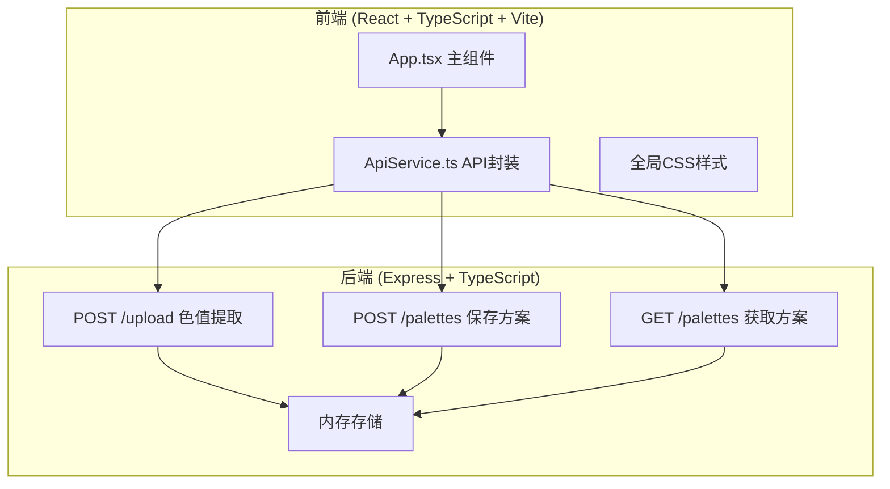
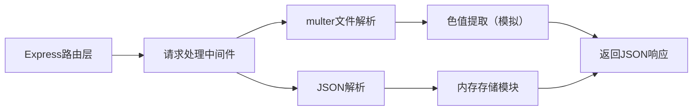
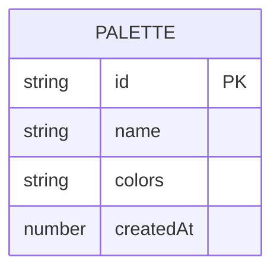

## 1. 架构设计



## 2. 技术描述
- **前端**：React 18 + TypeScript + Vite（无外部状态管理库，使用React Hooks）
- **后端**：Express 4 + TypeScript + multer（文件上传）
- **构建工具**：Vite（前端）+ ts-node / tsc（后端）
- **数据存储**：内存存储（仅运行时）

## 3. 路由定义
| 路由 | 用途 |
|-------|---------|
| / | 主应用页面 |

## 4. API 定义

### 类型定义
```typescript
// 色值提取响应
interface ExtractColorsResponse {
  colors: string[]; // 5个HEX色值数组
}

// 保存配色方案请求
interface SavePaletteRequest {
  name: string;
  colors: string[];
}

// 配色方案响应
interface Palette {
  id: string;
  name: string;
  colors: string[];
  createdAt: number;
}
```

### 接口详情
- **POST /upload**
  - 请求：multipart/form-data，字段名 `image`（File类型）
  - 响应：`{ colors: string[] }`（5个HEX色值）
  - 模拟处理时间 ≤ 500ms

- **POST /palettes**
  - 请求：`{ name: string, colors: string[] }`
  - 响应：`{ id: string, name: string, colors: string[], createdAt: number }`

- **GET /palettes**
  - 请求：无参数
  - 响应：`Palette[]`

## 5. 服务端架构图



## 6. 数据模型

### 6.1 数据模型定义



### 6.2 内存数据结构
```typescript
// 内存存储结构
interface MemoryStore {
  palettes: Palette[];
}
```

## 7. 文件结构
```
auto157/
├── package.json
├── index.html
├── vite.config.js
├── tsconfig.json
├── src/
│   ├── App.tsx
│   ├── ApiService.ts
│   └── index.css
└── server/
    └── index.ts
```
