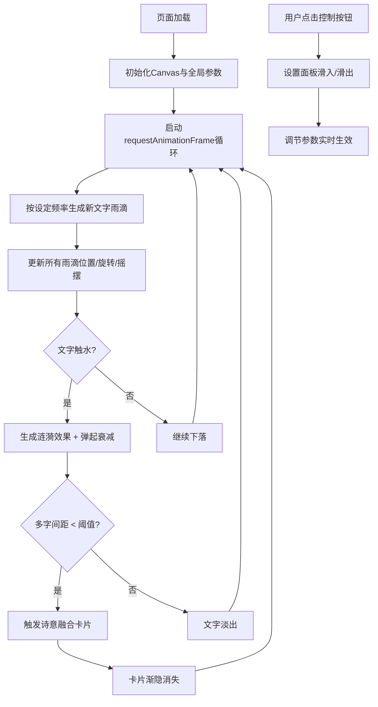

## 1. 产品概述

文字落雨与诗意碰撞交互式动画——一个沉浸式的中文诗词视觉艺术体验。用户可以欣赏汉字如雨滴般飘落，触碰水面激起涟漪，并在近距离碰撞时融合成诗意短句卡片。

- 目标用户：文学爱好者、艺术欣赏者、追求视觉美感的普通用户
- 核心价值：将中国古典诗词以动态视觉形式呈现，创造宁静而富有诗意的沉浸体验

## 2. 核心功能

### 2.1 功能模块
1. **文字雨动画**：中文诗句文字从屏幕顶部持续下落，带有摇摆和旋转效果
2. **水面涟漪系统**：文字触水时激起点状涟漪和扩散波纹
3. **诗意融合特效**：近距离下落的文字聚集形成毛玻璃短句卡片
4. **星光背景**：深蓝至深紫渐变背景搭配闪烁星光粒子
5. **交互控制面板**：右下角圆形按钮打开设置面板，可调节密度、速度、融合阈值

### 2.2 页面详情
| 页面名称 | 模块名称 | 功能描述 |
|-----------|-------------|---------------------|
| 主场景 | 文字雨系统 | 诗句文字随机下落，带摇摆、旋转、发光效果 |
| 主场景 | 水面涟漪 | 点状爆发 + 环形波纹扩散动画 |
| 主场景 | 诗意融合 | 间距小于阈值的文字聚合成卡片，渐隐消失 |
| 主场景 | 背景氛围 | 渐变背景 + 50颗闪烁星光粒子 |
| 主场景 | 控制面板 | 三个滑块：文字密度、速度倍率、融合间距 |

## 3. 核心流程

## 4. 用户界面设计

### 4.1 设计风格
- **主色调**：深蓝 #0B0C2A → 深紫 #1B1E3E 渐变
- **文字色系**：朱红 #C23B22、黛蓝 #2B4F6E、翠绿 #3B7A57、金色 #C9A96E、墨色 #2F2F2F
- **按钮风格**：圆形半透明（背景 #FFFFFF 0.15，悬停 0.3），直径 40px
- **字体**：Noto Serif SC 衬线体
- **卡片风格**：毛玻璃背景，圆角 12px，半透明 0.85
- **布局风格**：全屏沉浸式，无多余 UI

### 4.2 页面设计概述
| 页面名称 | 模块名称 | UI 元素 |
|-----------|-------------|-------------|
| 主场景 | 背景 | 线性渐变（上深紫下深蓝）、50颗星光粒子（1-2px，透明度 0.3-0.7 闪烁） |
| 主场景 | 文字雨滴 | 18-24px 衬线体、发光阴影（shadowBlur 8px）、正弦摇摆、缓慢旋转 |
| 主场景 | 水面涟漪 | 白色点状爆发（2px→12px）、环形波纹（18px→80px，线宽2px） |
| 主场景 | 诗意卡片 | 毛玻璃效果、圆角12px、透明度0.85、浮于水面渐隐 |
| 主场景 | 控制区 | 右下角圆形按钮、底部滑出面板（高150px，背景 #000000 0.6）、三个滑块 |

### 4.3 响应式
- 桌面优先，移动端自适应
- 屏幕宽度 < 768px 时：文字大小和涟漪动画整体缩放 0.7 倍，控制按钮移至左下角
- Canvas 自适应视口宽高，resize 时自动重算

### 4.4 动画节奏
- 文字下落：1.5-3.5 px/帧
- 星光闪烁：缓慢呼吸式透明度变化
- 面板动画：滑入/滑出 0.3s ease-out
- 涟漪爆发：0.05s 点状扩张 + 0.8s 环形扩散
- 融合卡片：渐隐式淡出
