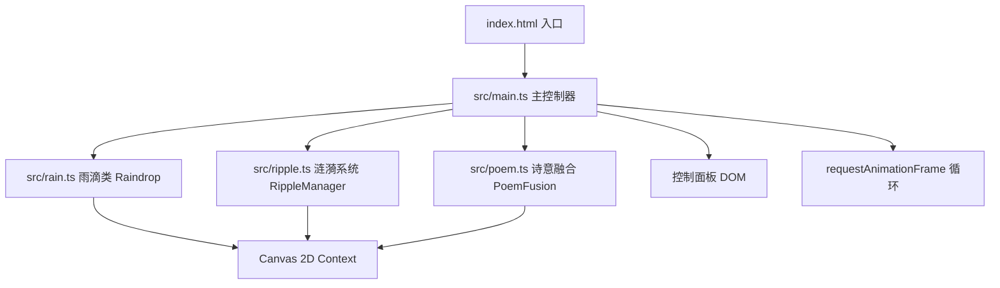

## 1. 架构设计



## 2. 技术描述
- **前端框架**：纯 TypeScript（无 React/Vue，Canvas 2D 渲染）
- **构建工具**：Vite 5.x
- **开发语言**：TypeScript 5.x
- **无后端、无数据库**，纯前端静态项目

## 3. 文件结构与职责

| 文件 | 职责 |
|------|------|
| package.json | 项目依赖（vite、typescript）与脚本（npm run dev） |
| vite.config.js | Vite 构建配置 |
| index.html | 入口 HTML，引入 Noto Serif SC 字体，挂载 Canvas |
| src/main.ts | 主控制器：场景初始化、Canvas 渲染循环、背景绘制、控制面板、全局参数 |
| src/rain.ts | Raindrop 类：单个文字雨滴的属性、运动、绘制、触水检测 |
| src/ripple.ts | Ripple 与 RippleManager：点状涟漪 + 环形波纹的生命周期管理 |
| src/poem.ts | PoemFusion 与 FusionCard：近距离检测、短句卡片生成与渲染 |

## 4. 核心类设计

### 4.1 Raindrop（src/rain.ts）
```typescript
interface Raindrop {
  char: string;           // 单字
  x: number; y: number;   // 当前位置
  baseX: number;          // 基准 X（用于正弦摇摆）
  vy: number;             // 下落速度
  size: number;           // 字体大小 18-24px
  color: string;          // 5种中国风颜色之一
  rotation: number;       // 当前旋转角度
  angularVelocity: number;// 角速度
  swayAmplitude: number;  // 摇摆振幅 2-4px
  swayFrequency: number;  // 摇摆频率 0.01-0.03
  swayPhase: number;      // 相位
  hasHit: boolean;        // 是否已触水
  bounceVelocity: number; // 弹起速度
  opacity: number;        // 透明度
}
```

### 4.2 Ripple（src/ripple.ts）
```typescript
interface Ripple {
  x: number; y: number;
  type: 'dot' | 'ring';
  startTime: number;
  duration: number;       // dot: 50ms, ring: 800ms
  startRadius: number;    // dot: 2, ring: 18
  endRadius: number;      // dot: 12, ring: 80
  color: string;
  lineWidth?: number;     // ring: 2px
  progress: number;       // 0-1
  alive: boolean;
}
```

### 4.3 FusionCard（src/poem.ts）
```typescript
interface FusionCard {
  x: number; y: number;
  text: string;           // 聚合的短句
  startTime: number;
  duration: number;       // 显示时长
  opacity: number;
  alive: boolean;
}
```

## 5. 性能策略

- **50 FPS+ 目标**：使用 requestAnimationFrame，所有计算轻量化
- **对象池化**：Raindrop、Ripple 对象复用，避免频繁 GC
- **离屏绘制**：背景渐变可缓存至离屏 Canvas（可选优化）
- **数量上限**：雨滴最大数量限制（如 200 个），超出则丢弃最早生成的
- **Canvas 尺寸**：在高 DPI 屏幕上使用 devicePixelRatio 缩放以保证清晰度

## 6. 全局配置参数

```typescript
interface Config {
  density: number;        // 5-30 字/秒，默认 15
  speedMultiplier: number;// 0.5-2x，默认 1.0
  fusionThreshold: number;// 10-60px，默认 30
  waterLineRatio: number; // 0.85（Canvas 高度的 85%）
}
```
