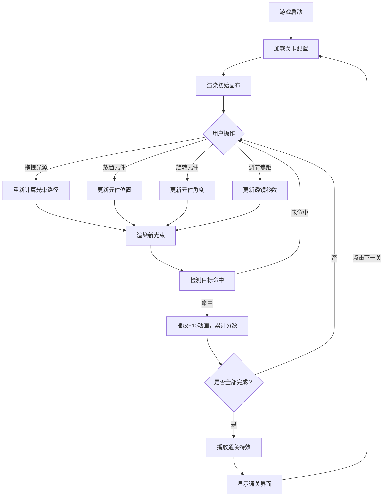

## 1. 产品概述

交互式光学谜题游戏 - 一个在浏览器中运行的光线传播与折射模拟应用，帮助物理爱好者和学生直观理解光的折射定律（Snell定律）和透镜聚焦原理。

- 主要用途：教育与娱乐结合的物理模拟游戏，通过互动方式学习光学原理
- 目标用户：物理爱好者、学生、教师
- 核心价值：将抽象的光学定律转化为可视化、可操作的互动体验

## 2. 核心特性

### 2.1 功能模块

1. **主游戏画布**：Canvas渲染，深灰色背景（#1A1A2E），支持光源拖拽、光学元件放置
2. **光束系统**：5条彩色光束（红橙黄绿蓝），遵循Snell定律折射，实时路径计算
3. **光学元件库**：凸透镜（焦距可调）、凹透镜、棱镜，支持拖拽放置和旋转操作
4. **目标系统**：右侧彩色目标槽，光束颜色匹配且准确射入时得分
5. **关卡系统**：8个预设关卡，渐进难度，进度追踪和通关特效
6. **UI交互**：左侧工具栏、右侧关卡栏、分数动画、通关动画

### 2.2 页面详情

| 页面名称 | 模块名称 | 功能描述 |
|-----------|-------------|---------------------|
| 主游戏页 | Canvas画布 | 光源拖拽、光束渲染、光学元件渲染、目标槽渲染 |
| 主游戏页 | 左侧工具栏 | 光学元件拖拽、凸透镜焦距调节滑块 |
| 主游戏页 | 右侧关卡栏 | 关卡列表按钮、当前关卡进度条 |
| 主游戏页 | 顶部进度条 | 0-5个目标完成进度，渐变色显示 |
| 主游戏页 | 得分动画 | +10分向上飘动效果 |
| 主游戏页 | 通关界面 | LEVEL COMPLETE文字、下一关按钮 |

## 3. 核心流程

### 3.1 用户操作流程

1. 用户进入游戏，默认加载第一关
2. 从左侧工具栏拖拽光学元件到画布上
3. 点击元件进行旋转调整角度
4. 拖动光源调整位置
5. 观察光束折射路径，调整元件使光束射入对应颜色的目标槽
6. 完成所有5个目标后自动触发通关特效
7. 点击"下一个关卡"进入下一关

### 3.2 流程图

## 4. 用户界面设计

### 4.1 设计风格

- **主题色系**：深色科技感主题
  - 主背景：#0F0F23
  - 副面板：#1A1A3E
  - 画布背景：#1A1A2E
  - 工具栏背景：半透明毛玻璃（blur 12px）
  - 工具栏悬停：#3A3F5C
- **强调色**：
  - 光源：黄色发光
  - 光束：红#FF5252、橙#FF9800、黄#FFEB3B、绿#4CAF50、蓝#2196F3
  - 发光效果：青色#00FFFF，模糊10px
  - 进度条渐变：#FF5252 → #69F0AE
  - 通关按钮：#4FC3F7
  - 通关金色：#FFD700
- **圆角风格**：统一圆角12px，按钮/面板圆角8-16px
- **交互反馈**：所有过渡动画0.2s ease-out

### 4.2 页面设计概述

| 页面名称 | 模块名称 | UI元素 |
|-----------|-------------|-------------|
| 主游戏页 | Canvas画布 | 深灰背景、发光光束、彩色目标槽、半透明光学元件 |
| 主游戏页 | 左侧工具栏 | 毛玻璃面板、圆角16px、内边距12px、宽200px、悬停变亮 |
| 主游戏页 | 右侧关卡栏 | 竖排按钮、圆角8px、背景#2A2D3E、通关后变绿#4CAF50 |
| 主游戏页 | 顶部进度条 | 渐变颜色、5个目标点 |
| 主游戏页 | 得分动画 | 白色加粗文字、向上飘动1.5秒、渐隐 |
| 主游戏页 | 通关界面 | 毛玻璃背景、圆角20px、白色32px文字、下一关按钮 |

### 4.3 响应式设计

- **桌面端**（≥900px）：三栏布局 - 左侧工具 + 居中画布 + 右侧关卡
- **移动端**（<900px）：上下布局 - 工具在上 + 画布居中 + 关卡在下
- **触摸优化**：拖拽区域放大，点击目标增大

### 4.4 视觉特效

- **光源**：黄色圆点半径8px，发光效果
- **光束**：线宽2px，青色发光阴影（#00FFFF，模糊10px）
- **折射点**：白色小圆半径3px，闪烁周期0.5秒
- **元件拖拽**：半透明显示（0.6）跟随鼠标
- **元件选中**：浅色虚线圆环（圆角10px，虚线4px间隔4px）
- **光束过渡**：方向变化0.2秒ease-out动画
