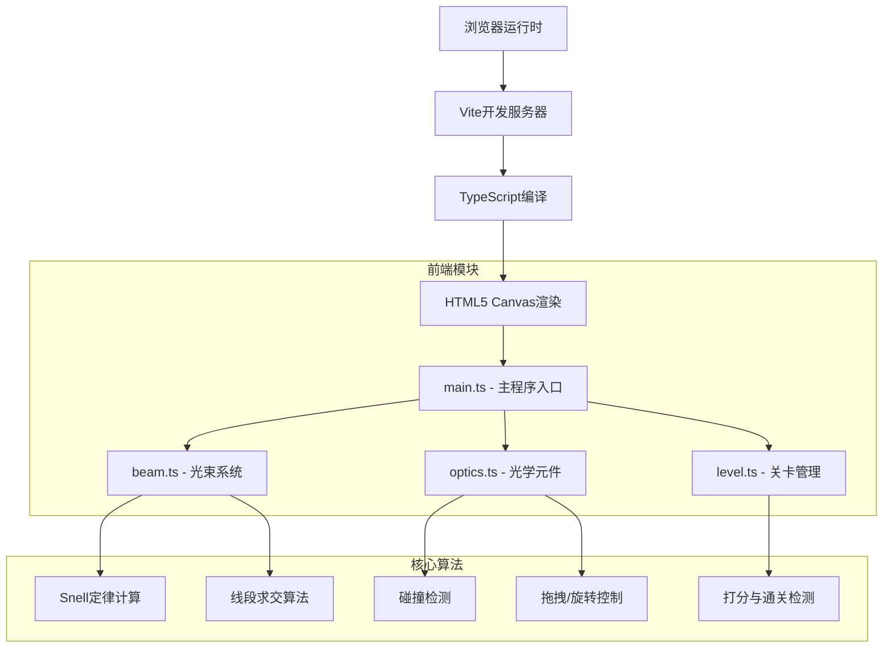

## 1. 架构设计



## 2. 技术描述

- **前端框架**：纯TypeScript + HTML5 Canvas（无框架）
- **构建工具**：Vite
- **语言**：TypeScript（严格模式，ES2020 target）
- **无外部物理引擎**：手动实现Snell定律和线段求交
- **无UI框架**：原生Canvas + CSS

### 2.1 技术选型说明

用户明确要求使用TypeScript、HTML5 Canvas和Vite，不使用外部物理引擎和UI框架，所有逻辑手动实现。

## 3. 项目结构

```
.
├── package.json
├── index.html
├── vite.config.js
├── tsconfig.json
└── src/
    ├── main.ts      # 程序入口：Canvas初始化、事件循环、UI交互
    ├── beam.ts      # 光束类：光源、路径计算、Snell折射
    ├── optics.ts    # 光学元件：凸透镜、凹透镜、棱镜
    └── level.ts     # 关卡管理：关卡配置、打分、通关检测
```

## 4. 核心数据结构与接口

### 4.1 类型定义（TypeScript）

```typescript
// 2D点坐标
interface Point {
  x: number;
  y: number;
}

// 颜色定义
type BeamColor = 'red' | 'orange' | 'yellow' | 'green' | 'blue';

// 光束线段
interface BeamSegment {
  start: Point;
  end: Point;
  color: BeamColor;
  refracted: boolean;
}

// 光学元件类型
type OpticType = 'convex-lens' | 'concave-lens' | 'prism';

// 光学元件基础接口
interface OpticElement {
  id: string;
  type: OpticType;
  position: Point;
  rotation: number; // 弧度
  refractiveIndex: number;
  focalLength?: number; // 透镜焦距
  isDragging?: boolean;
  isSelected?: boolean;
}

// 目标槽
interface TargetSlot {
  position: Point;
  width: number;
  height: number;
  color: BeamColor;
  hit: boolean;
}

// 关卡配置
interface LevelConfig {
  id: number;
  name: string;
  lightSource: Point;
  optics: OpticElement[];
  targets: TargetSlot[];
}

// 游戏状态
interface GameState {
  currentLevel: number;
  score: number;
  completedLevels: number[];
}
```

## 5. 核心算法

### 5.1 Snell定律实现

```
n1 * sin(θ1) = n2 * sin(θ2)
其中：
  n1 = 入射介质折射率（空气=1.0）
  n2 = 折射介质折射率（玻璃≈1.5）
  θ1 = 入射角（相对于法线）
  θ2 = 折射角
```

### 5.2 线段求交算法

使用参数方程求解两条线段的交点：
```
P = A + t*(B-A)  [0 ≤ t ≤ 1]
P = C + s*(D-C)  [0 ≤ s ≤ 1]
联立求解t和s
```

### 5.3 性能优化

- 光束路径计算：O(n)，n为元件数量
- 碰撞检测：空间分区优化
- Canvas渲染：requestAnimationFrame 60fps
- 事件节流：拖拽操作使用requestAnimationFrame合并

## 6. 事件系统

| 事件类型 | 处理函数 | 说明 |
|----------|----------|------|
| mousedown | onMouseDown | 开始拖拽光源或元件 |
| mousemove | onMouseMove | 拖拽更新位置 |
| mouseup | onMouseUp | 结束拖拽 |
| click | onClick | 点击元件旋转 |
| input (滑块) | onFocalLengthChange | 调节透镜焦距 |

## 7. 渲染流水线

每帧（60fps）执行：
1. 清空画布
2. 绘制背景
3. 计算所有光束路径（Snell折射）
4. 绘制光学元件
5. 绘制光束
6. 绘制光源
7. 绘制目标槽
8. 检测目标命中
9. 更新UI（分数、进度条）
