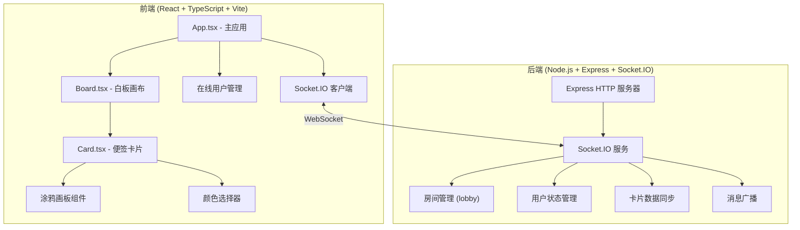

## 1. 架构设计



## 2. 技术说明

- **前端框架**：React 18 + TypeScript + Vite
- **状态管理**：React Hooks (useState, useEffect, useRef) 进行组件级状态管理
- **实时通信**：Socket.IO Client
- **后端框架**：Express 4 + Socket.IO
- **构建工具**：Vite 5
- **样式方案**：原生 CSS + CSS 变量 (无额外CSS框架)

## 3. 文件结构定义

| 文件路径 | 用途 |
|----------|------|
| `/package.json` | 项目依赖和启动脚本配置 |
| `/vite.config.js` | Vite 构建配置 |
| `/tsconfig.json` | TypeScript 编译配置 (严格模式, ESNext) |
| `/index.html` | 应用入口 HTML |
| `/server.js` | Node.js 后端服务 (Express + Socket.IO) |
| `/src/App.tsx` | 主应用组件，管理全局状态和 Socket 连接 |
| `/src/Board.tsx` | 白板画布组件，渲染卡片、处理拖拽和缩放 |
| `/src/Card.tsx` | 便签卡片组件，文字编辑、颜色选择、涂鸦功能 |
| `/src/index.css` | 全局样式和 CSS 变量 |
| `/src/main.tsx` | React 应用入口 |

## 4. Socket.IO 事件定义

### 客户端 → 服务器
| 事件名 | 数据类型 | 用途 |
|--------|----------|------|
| `join_room` | `{ roomId: string, userId: string, userName: string, userColor: string }` | 用户加入房间 |
| `create_card` | `CardData` | 创建便签卡片 |
| `move_card` | `{ cardId: string, x: number, y: number }` | 移动卡片位置 |
| `update_card_text` | `{ cardId: string, text: string }` | 更新卡片文字 |
| `update_card_color` | `{ cardId: string, color: string }` | 更新卡片颜色 |
| `update_card_drawing` | `{ cardId: string, drawing: DrawingPath[] }` | 更新卡片涂鸦 |
| `clear_board` | `{ roomId: string }` | 清空白板 |
| `disconnect` | - | 用户断开连接 |

### 服务器 → 客户端
| 事件名 | 数据类型 | 用途 |
|--------|----------|------|
| `room_state` | `{ users: User[], cards: CardData[] }` | 发送当前房间完整状态 |
| `user_joined` | `User` | 新用户加入通知 |
| `user_left` | `{ userId: string }` | 用户离开通知 |
| `card_created` | `CardData` | 卡片创建通知 |
| `card_moved` | `{ cardId: string, x: number, y: number }` | 卡片移动通知 |
| `card_text_updated` | `{ cardId: string, text: string }` | 卡片文字更新通知 |
| `card_color_updated` | `{ cardId: string, color: string }` | 卡片颜色更新通知 |
| `card_drawing_updated` | `{ cardId: string, drawing: DrawingPath[] }` | 卡片涂鸦更新通知 |
| `board_cleared` | - | 白板清空通知 |

## 5. 数据模型

### TypeScript 类型定义

```typescript
interface User {
  id: string;
  name: string;
  color: string;
  connected: boolean;
}

interface DrawingPoint {
  x: number;
  y: number;
}

interface DrawingPath {
  points: DrawingPoint[];
  color: string;
}

interface CardData {
  id: string;
  userId: string;
  text: string;
  color: string;
  x: number;
  y: number;
  drawing: DrawingPath[];
  createdAt: number;
}

interface RoomState {
  users: User[];
  cards: CardData[];
}
```

### 12种柔和色盘

```javascript
const COLOR_PALETTE = [
  '#FFE5E5', '#FFE8CC', '#FFF5CC', '#E5FFE5',
  '#E5FFF5', '#E5F5FF', '#E5E5FF', '#F5E5FF',
  '#FFE5F5', '#FFCCCC', '#CCFFCC', '#CCCCFF'
];
```

## 6. 性能优化策略

- **虚拟滚动/懒渲染**：仅渲染视口内的卡片（100张卡片时优化）
- **节流处理**：拖拽事件使用 requestAnimationFrame 节流
- **涂鸦优化**：使用离屏 Canvas 进行绘制，批量更新
- **Socket 优化**：高频操作（拖拽）合并发送，降低消息频率
- **CSS 硬件加速**：对卡片使用 transform: translate3d 触发 GPU 加速
