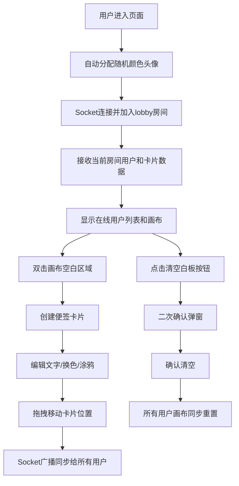

## 1. 产品概述
团队灵感白板应用 - 一个支持多用户实时协作的在线白板工具，允许团队成员在共享画布上添加、移动和编辑便签卡片，激发创意和促进远程协作。
- 主要用途：团队头脑风暴、远程协作会议、创意收集、任务管理可视化
- 目标用户：产品团队、设计团队、开发团队、远程办公团队

## 2. 核心功能

### 2.1 用户角色
| 角色 | 注册方式 | 核心权限 |
|------|----------|----------|
| 普通用户 | 自动分配（无需注册） | 创建/编辑/移动/删除便签、涂鸦、查看在线用户、清空白板 |

### 2.2 功能模块
1. **用户系统**：随机颜色头像分配、在线用户列表、自动加入公共房间
2. **白板画布**：无限画布、拖拽移动、缩放支持、双击创建卡片
3. **便签卡片**：文字编辑、颜色标签、涂鸦功能、拖拽移动、离线状态显示
4. **实时同步**：Socket.IO 实时广播、300ms 内响应、断线状态同步
5. **清空功能**：一键清空白板、二次确认弹窗

### 2.3 页面详情
| 页面名称 | 模块名称 | 功能描述 |
|----------|----------|----------|
| 主白板页 | 用户侧边栏 | 显示在线用户头像列表，实时更新用户状态 |
| 主白板页 | 画布区域 | 共享白板画布，支持缩放、平移、双击创建卡片 |
| 主白板页 | 便签卡片 | 展示文字内容、背景色、涂鸦、用户头像，支持拖拽和编辑 |
| 主白板页 | 工具栏 | 清空白板按钮，带二次确认 |
| 主白板页 | 涂鸦画板 | 卡片内嵌微型画板，支持鼠标绘制 |
| 主白板页 | 颜色选择器 | 12种柔和色盘，弹出动画效果 |

## 3. 核心流程

### 主使用流程
用户进入页面 → 自动分配颜色头像 → 加入 lobby 房间 → 查看在线用户 → 双击画布创建便签 → 编辑文字/更换颜色/涂鸦 → 拖拽移动卡片 → 所有操作实时同步给其他用户 → （可选）清空白板

## 4. 用户界面设计

### 4.1 设计风格
- **主色调**：浅灰色背景 (#F5F5F5)，便签卡片使用12种柔和色盘
- **卡片样式**：圆角矩形 (border-radius: 12px)，轻微阴影 (box-shadow: 0 4px 12px rgba(0,0,0,0.1))
- **侧边栏**：左边缘固定，宽度240px，半透明毛玻璃效果 (backdrop-filter: blur(10px))
- **动画效果**：卡片拖拽过渡 (200ms)，颜色选择器弹出 (scale 0.9→1.0)，涂鸦模式虚线边框闪烁
- **字体**：现代无衬线字体，清晰易读

### 4.2 页面设计概览
| 页面名称 | 模块名称 | UI元素 |
|----------|----------|--------|
| 主白板页 | 用户侧边栏 | 圆形头像、在线状态指示、用户名、毛玻璃半透明背景 |
| 主白板页 | 画布区域 | 浅灰背景、网格纹理、可缩放平移 |
| 主白板页 | 便签卡片 | 圆角矩形、阴影、用户头像角标、文字区域、画笔图标、颜色选择器 |
| 主白板页 | 涂鸦画板 | 200x150px画布、互补色线条、虚线闪烁边框 |
| 主白板页 | 工具栏 | 清空按钮、警告色、悬停效果 |

### 4.3 响应式设计
- **桌面端 (>768px)**：左侧固定侧边栏 (240px)，主画布区域自适应
- **移动端 (<768px)**：侧边栏收起为底部固定条，画布全屏展示
- **触摸优化**：支持触摸拖拽和双指缩放

### 4.4 性能指标
- 100张卡片时拖拽和滚动保持 60FPS
- 涂鸦绘制延迟 ≤ 50ms
- Socket同步响应 ≤ 300ms
