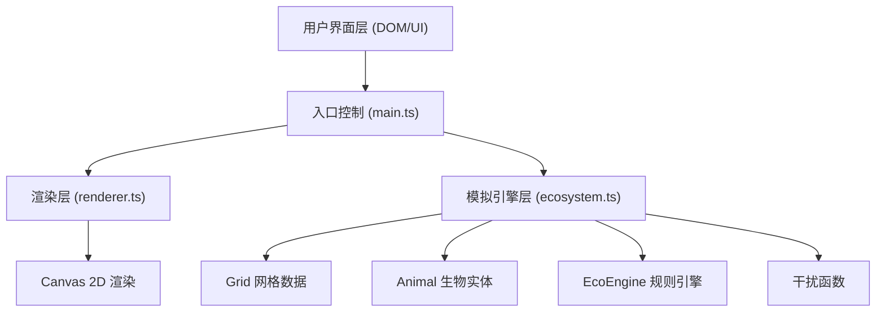

## 1. 架构设计



## 2. 技术描述
- 前端：TypeScript + HTML5 Canvas + Vite
- 初始化工具：手动创建配置文件
- 后端：无，纯前端应用
- 数据库：无，内存状态

## 3. 路由定义
无路由，单页应用。

## 4. 数据模型

### 4.1 格子类型定义
```typescript
enum CellType {
  EMPTY = 'empty',
  GRASS = 'grass',
  BUSH = 'bush'
}
```

### 4.2 生物类型定义
```typescript
enum AnimalType {
  RABBIT = 'rabbit',
  FOX = 'fox',
  WOLF = 'wolf'
}
```

### 4.3 Grid 网格类
- 存储二维数组：100列 x 80行
- 方法：getCell(x,y), setCell(x,y,type), getNeighbors(x,y)

### 4.4 Animal 生物类
- 属性：position(x,y), type, hungerCount
- 方法：move(grid), eat(grid), canBreed()

### 4.5 EcoEngine 规则引擎
- 持有Grid和Animal列表
- step() 方法推进一个时间步
- getStats() 返回统计数据

## 5. 文件结构
```
package.json
index.html
vite.config.js
tsconfig.json
src/
  ecosystem.ts    - 生态模拟核心逻辑
  renderer.ts     - Canvas渲染层
  main.ts         - 入口脚本和交互
```
