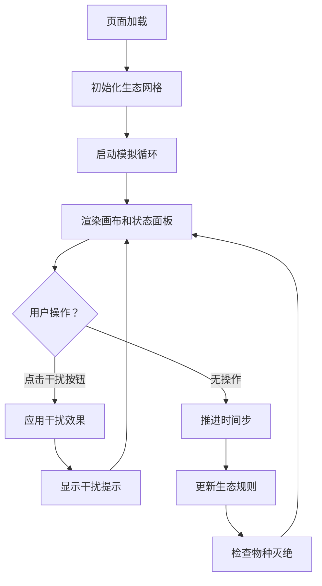

## 1. 产品概述

生态种群动态演化模拟游戏，帮助生态爱好者和学生直观理解食物链、种群密度依赖以及外界干扰对生态系统稳定性的影响。

- 主要用途：教育演示、科普互动、生态学习
- 目标用户：生态爱好者、学生、教师
- 产品价值：通过交互式模拟将抽象的生态学概念转化为可视化的动态体验

## 2. 核心功能

### 2.1 功能模块
1. **生态模拟画布**：Canvas渲染的100x80网格世界，展示草地、灌木、兔子、狐狸、狼的动态演化
2. **实时状态面板**：显示时间步数、各物种数量、生态稳定性指标和动态柱状图
3. **外界干扰控制**：火灾、降雨、狩猎、重置四种干扰按钮
4. **物种灭绝告警**：物种数量为0时红色脉冲告警提示

### 2.2 页面详情
| 页面名称 | 模块名称 | 功能描述 |
|-----------|-------------|---------------------|
| 主页面 | 生态画布 | Canvas渲染100x80网格，渐变背景，实时渲染各物种和资源状态 |
| 主页面 | 状态面板 | 显示时间步数、物种数量统计、稳定性指标、柱状图动画 |
| 主页面 | 控制按钮 | 火灾、降雨、狩猎、重置四个交互按钮，带动效反馈 |
| 主页面 | 告警提示 | 物种灭绝时右上角红色脉冲告警 |
| 主页面 | 干扰提示 | 画布上方浮现干扰事件文字提示动画 |

## 3. 核心流程
用户打开页面后，生态模拟自动开始运行。用户可观察各物种的动态变化，通过点击控制按钮施加外界干扰，观察生态系统的响应。

## 4. 用户界面设计

### 4.1 设计风格
- 主色调：大地棕色#4A6741、#8B6914，自然生态主题
- 按钮样式：圆角矩形8px，下沉点击效果0.15s过渡
- 字体：数字使用等宽字体，按钮文字14px白色
- 布局：画布居中，状态面板顶部居中，按钮右下角悬浮
- 图标风格：使用emoji图标🌿🌳🐇🦊🐺
- 阴影效果：2px偏移8px模糊，rgba(0,0,0,0.15)

### 4.2 页面设计概述
| 页面名称 | 模块名称 | UI元素 |
|-----------|-------------|-------------|
| 主页面 | 生态画布 | 100x80网格、渐变色背景、圆形生物符号、过渡动画 |
| 主页面 | 状态面板 | 半透明白色背景、圆角12px、彩色数字、动态柱状图 |
| 主页面 | 控制按钮 | 彩色圆角按钮、悬停变亮、点击下沉、平滑过渡 |
| 主页面 | 告警提示 | 红色脉冲闪烁动画、16px字体、右上角位置 |
| 主页面 | 干扰提示 | 20px白色文字、透明渐变动画、画布上方居中 |

### 4.3 响应式
桌面端优先设计，画布自适应容器大小，处理窗口resize事件。

