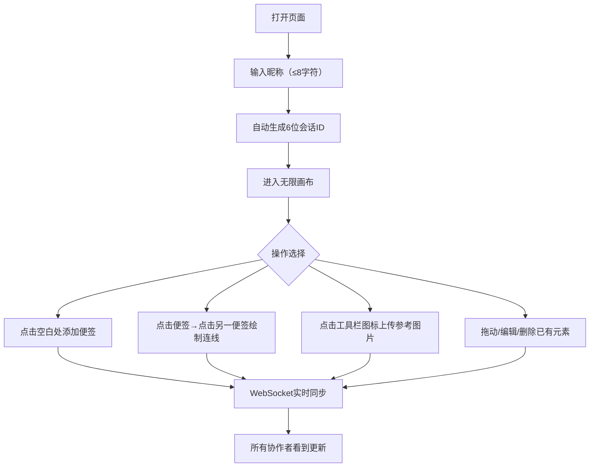

## 1. 产品概述

在线协同创意脑暴图板是一款面向远程团队的实时协作工具，让团队成员能够在无限画布上自由放置便签、绘制连线、上传参考图片，所有改动实时同步，非常适合远程会议和头脑风暴场景。

## 2. 核心功能

### 2.1 用户角色
| 角色 | 加入方式 | 核心权限 |
|------|----------|----------|
| 协作用户 | 通过昵称和邀请链接加入房间 | 放置便签、绘制连线、上传图片、同步光标 |

### 2.2 功能模块
1. **房间管理**：会话ID生成、加入房间、邀请成员
2. **实时画布**：无限画布、便签、连线、参考图片
3. **协作者同步**：光标位置实时同步、用户昵称标签显示
4. **工具栏**：图片上传工具

### 2.3 页面详情
| 页面名称 | 模块名称 | 功能描述 |
|-----------|-------------|---------------------|
| 主页面 | 昵称输入 | 用户打开页面后输入昵称（最多8字符），自动分配随机会话ID |
| 主页面 | 顶部状态栏 | 显示当前会话ID、邀请成员按钮（复制链接到剪贴板） |
| 主页面 | 画布区域 | 无限画布，渲染便签、连线、参考图片、协作者光标 |
| 主页面 | 便签组件 | 160x120px圆角便签，支持拖动、编辑、删除 |
| 主页面 | 连线组件 | 贝塞尔曲线连接便签，支持悬停高亮和删除 |
| 主页面 | 图片组件 | 支持上传、拖动、滚轮缩放（0.5-2.0倍） |
| 主页面 | 底部工具栏 | 图片上传按钮，毛玻璃效果 |

## 3. 核心流程

用户打开页面 → 输入昵称（≤8字符） → 自动生成6位随机会话ID → 进入画布 → 点击空白处添加便签/使用工具栏上传图片/点击便签绘制连线 → 所有操作实时同步给协作者。

## 4. 用户界面设计

### 4.1 设计风格
- **主题色**：深色模式，背景 #1A1A2E
- **便签马卡龙色系**：黄#FFD54F、粉#F48FB1、蓝#64B5F6、绿#81C784、紫#CE93D8、橙#FFAB91、青#4DB6AC、灰#BDBDBD
- **用户光标调色板**：12种预设颜色，带白色昵称标签（10px字体）
- **连线颜色**：#64B5F6，悬停时加粗到3px高亮
- **按钮风格**：扁平图标+文字标签，悬停放大1.1倍并发光
- **动效**：平滑过渡（transform 0.2s ease, opacity 0.3s ease）

### 4.2 页面设计概述
| 页面名称 | 模块名称 | UI元素 |
|-----------|-------------|-------------|
| 主页面 | 顶部状态栏 | 半透明、会话ID显示、复制邀请链接按钮 |
| 主页面 | 画布区域 | 深色背景#1A1A2E、便签卡片、贝塞尔曲线连线、图片、光标 |
| 主页面 | 底部工具栏 | 居中固定、毛玻璃rgba(30,30,50,0.85)、圆角16px、内边距12px、按钮间隔12px |
| 主页面 | 便签组件 | 160x120px、圆角8px、马卡龙色系、右上角X删除按钮 |

### 4.3 响应式
- 桌面端优先设计
- 画布区域自适应窗口大小
- 底部工具栏始终居中固定
