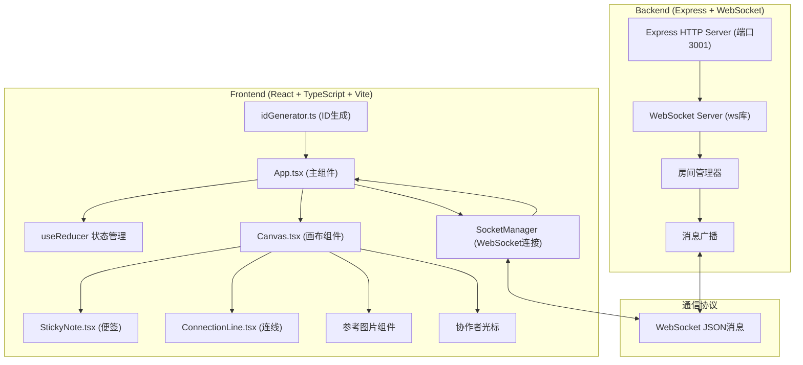
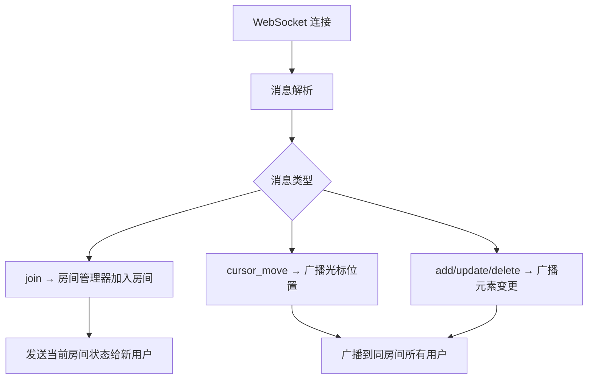
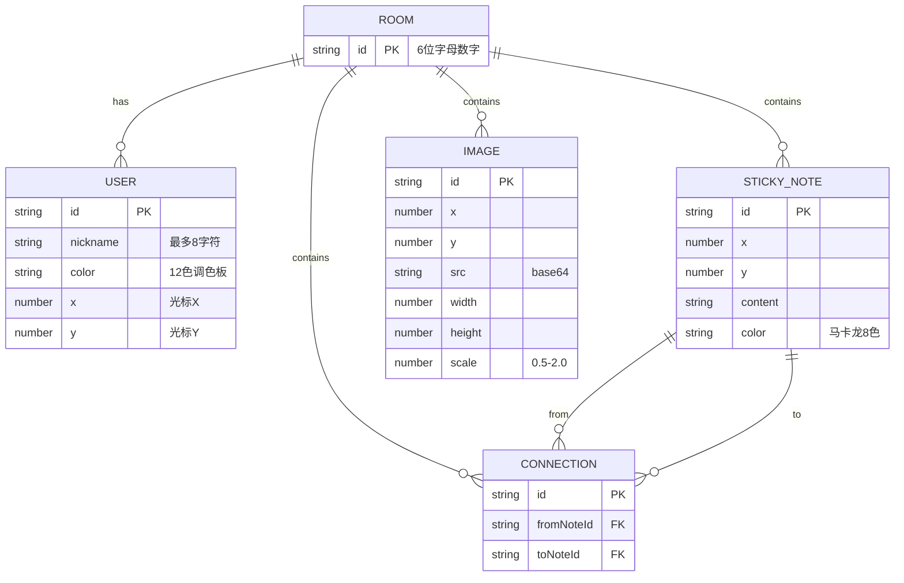

## 1. 架构设计



## 2. 技术描述
- **前端**：React@18 + TypeScript + Vite@5，使用 useReducer 管理画布状态
- **后端**：Express@4 + ws@8 (WebSocket库)
- **通信**：WebSocket 实时双向通信，JSON 序列化消息
- **构建工具**：Vite，代理 /api 和 /ws 到后端 3001 端口
- **样式**：原生 CSS，深色模式，马卡龙色系，毛玻璃效果，平滑过渡动画

## 3. 路由定义
| 路由 | 目的 |
|-------|---------|
| / | 主页面（React SPA入口） |
| /ws | WebSocket 连接端点 |

## 4. API / WebSocket 消息定义

### WebSocket 消息类型

```typescript
// 客户端 → 服务端
type ClientMessage =
  | { type: 'join'; roomId: string; userId: string; nickname: string }
  | { type: 'cursor_move'; roomId: string; userId: string; x: number; y: number }
  | { type: 'add_note'; roomId: string; note: StickyNoteData }
  | { type: 'update_note'; roomId: string; note: StickyNoteData }
  | { type: 'delete_note'; roomId: string; noteId: string }
  | { type: 'add_connection'; roomId: string; connection: ConnectionData }
  | { type: 'delete_connection'; roomId: string; connectionId: string }
  | { type: 'add_image'; roomId: string; image: ImageData }
  | { type: 'update_image'; roomId: string; image: ImageData }
  | { type: 'delete_image'; roomId: string; imageId: string }

// 服务端 → 客户端
type ServerMessage =
  | { type: 'room_state'; notes: StickyNoteData[]; connections: ConnectionData[]; images: ImageData[]; users: User[] }
  | { type: 'user_joined'; user: User }
  | { type: 'user_left'; userId: string }
  | { type: 'cursor_moved'; userId: string; x: number; y: number }
  | { type: 'note_added'; note: StickyNoteData }
  | { type: 'note_updated'; note: StickyNoteData }
  | { type: 'note_deleted'; noteId: string }
  | { type: 'connection_added'; connection: ConnectionData }
  | { type: 'connection_deleted'; connectionId: string }
  | { type: 'image_added'; image: ImageData }
  | { type: 'image_updated'; image: ImageData }
  | { type: 'image_deleted'; imageId: string }

interface User {
  id: string
  nickname: string
  color: string
  x: number
  y: number
}

interface StickyNoteData {
  id: string
  x: number
  y: number
  content: string
  color: string
}

interface ConnectionData {
  id: string
  fromNoteId: string
  toNoteId: string
}

interface ImageData {
  id: string
  x: number
  y: number
  src: string // base64 data URL
  width: number
  height: number
  scale: number
}
```

## 5. 服务端架构



## 6. 数据模型

### 6.1 数据模型定义



## 7. 项目文件结构

```
.
├── package.json
├── index.html
├── vite.config.js
├── tsconfig.json
├── server/
│   └── index.ts          # Express+WebSocket服务端
└── src/
    ├── main.tsx          # React入口
    ├── App.tsx           # 主组件（房间连接+状态管理）
    ├── canvas/
    │   ├── Canvas.tsx        # 画布组件
    │   ├── StickyNote.tsx    # 便签组件
    │   └── ConnectionLine.tsx # 连线组件
    └── utils/
        ├── idGenerator.ts    # ID生成工具
        └── socketManager.ts  # WebSocket连接管理
```
