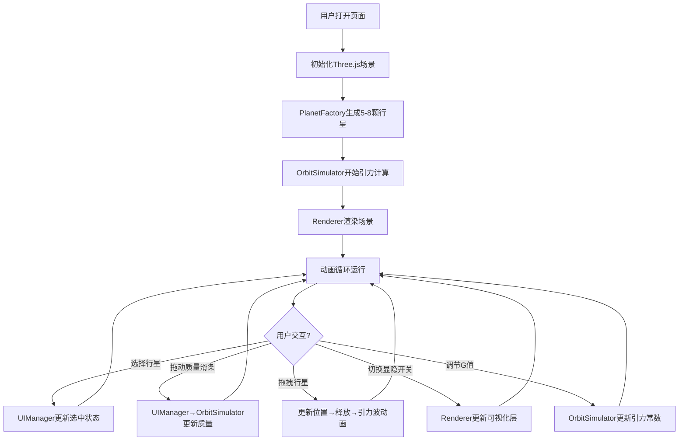

## 1. 产品概述
交互式3D引力场模拟器，面向天文馆教育场景，让学生通过拖拽行星、调整质量等交互方式，直观理解开普勒定律和万有引力原理。

- 目标用户：天文馆讲解员、学生、物理/天文教育工作者
- 核心价值：将抽象的引力物理概念转化为可视化、可交互的3D体验

## 2. 核心功能

### 2.1 功能模块
1. **3D引力模拟场景**：中心恒星 + 5-8颗随机行星，实时N体引力计算
2. **行星交互系统**：选择行星、调整质量、拖拽改变位置
3. **可视化辅助层**：轨道线、速度矢量、引力场线、背景星空
4. **实时信息面板**：模拟时间、行星参数、偏心率、引力常数调节

### 2.2 功能详情
| 功能模块 | 子功能 | 功能描述 |
|-----------|-------------|---------------------|
| 引力模拟 | N体计算 | 基于牛顿万有引力定律实时计算行星运动 |
| 引力模拟 | 初始状态 | 5-8颗随机行星，近似圆形轨道，倾角-15°~15° |
| 行星交互 | 质量调节 | 0.5-50地球质量滑条，颜色随质量变化（蓝→绿→橙→红） |
| 行星交互 | 拖拽移动 | 点击拖拽行星，释放后重新计算轨道，播放引力波动画 |
| 可视化 | 轨道线 | 半透明圆环，与行星同色，不透明度0.6 |
| 可视化 | 速度矢量 | 绿色箭头，长度比例0.5，起点为行星位置 |
| 可视化 | 引力场线 | 青色半透明贝塞尔曲线，从恒星向外辐射 |
| 可视化 | 背景星空 | 2000颗闪烁粒子，大小0.05-0.2随机 |
| UI面板 | 控制面板 | 左下角：行星选择、质量滑条、显隐开关 |
| UI面板 | 信息面板 | 右上角：模拟时间、行星参数、G值调节 |

## 3. 核心流程

## 4. 用户界面设计

### 4.1 设计风格
- **深空主题**：背景#0A0A2A到#1A1A3E径向渐变
- **毛玻璃UI**：backdrop-filter: blur(8px)，半透明面板
- **配色方案**：
  - 主色：青色#00BCD4、黄色#FFF176（恒星）
  - 行星质量梯度：蓝#00BCD4 → 绿#4CAF50 → 橙#FF9800 → 红#F44336
  - 辅助色：亮绿#76FF03（速度矢量）、青色#00BCD4（引力场线）
- **字体**：白色14px无衬线字体
- **控件样式**：滑条宽200px高4px，按钮悬停背景rgba(255,255,255,0.1)

### 4.2 页面设计
| 区域 | 模块 | UI元素 |
|-----------|-------------|-------------|
| 全屏 | 3D场景 | 恒星、行星、轨道、速度矢量、引力场线、星空粒子 |
| 左下角 | 控制面板 | 行星下拉、质量滑条、4个显隐开关、FPS、偏心率读数 |
| 右上角 | 信息面板 | 模拟时间、行星数、选中行星名、轨道半径、偏心率、G值滑条 |

### 4.3 响应式适配
- 桌面端：控制面板左下固定，信息面板右上固定
- 移动端（<768px）：控制面板折叠为底部横条，高度60px，滑条缩至120px

### 4.4 3D场景指引
- **环境**：深空背景径向渐变 + 2000颗闪烁星空粒子
- **光照**：恒星作为点光源，周围加环境光确保行星可见
- **相机**：PerspectiveCamera，初始位置可观察整个星系，支持OrbitControls旋转缩放
- **交互动画**：点击行星产生脉动光环（0.3s），拖拽释放产生引力波（1.5s扩散）
- **性能**：30fps+稳定运行，≤10颗行星无卡顿
