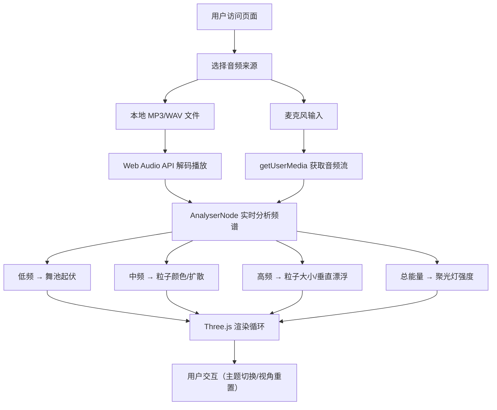

## 1. 产品概述
基于 Three.js 的交互式 3D 音流舞池可视化应用，让用户在浏览器中创建动态舞池场景，音乐节奏驱动舞台灯光和粒子舞蹈效果。
- 面向音乐爱好者、视觉艺术家和演示场景，提供沉浸式音频可视化体验
- 通过 Web Audio API 实现实时音频分析，将声音频谱转化为视觉表现

## 2. 核心功能

### 2.1 用户角色
无需角色区分，单用户桌面浏览器应用。

### 2.2 功能模块
1. **3D 舞池场景**：动态起伏的舞池地面 + 流动光栅条纹
2. **粒子星云系统**：8000 个粒子组成的旋转云团，受音频驱动
3. **音频分析控制**：本地音频文件播放 / 麦克风输入
4. **动态聚光灯**：三盏彩色旋转聚光灯投射阴影
5. **控制面板**：文件选择、麦克风开关、粒子主题切换、视角重置
6. **波形可视化**：左上角实时 Canvas 波形显示

### 2.3 页面详情
| 页面名称 | 模块名称 | 功能描述 |
|---------|---------|---------|
| 主页面 | Three.js 场景容器 | 全屏 3D 渲染，背景深蓝到深紫渐变，底部指数雾效 |
| 主页面 | 波形 Canvas | 左上角 200x60px 实时音频波形显示 |
| 主页面 | 控制面板 | 右下角半透明控制面板，包含音频源切换、主题切换、视角重置 |

## 3. 核心流程
用户打开页面 → 选择音频文件或启用麦克风 → 音频开始播放/采集 → Three.js 场景根据音频频谱实时动画 → 用户可切换粒子主题或重置视角

## 4. 用户界面设计

### 4.1 设计风格
- **主色调**：深蓝 #0A0A23 → 深紫 #1A0033 渐变背景
- **强调色**：橙色 #FF6F00（按钮）、黄色 #FFD54F（波形）、青色 #00E5FF（舞池高亮）
- **按钮风格**：圆角 8px，橙色背景白色文字，hover 深橙色
- **字体**：'Segoe UI', sans-serif，14px 默认字号，行高 1.5
- **布局**：全屏 Three.js 画布 + 绝对定位的 UI 浮层

### 4.2 页面设计概述
| 页面名称 | 模块名称 | UI 元素 |
|---------|---------|---------|
| 主页面 | Three.js 容器 | 全屏 Canvas，resize 自适应，无滚动条 |
| 主页面 | 波形可视化 | 200x60px Canvas，透明背景，黄色线条 #FFD54F，线宽 2px |
| 主页面 | 控制面板 | 260px 宽，圆角 12px，rgba(0,0,0,0.6) 背景，16px 内边距 |
| 控制面板 | 文件选择按钮 | 圆角 8px，#FF6F00 背景，白色文字 |
| 控制面板 | 麦克风开关 | Toggle Slider，激活时绿色滑块 |
| 控制面板 | 主题切换 | 四个按钮：霓虹/海洋/火焰/极光，选中状态高亮 |
| 控制面板 | 重置视角 | 普通按钮样式，恢复相机初始位置 |

### 4.3 响应式
桌面端优先，画布自适应窗口尺寸，控制面板固定在右下角。

### 4.4 3D 场景指导
- **环境**：渐变背景（#0A0A23 → #1A0033），指数雾（密度 0.005）
- **灯光**：三盏彩色聚光灯（红#FF1744、绿#00E676、蓝#2979FF），半径 8 圆周旋转，投射 1024x1024 阴影
- **相机**：PerspectiveCamera，初始位置 (10, 8, 10)，看向原点，OrbitControls 交互
- **舞池**：12x12 平面，64x64 细分，自定义 Shader 实现低频驱动起伏 + 30° 流动光栅条纹
- **粒子**：8000 PointsMaterial 粒子，10x10x5 空间分布，y 轴旋转 + 布朗运动，大小衰减
