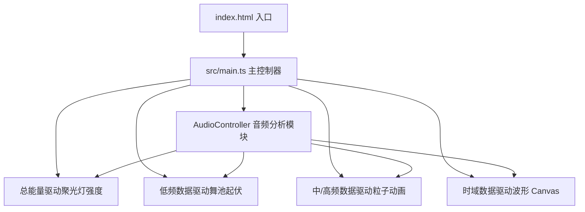

## 1. 架构设计



## 2. 技术说明
- **前端框架**：原生 HTML/CSS + TypeScript（无 React/Vue）
- **3D 引擎**：three@^0.160.0 + @types/three
- **构建工具**：Vite@^5.0.0（开发服务器端口 8080）
- **类型系统**：TypeScript，严格模式，target ES2020，ESNext 模块
- **音频处理**：Web Audio API（AudioContext、AnalyserNode、MediaElementSource、MediaStreamSource）
- **无后端、无数据库**

## 3. 文件结构
```
.
├── package.json
├── index.html
├── vite.config.js
├── tsconfig.json
└── src/
    ├── main.ts
    ├── audioController.ts
    ├── danceFloor.ts
    └── particleSystem.ts
```

### 文件职责
| 文件 | 职责 |
|-----|-----|
| package.json | 依赖声明（three、@types/three、typescript、vite），dev 脚本 |
| vite.config.js | Vite 构建配置，端口 8080 |
| tsconfig.json | TypeScript 严格模式配置 |
| index.html | 入口 HTML，Three.js 容器、波形 Canvas、控制面板 DOM |
| src/main.ts | Three.js 初始化、聚光灯、渲染循环、UI 事件绑定、resize 处理 |
| src/audioController.ts | Web Audio API 封装：文件/麦克风输入、三频段频谱分析、波形数据 |
| src/danceFloor.ts | 舞池地面：自定义 ShaderMaterial + PlaneGeometry，低频驱动顶点位移 |
| src/particleSystem.ts | 8000 粒子管理：BufferGeometry + PointsMaterial，音频驱动颜色/大小/运动 |

## 4. 核心数据结构

### AudioController 输出
```typescript
interface AudioData {
  lowFreq: number;      // 0-250Hz 均值，范围 0-1
  midFreq: number;      // 250-4000Hz 均值，范围 0-1
  highFreq: number;     // >4000Hz 均值，范围 0-1
  totalEnergy: number;  // 全频段能量，范围 0-1
  waveform: Float32Array; // 时域波形数据
}
```

### 粒子主题
```typescript
interface ParticleTheme {
  name: 'neon' | 'ocean' | 'flame' | 'aurora';
  colorA: THREE.Color;  // 低频色
  colorB: THREE.Color;  // 高频色
}
```

## 5. 性能优化策略
- **粒子**：使用 BufferGeometry + 单个 Points 批量渲染，避免 8000 个独立 Mesh
- **着色器**：舞池起伏在 Vertex Shader 中计算，GPU 并行处理 64x64 顶点
- **音频分析**：60fps 更新频率，使用 getByteFrequencyData / getByteTimeDomainData 高效获取数据
- **阴影**：仅聚光灯投射阴影，分辨率 1024x1024，舞池地面接收阴影
- **resize 防抖**：窗口 resize 时更新相机和渲染器尺寸
