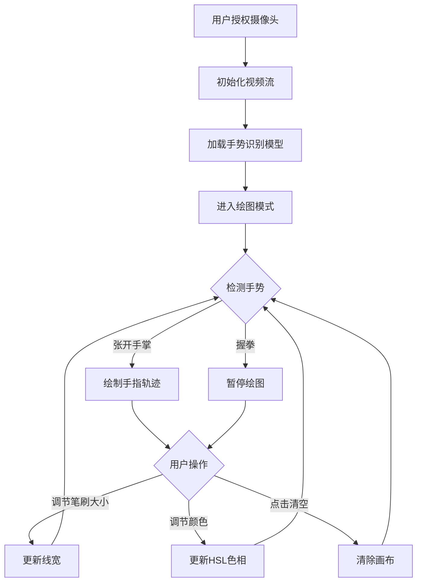

## 1. 产品概述
基于浏览器摄像头的手势控制交互式绘图应用，用户通过手指移动轨迹实时控制画笔在画布上绘画，无需任何物理输入设备。
- 面向创意工作者、教育场景和趣味交互用户，提供沉浸式无接触绘图体验
- 利用计算机视觉技术实现实时手势识别，降低数字绘画的操作门槛

## 2. 核心功能

### 2.1 功能模块
1. **实时视频预览模块**：摄像头画面镜像显示（640×480px），提供视觉反馈
2. **手势识别追踪模块**：检测手部21个关键点，识别手指坐标及握拳/张开手势
3. **绘图画布模块**：跟随手指轨迹绘制彩色线条，支持笔刷属性调节
4. **控制面板模块**：笔刷大小滑块、HSL颜色选择器、清空画布按钮
5. **状态指示模块**：显示当前绘图/暂停模式、笔刷大小实时数值

### 2.2 页面详情
| 页面名称 | 模块名称 | 功能描述 |
|-----------|-------------|---------------------|
| 主绘图页 | 视频预览区 | 640×480px镜像视频流，左上角叠加状态指示条 |
| 主绘图页 | 绘图画布区 | 640×480px画布，实时绘制手指轨迹，模式切换时边缘闪烁提示 |
| 主绘图页 | 控制面板 | 笔刷大小滑块(2-20px)、HSL色环滑块、清空画布按钮 |
| 主绘图页 | 状态指示条 | 毛玻璃效果，显示模式状态（绘图中/已暂停）和笔刷大小 |

## 3. 核心流程

用户授权摄像头访问 → 系统初始化视频流和手势识别模型 → 进入默认绘图模式
→ 手指移动时系统识别指尖坐标 → 画布跟随绘制彩色线条
→ 握拳手势：暂停绘图，画布边缘闪白提示
→ 张开手掌手势：恢复绘图，画布边缘闪白提示
→ 调节滑块：实时更新笔刷大小和颜色
→ 点击清空按钮：清除画布所有内容

## 4. 用户界面设计

### 4.1 设计风格
- **主色调**：深色主题背景 #121212，卡片 #1E1E1E
- **强调色**：绘图状态绿 #4CAF50，暂停状态红 #F44336，默认笔刷橙 #FF5722，滑块轨道绿 #4CAF50
- **按钮样式**：圆角8px，清空按钮红底白字，悬停变暗，点击缩放动画0.15s
- **字体**：无衬线系统字体，标签文字12px白色
- **布局风格**：视频+画布居中排列，右侧控制面板卡片式，移动端控制面板底部横排
- **动效**：状态指示条"绘图中"文字呼吸动画，滑块拖动平滑过渡，模式切换画布边缘闪白0.2s

### 4.2 页面设计概述
| 页面名称 | 模块名称 | UI元素 |
|-----------|-------------|-------------|
| 主绘图页 | 视频预览区 | 640×480px镜像视频，左上角半透明状态条，圆角容器，20px内边距 |
| 主绘图页 | 绘图画布区 | 640×480px画布，与视频对齐，模式切换时白色边框闪烁动画 |
| 主绘图页 | 控制面板 | 深灰卡片#1E1E1E，圆角16px，内边距20px，柔和阴影，垂直排列滑块和按钮 |
| 主绘图页 | 状态指示条 | rgba(0,0,0,0.5)背景毛玻璃，圆角12px，z-index最高，固定视频左上角 |

### 4.3 响应式
- Desktop-first设计，视口宽度≥900px：视频画布居左，控制面板居右
- 视口宽度<900px：控制面板移至底部成为横向栏，滑块和按钮水平排列
- 触控优化：滑块加大触控区域，按钮最小尺寸40×40px

