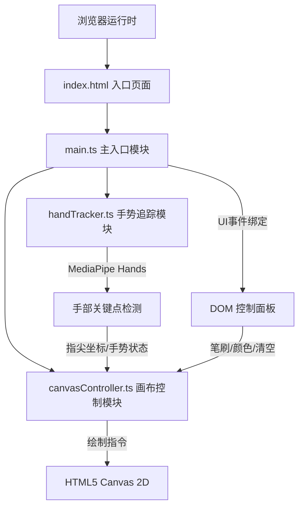

## 1. 架构设计



## 2. 技术描述
- **前端框架**：原生 HTML5 + CSS3 + TypeScript（无框架，零依赖UI）
- **构建工具**：Vite 5.x，开发服务器端口8080，入口 index.html
- **手势识别**：MediaPipe Hands（通过CDN或@mediapipe/hands包加载WASM模型）
- **绘图引擎**：HTML5 Canvas 2D API
- **摄像头访问**：navigator.mediaDevices.getUserMedia Web API

## 3. 模块划分（单页应用，无路由）
| 模块文件 | 职责 | 核心导出 |
|-------|------|---------|
| src/main.ts | 应用初始化：摄像头启动、模块组装、DOM事件绑定、主循环 | - |
| src/handTracker.ts | 视频帧手部关键点检测、指尖坐标提取、握拳/张开手势判定 | HandTracker 类 |
| src/canvasController.ts | 画布状态管理、笔画绘制、笔刷大小/颜色控制、清空操作、模式切换闪烁效果 | CanvasController 类 |

## 4. 核心数据结构与接口

### 4.1 HandTracker 接口
```typescript
interface FingerPoint {
  x: number;  // 0-1 归一化坐标
  y: number;
}

interface HandTrackingResult {
  isHandDetected: boolean;
  indexFingerTip: FingerPoint | null;  // 食指指尖
  isFist: boolean;  // 握拳判定
  isOpenPalm: boolean;  // 张开手掌判定
}

class HandTracker {
  constructor(videoElement: HTMLVideoElement);
  async init(): Promise<void>;  // 加载模型
  detect(): HandTrackingResult;  // 单帧检测
}
```

### 4.2 CanvasController 接口
```typescript
interface BrushSettings {
  size: number;     // 2-20px
  colorHue: number; // 0-360 HSL色相
}

type DrawingMode = 'drawing' | 'paused';

class CanvasController {
  constructor(canvas: HTMLCanvasElement);
  setBrushSize(size: number): void;
  setColorHue(hue: number): void;
  setMode(mode: DrawingMode): void;
  clear(): void;
  drawPoint(x: number, y: number): void;  // 传入像素坐标
  flashBorder(): void;  // 模式切换闪烁动画
}
```

## 5. 性能保障策略
- **帧率控制**：requestAnimationFrame 主循环，目标≥15fps，手势检测与绘制共享帧
- **延迟优化**：指尖坐标直接映射画布像素，无冗余计算；Canvas 2D 硬件加速
- **视频流优化**：视频源分辨率锁定640×480，与画布1:1映射，减少坐标缩放开销
- **手势判定防抖**：连续3帧一致才切换模式，避免误触

